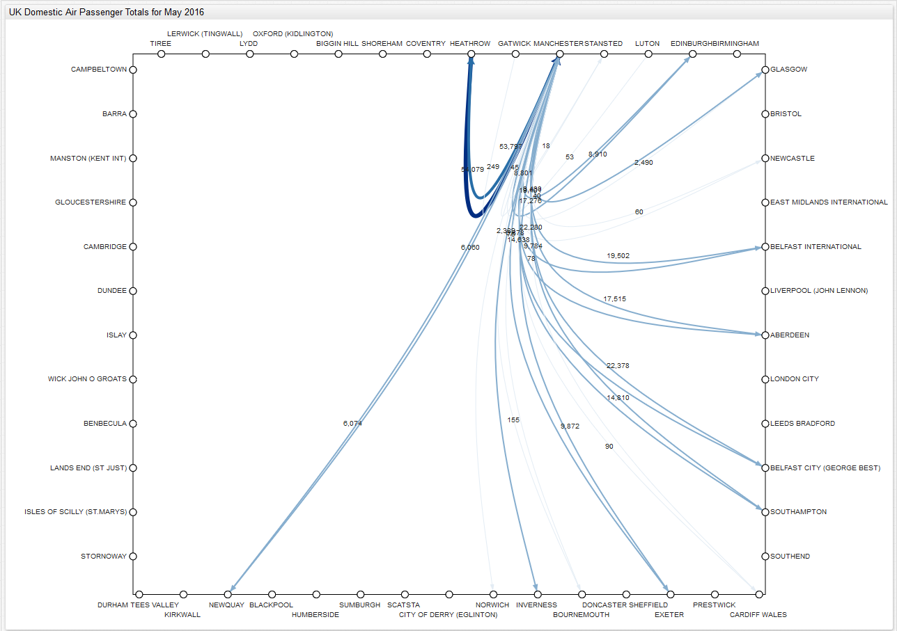
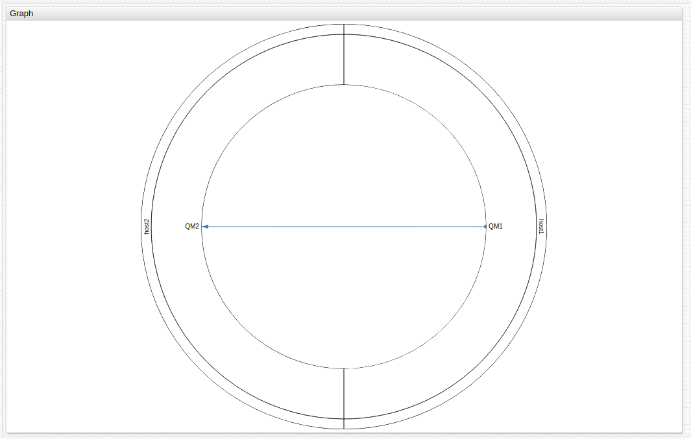
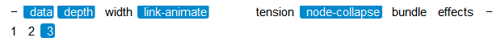
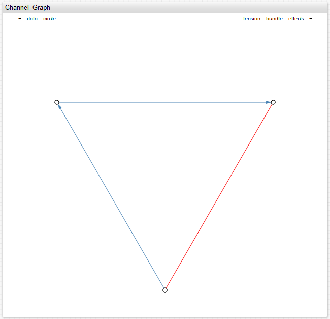
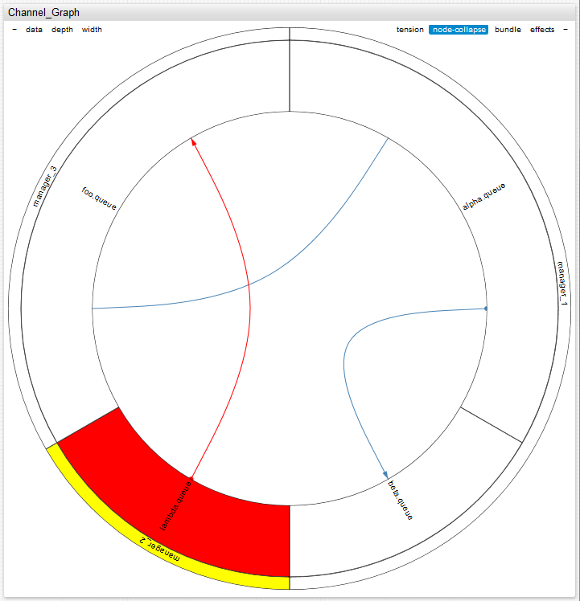
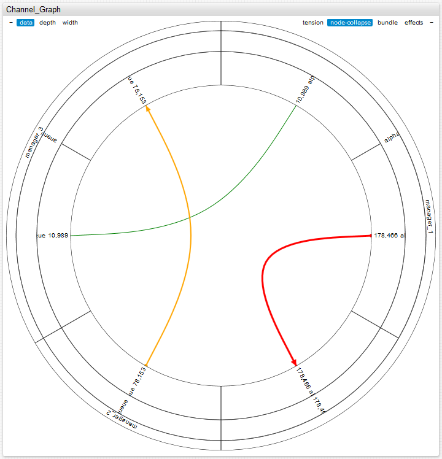

# Graph Widget



## Overview

The graph widget displays the topology and relationships of servers, virtual machines, and managers alongside corresponding status.

## Syntax

### `[widget]` Settings

Setting |Description
--|--
|`mode`|Determines the overall look of the widget, possible values: `hierarchy` or `non-hierarchy`.<br>`non-hierarchy` by default.|
|`layout`|Form of the widget in `non-hierarchy` mode, possible values: `circle` or `rectangle`.<br>`circle` by default.|
|`depth`|Depth of the displayed vertex hierarchy from `1` to the maximum depth of the vertex hierarchy plus `1`<br>Final level corresponds to edges<br>Maximal depth of the hierarchy is default.|
|`tension`|The degree curvature of edges.<br>Corresponds to the parameter `C` in the formula for the cardinal spline.<br>Varies from `0` to `1`, `0` corresponds to straight edges.<br>`0.9` by default.|
|`bundled`|Hierarchical contraction of edges ([Danny Holten](http://www.win.tue.nl/vis1/home/dholten/) algorithm).<br>`true` by default.|
|`effects`|Animation when changing the geometry of the graph.<br> `false` by default.|
|`duration`|The duration of a transaction when changing the geometry of the graph in milliseconds.<br>`1000` by default.|
|`min-ring-width`|The minimum allowed width of the vertex ring.<br> The value is from `0` to a maximum permissible value of the ring width.<br>`0.3` by default.|
|`max-ring-width`|The maximum allowed width of the vertex ring from the current minimal value of the ring width.<br> `0.5` by default.|
|`arrows`|Arrows on the directed edges<br>`false` by default.|
|`node-connect`|Connect vertices on the perimeter<br>`true` by default.|
|`data`|Information about the last time series value next to the image of the corresponding vertex.<br>`false` by default.|
|`node-collapse`|Collapse vertex sectors when clicked.<br>`true` by default.|
|`node-alert-style`|Style of vertices, in the event of an `alert-expression` being triggered tied to the time series.|
|`link-alert-style`|Style of edges in the event of an `alert-expression` being triggered and tied to the time series.|
|`link-thresholds`|Threshold for time series attached to the edges.<br>Supports both JavaScript and `percentile` functions.|
|`link-colors`|Color to indicate the threshold of time series.<br>Attached to the edges and separated by commas.|
|`link-widths`|Width to indicate the thresholds of the time series tied to the edges and separated by commas or spaces.|
|`node-thresholds`|Threshold for time series tied to vertices.<br>Supports JavaScript, `percentile` functions, or can be set as an array.|
|`node-colors`|Color to indicate the threshold of time series that are bound to vertices and separated by commas.|
|`node-radiuses`|Radii of the lighting for the display of the time series thresholds linked to the vertices and separated by commas or spaces.|
|`node-radius`|Radius of the vertex in pixels.<br>Not valid in `hierarchy` mode.|
|`padding`|Offset from the edge of the container in pixels.|
|`link-animate`|Animation of directed vertices.<br> `false` by default.|
|`disconnected-node-display`|Show vertices without edge.<br>Values: `true` or `false`<br>`true` by default.|
|`node-labels`|Display vertex labels.<br>Possible values: `true` or `false`.|
|`link-labels`|Display edge labels.<br>Possible values: `true` or `false`.|
|`link-data`|Series last value next to the `link-label`.|
|`link-color-range`|Color scheme for `link-threshold`.|
|`link-label-zoom-threshold`|Parameter value is a value of scale when labels appear based on edge threshold.<br>`value < 1`: Labels disappear on zoom out.<br>`value > 1`: Labels appear on zoom in.|
|`node-label-zoom-threshold`|Parameter value is a value of scale when labels appear based on vertex threshold<br>`value < 1`: Labels disappear on zoom out.<br>`value > 1`: Labels appear on zoom in.|
|`auto-padding`|Add padding if labels overflow container.<br>Possible values: `true` or `false`.<br>`true` by default.|
|`link-width-order`|Sort links according to their width<br> Possible values: `top`, `bottom` or `undefined`<br>`undefined` by default.|

### `[node]` Settings

|Setting |Description |
|--- |--- |
|`id`|Unique name of the vertex. **Required**|
|`parent`|ID of parent vertex.|
|`series`|`alias` of time series associated with vertex.|
|`alert-style`|Vertex style upon breach of `alert-expression` condition.|
|`tooltip`|Add custom string to tooltip.|
|`label`|Text on label.<br>`element-id` by default. |

Use `[properties]` to specify any values divided by an equal sign. If a value contains `=` or `\` escape them with a backslash: `\=` or `\\`.



[](https://apps.axibase.com/chartlab/23c37d69)

### `[link]` Settings

|Setting |Description |
|--- |--- |
|`id` |Unique edge name. |
|`nodes` |Vertices connected by an edge.<br> ID of vertices, separated by a comma or hyphen for undirected edges, `-}` or `{-` for directed edges.<br> If vertex ID contains a hyphen, it must be shielded using `""` double quotes. |
|`series` |`alias` of time series associated with the edge. |
|`alert-style` |Edge style upon breach of `alert-expression` condition. |
|`tooltip` |Add custom string to tooltip. |
|`label` |Text on label.<br>`element-id` by default. |

Use `[properties]` to specify any values divided by an equal sign. If a value contains `=` or `\` escape them with a backslash: `\=` or `\\`.


[](https://apps.axibase.com/chartlab/23c37d69)

### `[series]` Settings

Use `[series]` settings to associate time series with the graph.

|Setting |Description |
|--- |--- |
|`nodes`|List of vertices associated with this series.<br>When the vertex id contains a hyphen, it must be shielded with `""` double quotes.|
|`links`|List of edges associated with this series is defined by an ID or edge ID of the corresponding vertices with a hyphen.<br> When edge ID contains a hyphen, it must be shielded with `""` double quotes.|
|`link-alerts-style`|Edge style to which a time series is bound in the event of an `alert-expression` being triggered.|
|`node-alert-style`|Vertex style to which a time series is bound in the event of an `alert-expression` being triggered.|

It is possible to create an expanded mouseover tooltip containing contextual information. Use `[series]` level settings. Use `[properties]` to specify any values divided by an equal sign. If a value contains `=` or `\` escape them with a backslash: `\=` or `\\`. Information is displayed in a table within the tooltip. Use the `>` context setting displayed in the tooltip before the `[properties]` tooltip table. Within the `>` context setting, create a table using standard HTML parameters: `>` table class, `tbody`, `tr`, `td`.

## Controls

Adjust graph appearance using the controls located in the top corners of the widget:



|Setting |Description |
|--- |--- |
|`data`|Show or hide information about the last value of a time series next to the corresponding image of the vertices.<br>By default, the information is hidden.|
|`depth`|Set the depth of the displayed vertex hierarchy.<br>Allows a value of `1` to a maximum height of the vertex tree plus `1`, the final level corresponds to the edges.<br>By default, the depth is equal to the height of the vertex tree displayed.|
|`width`|Maximum and minimum allowed width of the vertex ring is the percent from the radius of the circle.<br>By default, minimum `30%`, maximum `50%`.|
|`tension`|The degree of edge curvature.<br>Corresponds to the parameter `C` in the formula for the cardinal spline.<br>Varies from `0` to `1` where `0` corresponds to direct edges.<br>Default value is `0.9`.|
|`bundle`|Hierarchical contraction of edges ([Danny Holten](http://www.win.tue.nl/vis1/home/dholten/) algorithm).<br>Used by default.|
|`effects`|Animation when changing the geometry of the graph.<br>Used by default.|
|`node-collapse`|Collapse sector peaks when clicked.<br>`true` by default.|
|`link-animate`|Animation of directed edges.<br>`false` by default.|

## Structure

The structure of the graph is defined by the description of its vertices and edges. Use `[node]` level settings to describe each vertex, and define the hierarchy of vertices with the `parent` parameter, which sets the predecessor. Use `[link]` settings to describe the edges. Adjacent edges, with vertices, are determined by `[node]` settings.

Link series to edges or vertices by indicating the `alias` in the series parameter of `[link]` or `[node]` settings. Alternatively, list the loaded edges or vertices in the links or nodes of the `[series]` settings.

### Example Configuration

```ls
[widget]
height-units = 4
width-units = 4
type = graph
title = Channel_Graph
alert-expression = value > 100000
alert-style = stroke: red
bundle = false
circle = false
tension = 0

[node]
id = queue_1

[node]
id = queue_2

[node]
id = queue_3

[link]
id = channel_1
nodes = queue_1-queue_2
series = ch1

[link]
id = channel_2
nodes = queue_2->queue_3

[link]
id = channel_3
nodes = queue_1<-queue_3

[series]
entity = gr01
metric = message_count
links = channel_2

[tag]
name = channel_name
value = channel2

[series]
alias = ch1
entity = gr01
metric = message_count

[tag]
name = channel_name
value = channel1
```



[](https://apps.axibase.com/chartlab/3bb35314)

## Hierarchial Mode

Activate hierarchial mode using the `mode` setting:

```ls
mode = hierarchial
```

## Alert Expression

In the event of an alert-expression response on the time series of the vertex or edge to which the time series is tied. Value of alert-style can be either string or script. If alert-style is script, the variable alert is available, and it is equal to the value that the alert returns. The following styles are applied (in a specified order) in the parameters below:

```ls
/* widget level settings */
[widget]
alert-style = color: red
link-alert-style = color: red
node-alert-style = color: red

/* link level settings */
[link]
alert-style = color: red

/* node level settings */
[node]
alert-style = color: red

/* series level settings */
[series]
alert-style = color: red
link-alert-style = color: red
node-alert-style = color: red
```

### Example Syntax

```ls
/* Modify stroke width of series line on alert */
link-alert-style = if (alert > 99) return 'stroke-width:3px';

/* modify color of node on alert */
node-alert-style = if (alert > 99) return 'fill:red';
```

### Configuration Example

```ls
[widget]
type = graph
title = Channel_Graph
alert-expression = value > 100000
node-alert-style = fill: red
link-alert-style = stroke: red
bundle = false
mode = hierarchy

[node]
id = manager_1

[node]
id = manager_2
alert-style = fill: yellow

[node]
id = manager_3

[node]
id = alpha.queue
parent = manager_1

[node]
id = beta.queue
parent = manager_1

[node]
id = lambda.queue
parent = manager_2

[node]
id = foo.queue
parent = manager_3

[link]
nodes = alpha.queue - foo.queue

[link]
nodes = lambda.queue -> foo.queue

[link]
nodes = beta.queue <- alpha.queue

[series]
entity = gr02
metric = message_count
links = lambda.queue - foo.queue
nodes = lambda.queue, manager_2

[tag]
name = channel_name
value = THE.BEST.CH

[series]
entity = gr02
metric = message_count
links = alpha.queue - foo.queue

[tag]
name = channel_name
value = ALPHA.FOO.CH

[series]
entity = gr02
metric = message_count
links = alpha.queue - beta.queue
nodes = beta.queue

[tag]
name = channel_name
value = ALPHA.BETA.CH
```



[](https://apps.axibase.com/chartlab/0d5d6c04)

## Thresholds

Set thresholds for time series which are tied to vertices or edges using the `link-threshold` or `node-threshold` parameters under `[widget]` level settings.

Color and width parameters are applied to the edge and vertices based on `link-widths` and `link-colors`, additionally `node-radiuses` and `node-colors` under the `[widget]` tag.

`alert-expression` styles are superimposed over the threshold styles.

```ls
[widget]
mode = hierarchy
type = graph
title = Channel_Graph
bundle = false
data = true
depth = 3
max-ring-width = .3
link-thresholds = 1000
link-thresholds = Math.max(percentile(25), 50000)
link-thresholds = percentile(90)
link-widths = 1, 1, 2, 3
link-colors = blue, green, orange, red

[node]
id = manager_1

[node]
id = manager_2
alert-style = fill: yellow

[node]
id = manager_3

[node]
id = alpha.queue
parent = manager_1

[node]
id = beta.queue
parent = manager_1

[node]
id = lambda.queue
parent = manager_2

[node]
id = foo.queue
parent = manager_3

[link]
nodes = alpha.queue - foo.queue

[link]
nodes = lambda.queue -> foo.queue

[link]
nodes = beta.queue <- alpha.queue

[series]
entity = gr02
metric = message_count
links = lambda.queue - foo.queue

[tag]
name = channel_name
value = THE.BEST.CH

[series]
entity = gr02
metric = message_count
links = alpha.queue - foo.queue

[tag]
name = channel_name
value = ALPHA.FOO.CH

[series]
entity = gr02
metric = message_count
links = alpha.queue - beta.queue

nodes = beta.queue

[tag]
name = channel_name
value = ALPHA.BETA.CH
```



[](https://apps.axibase.com/chartlab/ba729a82)