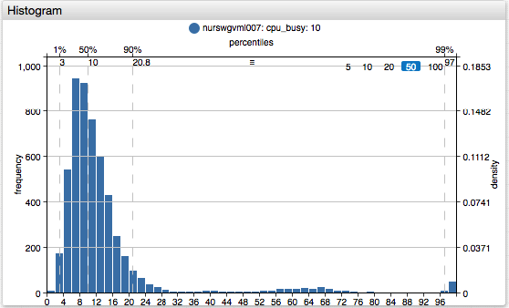
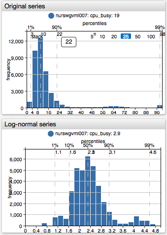
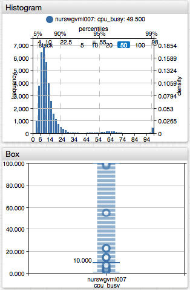

# Histogram Chart

## Overview

The **Histogram Chart** shows the distribution of samples recorded within the specified timespan using percentiles, frequencies, and density.

```ls
[widget]
  type = histogram

  top-axis = percentiles
  right-axis = density

  [series]
    entity = nurswgvml007
    metric = cpu_busy
```



[](https://apps.axibase.com/chartlab/02fbfe04/3/)

## Widget Settings

* The settings apply to the `[widget]` section.
* [Common](../shared/README.md#widget-settings) `[widget]` settings are inherited.

Name | Description | &nbsp;
:--|:--|:--
<a name="mode"></a>[`mode`](#mode)| Add frequencies from multiple series.<br>Possible values: `stack`, `none`.<br>**Example**: `mode = stack`|[↗](https://apps.axibase.com/chartlab/828a5b0a/3/)
<a name="bar-count"></a>[`bar-count`](#bar-count)|Number of bars in which to group loaded samples.<br>Default value: `50`.<br>**Example**: `bar-count = 20`|[↗](https://apps.axibase.com/chartlab/828a5b0a/4/)

### Axis Settings

Name | Description | &nbsp;
:--|:--|:--
<a name="left-axis"></a>[`left-axis`](#left-axis)|Value statistics displayed on the **left** axis.<br>Possible values:<br>`frequency` - The height of each bar is equal to the number of samples in the bar range.<br>`density` - The height of each bar is equal to the number of samples in the bar range divided by the total number of samples. The sum of all densities is `1`.<br>`none` - No scaling applied.<br>Default value: `frequency`.<br>**Example**: `left-axis = frequency`|[↗](https://apps.axibase.com/chartlab/77a75ae6/2/)
<a name="right-axis"></a>[`right-axis`](#right-axis)|Value statistics displayed on the **right** axis. Same as left axis.<br>Default value: `none`.<br>**Example**: `right-axis = density`|[↗](https://apps.axibase.com/chartlab/77a75ae6/3/)
<a name="top-axis"></a>[`top-axis`](#top-axis)|Value statistics displayed on the **top** axis.<br>Possible values: `none`, `percentiles`, `values`.<br>Default value: `none`.<br>**Example**: `top-axis = percentiles`|[↗](https://apps.axibase.com/chartlab/77a75ae6/4/)
<a name="bottom-axis"></a>[`bottom-axis`](#bottom-axis)|Value statistics displayed on the **bottom** axis.<br>Possible values: `none`, `percentiles`, `values`.<br>Default value: `values`.<br>**Example**: `bottom-axis = percentiles`|[↗](https://apps.axibase.com/chartlab/77a75ae6/4/)
<a name="rotate-ticks"></a>[`rotate-ticks`](#rotate-ticks)| Rotate labels on the **bottom** axis (typically `values` axis) by `n` degrees.<br>Possible values: `0` (horizontal) and `90` (vertical).<br>Default value: `0`.<br>**Example**: `rotate-ticks = 90`|[↗](https://apps.axibase.com/chartlab/828a5b0a/2/)
<a name="range-offset"></a>[`range-offset`](#range-offset)| Offset applied to the **bottom** axis, specified in **pixels**.<br>Default value: `0`.<br>**Example**:  `range-offset = 100`| [↗](https://apps.axibase.com/chartlab/828a5b0a/5/)
<a name="percentiles"></a>[`percentiles`](#percentiles)|Percentile numbers to calculate and displayed on the top or bottom axis.<br>Markers are hidden if the space to display the value is missing.<br>Possible values: list of comma-separated numbers `(0,100]`.<br>**Example**: `percentiles = 50,75,90,95,97,99`|[↗](https://apps.axibase.com/chartlab/77a75ae6/5/)
<a name="vertical-grid"></a>[`vertical-grid`](#vertical-grid)|Display a vertical line corresponding to each percentile or bar range.<br>Possible values: `none`, `percentiles`, `values`.<br>Default value: `percentiles`.<br>**Example**: `vertical-grid = percentiles`|[↗](https://apps.axibase.com/chartlab/77a75ae6/6/)
<a name="horizontal-grid"></a>[`horizontal-grid`](#horizontal-grid)|Display a horizontal line corresponding to each value on the right or left axis.<br>Possible values: `none`, `density`, `frequency`.<br>Default value: `frequency`.<br>**Example**: `horizontal-grid = frequency`|[↗](https://apps.axibase.com/chartlab/77a75ae6/7/)

## Examples

### Multiple Series


[](https://apps.axibase.com/chartlab/6f9bf2a8)

### Stacked Frequencies


[](https://apps.axibase.com/chartlab/bd60b57f)

### Log-Normal Distribution



[](https://apps.axibase.com/chartlab/6914a6db)

### Histogram and Box Charts



[](https://apps.axibase.com/chartlab/02fbfe04/2/)