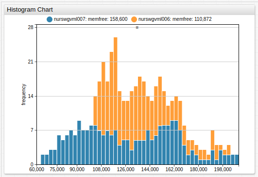
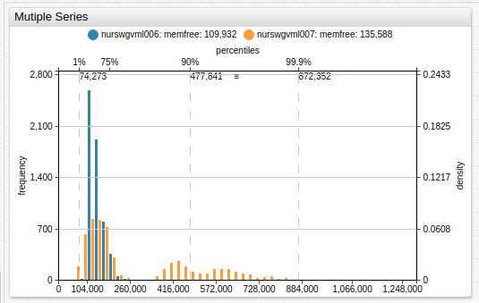
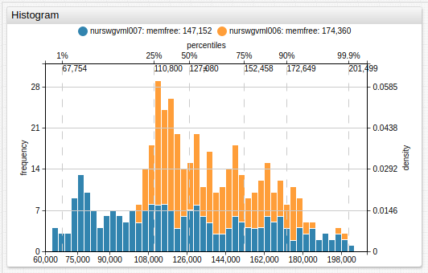

# Histogram Chart

## Overview

The **Histogram Chart** visualizes data distribution.

```ls
[widget]
  type = histogram
  mode = stack

  [series]
      metric = memfree
      entity = nurswgvml007
  [series]
      metric = memfree
      entity = nurswgvml006
```



[](https://apps.axibase.com/chartlab/dc9b8198)

## Widget Settings

* The settings apply to the `[widget]` section.
* [Shared](../shared/README.md#widget-settings) `[widget]` settings are inherited.

Name | Example | Description | &nbsp;
:--|:--|:--|:--
[`mode`](#mode)|`mode = stack`|Histogram display mode.<br>Possible values:<br>`stack`: For multiple series, data is merged into a single data array.|[↗](https://apps.axibase.com/chartlab/3e4c1692)|
[`rotate-ticks`](#rotate-ticks)| `rotate-ticks = 90` | Rotate labels on the time axis by `n` degrees.<br>Possible values: Between `0` (horizontal) and `90` (vertical).<br>Default value: `90` (vertical).|[↗](https://apps.axibase.com/chartlab/bdb845eb)
[`bar-count`](#bar-count)|`bar-count = 20`|Number of bars in which to group or split loaded data.<br>Default value: `50`.|[↗](https://apps.axibase.com/chartlab/8165265e)|
[`left-axis`](#left-axis)|`left-axis = frequency`|Format of values displayed on the left axis.<br>Possible values:<br>`none`: No scaling applied.<br>`density`: Scales the height of the bars such that the sum of their areas is equal to `1`.<br>`fractions`: Scales the height of the bars such that the sum of their heights is equal to `1`.<br>`frequency`: Scales the height of the bars such that the height of each bar is equal to the number of observations in the series. Thus, the sum of the heights is equal to the total number of observations.<br>Default value: `frequency`.|[↗](https://apps.axibase.com/chartlab/81660bb9)|
[`right-axis`](#right-axis)|`right-axis = density`|Format of values displayed on the right axis.<br>Possible values:<br>`none`: No scaling applied.<br>`density`: Scales the height of the bars such that the sum of their areas equals `1`.<br>`fractions`: Scales the height of the bars such that the sum of their heights equals `1`.<br>`frequency`: Scales the height of the bars such that each bar height is equal to the number of observations in the series. Thus the sum of the heights is equal to the total number of observations.<br>Default value: `none`.|[↗](https://apps.axibase.com/chartlab/7f906511/4/)|
[`top-axis`](#top-axis)|`top-axis = percentiles`|Top axis ticks format.<br>Possible values: `none`, `percentiles`, `values`.<br>Default value: `none`|[↗](https://apps.axibase.com/chartlab/d0a74f21)|
[`bottom-axis`](#bottom-axis)|`bottom-axis = percentiles`|Bottom axis ticks format.<br>Possible values: `none`, `percentiles`, `values`.<br>Default value: `values`|[↗](https://apps.axibase.com/chartlab/7d35910f)|
[`percentiles`](#percentiles)|`percentiles = 1, 10, 50, 90, 99.9`|Percentiles displayed when `top-axis` or `bottom-axis = percentiles`.<br>Separate percentiles with commas.<br>Possible values: Between `0` and `100`.|[↗](https://apps.axibase.com/chartlab/7f906511/7/)|
[`vertical-grid`](#vertical-grid)|`vertical-grid = percentiles`|Display a vertical line corresponding to each percentile on the top axis.<br>Possible values: `none`, `percentiles`.<br>Default value: `none`|[↗](https://apps.axibase.com/chartlab/7f906511/8/)|
[`horizontal-grid`](#horizontal-grid)|`horizontal-grid = frequency`|Display a horizontal line corresponding to each value on the right or left axis.<br>Possible values: `none`, `density`, `fractions`, `frequency`.<br>Default value: `frequency`|[↗](https://apps.axibase.com/chartlab/7f906511/9/)|

## Examples

### Multiple Series



[](https://apps.axibase.com/chartlab/34733f85)

### Advanced Configuration Example



[](https://apps.axibase.com/chartlab/5f79628e)