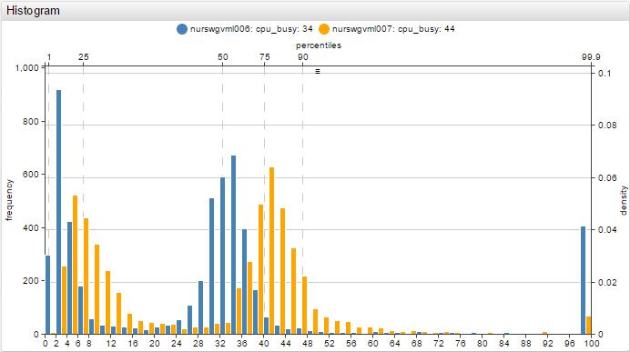

# Histogram Chart


Histogram charts visualize data distribution.

## Syntax

Histogram Charts support [Shared Widget](../shared/README.md) syntax.

### `[widget]` Settings

|Setting |Syntax |Description |Example |
|--- |--- |--- |--- |
|Mode|`mode = stack`|If `mode = stack` with multiple series configured, data is merged from all series into one data array.<br>If mode is not set to stack, each series of the histogram is displayed separately.|[](https://apps.axibase.com/chartlab/7f906511)|
|Bar Count|`bar-count = 20`|Number of bars or distributions.<br>Default value: `50`.<br>Alternatively control bar count from mouseover menu in the upper right corner of the widget.|[](https://apps.axibase.com/chartlab/7f906511/2/)|
|Left Axis|`left-axis = frequency`|Values displayed on the left-axis.<br>Possible values: `none`, `density`, `fraction`, `frequency`.<br>Default value: `frequency`.<br>`density`: Scales the height of the bars such that the sum of their areas equals `1`.<br>`fractions`: Scales the height of the bars such that the sum of their heights equals `1`.<br>`frequency`: Scales the height of the bars such that each bar height is equal to the number of observations in the series. Thus, the sum of the heights is equal to the total number of observations.|[](https://apps.axibase.com/chartlab/7f906511/3/)|
|Right Axis|`right-axis = density`|Values displayed on the right-axis.<br>Possible values: `none`, `density`, `fraction`, `frequency`.<br>Default value: `none`.<br>`density`: Scales the height of the bars such that the sum of their areas equals `1`.<br>`fractions`: Scales the height of the bars such that the sum of their heights equals `1`.<br>`frequency`: Scales the height of the bars such that each bar height is equal to the number of observations in the series. Thus the sum of the heights is equal to the total number of observations.|[](https://apps.axibase.com/chartlab/7f906511/4/)|
|Top Axis|`top-axis = percentiles`|Values displayed on the top axis.<br>Possible values: `none`, `percentiles`, `values`.<br>Default value: `none`|[](https://apps.axibase.com/chartlab/7f906511/14/)|
|Bottom Axis|`bottom-axis = percentiles`|Values displayed on the bottom axis.<br>Possible values: `none`, `percentiles`, `values`. Default value: `values`|[](https://apps.axibase.com/chartlab/7f906511/15/)|
|Percentiles|`percentiles = 1, 10, 50, 90, 99.9`|Percentiles displayed when `top-axis = percentiles`.<br>Multiple percentiles must be separated with commas.|[](https://apps.axibase.com/chartlab/7f906511/7/)|
|Vertical Grid|`vertical-grid = percentiles`|Display a vertical line corresponding to each percentile on the top axis.<br>Possible values: `none`, `percentiles`. Default value: `none`|[](https://apps.axibase.com/chartlab/7f906511/8/)|
|Horizontal Grid|`horizontal-grid = frequency`|Display a horizontal line corresponding to each value on the right or left axis.<br>Possible values: `none`, `density`, `fractions`, `frequency`.<br>Default value: `frequency`|[](https://apps.axibase.com/chartlab/7f906511/9/)|
|Minimum and Maximum Range|`min-range = 20``max-range = 90`|Set the minimum and maximum range of the `x` axis.If value is outside the set maximum or minimum range then it is added to the maximum or minimum bucket in the visible range.|[](https://apps.axibase.com/chartlab/7f906511/10/)|
|Force Minimum and Maximum Range|`min-range-force = 20``max-range-force = 90`|Set the strict minimum and maximum range of the `x` axis.|[](https://apps.axibase.com/chartlab/7f906511/11/)|
|Range Offset|`range-offset = 50`|Adds an offset to the left and right of the dataset, set in pixels.<br>Inactive by default. |[](https://apps.axibase.com/chartlab/394e80a5)|

### `[series]` Settings

Settings inherited from [Shared Widget `[series]` Syntax](../shared/README.md): `entity`, `metric`, `type`, `interval`, `style`, `color`, `label`, `tooltip`, `display`, `hidden`, `refresh-interval`, `retry-refresh-interval`, `error-refresh-interval`.

### `display` Setting

#### Filter series based on a time lag

```ls
display = this.lastRequestTime - this.last.t < 60*200
```


[](https://apps.axibase.com/chartlab/650b1692/1)

#### Sort top two series by value

```ls
display = value >= top(2)
```


[](https://apps.axibase.com/chartlab/650b1692/2)

#### Filter series with value greater than `10`

```ls
display = value < 10
```


[](https://apps.axibase.com/chartlab/650b1692/3)

### Examples

#### Stacked Histogram

```ls
mode = stack
```


[](https://apps.axibase.com/chartlab/71546547/2/)

#### Multiple Series

```ls
[series]
    entity = nurswgvml006
    metric = cpu_busy
[series]
    entity = nurswgvml007
    metric = cpu_busy
```



[](https://apps.axibase.com/chartlab/71546547/3/)