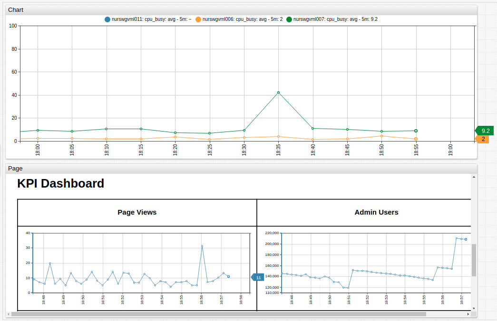

# Page Widget

## Syntax

### `[widget]` Settings

Setting | Syntax | Description
--|--|--
Alert Disable | `disable-alert = true` | Cancel alerts raised by the loaded page. Default value: `false`.
Fit `svg` | `fig-svg = true` | Zooms and positions a user-loaded `svg` file in the center of the widget. Default value: `false`.
Zoom `svg` | `zoom-svg = 1.2` | Zoom the user-loaded `svg` file. Possible values: `0` to any positive integer.
Unscale | `unscale = .event, .location` | `CSS Selector` to determine unscaled elements in a user-loaded `svg` file. Default value: `.event`
Scale | `scale = 0.8` | Scales the width and height of the target page. Value is the factor by which the page scales.

## Examples

### Chart and Page Widgets

