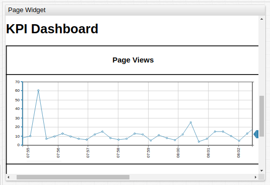
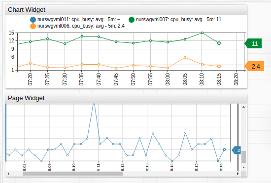

# Page Widget

## Overview

The **Page Widget** displays the contents of an external page in a **ChartLab** portal.

```ls
[widget]
  type = page
  url = https://apps.axibase.com/embedded/
```



[](https://apps.axibase.com/chartlab/60d336ab)

## Widget Settings

* The settings apply to the `[widget]` section.
* [Common](../shared/README.md#widget-settings) `[widget]` settings are inherited.

Name | Description | &nbsp;
:--|:--|:--
<a name="disable-alert"></a>[`disable-alert`](#disable-alert) | Cancel alerts raised by the loaded page.<br>Possible values: `false`, `true`.<br>Default value: `false`.<br>**Example**: `disable-alert = true` | [↗](https://apps.axibase.com/chartlab/6614f160)
<a name="scale"></a>[`scale`](#scale)| Scale the width and height of the target page.<br>Value is the factor by which the page scales.<br>Default value: `1.0`.<br>**Example**: `scale = 0.8`| [↗](https://apps.axibase.com/chartlab/e7c910e2)

## Examples

### Chart and Page Widgets



[](https://apps.axibase.com/chartlab/3d0640c8)