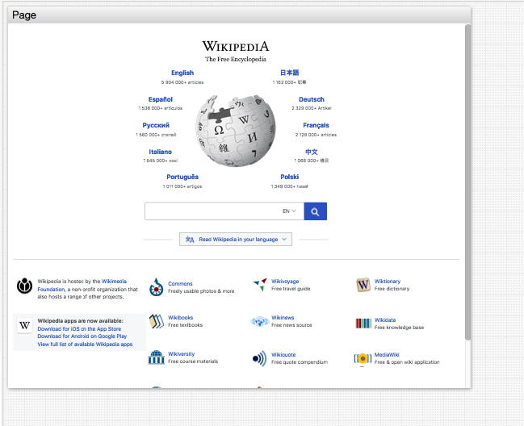
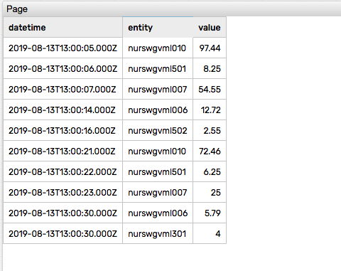

# Page Widget

## Overview

The **Page Widget** displays the contents of an external page inside the widget area.

```ls
[widget]
  type = page
  url = https://wikipedia.org/
```



## Widget Settings

* The settings apply to the `[widget]` section.
* [Common](../shared/README.md#widget-settings) `[widget]` settings are inherited.

Name | Description | &nbsp;
:--|:--|:--
<a name="url"></a>[`url`](#url) | URL of the external page.<br>**Example**: `url = https://axibase.com/` | [↗](https://apps.axibase.com/chartlab/6614f160)
<a name="disable-alert"></a>[`disable-alert`](#disable-alert) | Cancel JavaScript alerts raised by the external page.<br>Possible values: `false`, `true`.<br>Default value: `false`.<br>**Example**: `disable-alert = true` | [↗](https://apps.axibase.com/chartlab/6614f160)
<a name="scale"></a>[`scale`](#scale)| Scale the dimensions of the target page by the specified factor.<br>Default value: `1.0`.<br>**Example**: `scale = 0.8`| [↗](https://apps.axibase.com/chartlab/e7c910e2)

## Examples

### Any Site

```ls
[widget]
  type = page
  url = https://wikipedia.org
  scale = 0.50
```


[](https://apps.axibase.com/chartlab/a5a35961/2/)

### SQL Query

```ls
[widget]
  type = page
  #url = https://atsd.example.org/sql/preview?sql=...
  url = /sql/preview?sql=@{encodeURIComponent(query)}
  #url = /sql/preview?sql=SELECT datetime, entity, value FROM cpu_busy WHERE datetime > current_hour ORDER BY datetime LIMIT 10
```

> The link to query results in HTML format can be generated on the **SQL > Console** page.



[](https://apps.axibase.com/chartlab/a5a35961)
