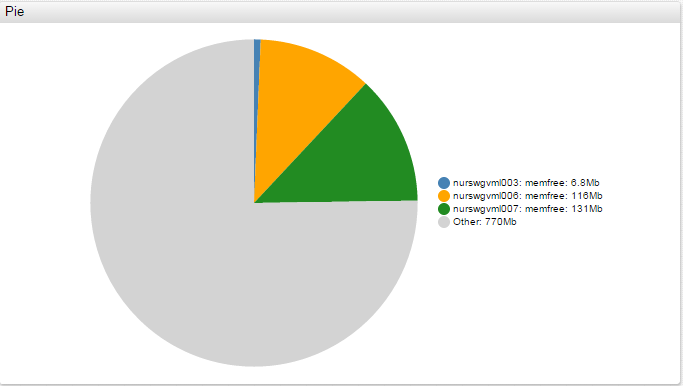

# Pie Chart


## Overview

Pie Chart illustrates numerical proportions between series values and their total value.

## Syntax

Pie Charts support [Shared Widget](../shared/README.md) syntax.

Pie Charts include unique behavior upon clicking a segment of the visualization:

* Single-Click: Opens a dialog window with a [time chart](../time-chart/README.md) for the series.
* Double-Click: Expand or collapse the selected pie segment.

> Control initial segment position with the `expand` setting.

### `[widget]` Settings

<!-- markdownlint-disable MD102 -->

Setting|Syntax|Description|Example
--|--|--|--
|Mode|`mode = ring`|Display a ring instead of circle.<br>Possible values: `pie`, `ring`.<br>Default value: `pie`|[](https://apps.axibase.com/chartlab/7111ece6/9/)|
|Total Value|`total-value = 1024` `total-value = value('007-root') + value('006-root')`|Define the total value explicitly, otherwise it is computed as the sum of all series values.<br>`total-value` can be calculated by referencing other series similar to computed series.|[](https://apps.axibase.com/chartlab/7111ece6/3/)<br>[](https://apps.axibase.com/chartlab/61665be7)|
|Expand|`expand = true`|Set under either `[widget]` or `[series]` settings.<br>Expand all segments or an individual segment.<br> Possible values: `true`, `false`.<br>Double-click modifies `expand` setting interactively.|[](https://apps.axibase.com/chartlab/e670a008/2/)|
|Selector Mode|`selector-mode = highlight`|Controls how pie segments react to click interaction. Possible Settings: highlight, expand. Highlight – double click highlights the selected pie segment, other segments are greyed out. Expand – double click expands the selected pie segment.|[](https://apps.axibase.com/chartlab/535a6aec)|
|Series Double Click|`on-series-double-click = ''`|Disable [double click functionality](#syntax) in the widget.|[](https://apps.axibase.com/chartlab/89dce57d)|

<!-- markdownlint-enable MD102 -->

### `[series]` Settings

Inherited settings from [Shared Widget Syntax](../shared/README.md): `entity`, `metric`, `style`, `color`, `label`, `tooltip`, `format`, `display`, `hidden`, `refresh-interval`, `retry-refresh-interval`, `error-refresh-interval`.

Setting|Syntax|Description|Example
--|--|--|--
|Series Labels|`series-labels = inside`<br>`series-labels = outside`<br>`series-labels = connected`<br>`series-labels = value >= 2000000 ? 'connected' : 'auto'`|Display values for each pie slice (series) as a tick.<br>Possible settings: `inside`, `outside`, `connected`, `auto`, `none`<br>Default value: `none`<br>Set to an expression that changes the label type depending on series value.|[](https://apps.axibase.com/chartlab/9e04b681)[](https://apps.axibase.com/chartlab/7111ece6/13/)|

### Icon and Caption Settings

Apply icons and captions to series when Pie Chart mode is set to [`ring`](#widget-settings).

Setting|Syntax|Description|Example
--|--|--|--
|Icon|`icon = public/img/svg/linear/users.svg`<br>`icon = alerts_color_07`<br>`icon = alerts-color-07`|Display an `.svg` icon in chart ring.<br>Path to custom icons must be defined.<br>The icon directory is `/opt/atsd/atsd/conf/portal/img/` in ATSD.<br>ATSD includes a built-in collection of icons.<br>Built-in icons are referenced by name, without the full path.<br>See the [Icon Reference Sheet.](resources/atsd-embedded-icons.pdf) for available icons.<br>Substitute underscores (`_`) in built-in icon names with dashes(`-`):<br>`icon = alerts_color_07`<br>`icon = alerts-color-07`|[](https://apps.axibase.com/chartlab/91065173/4/)[](https://apps.axibase.com/chartlab/91065173/6/)|
|Icon Alert Expression|`icon-alert-expression = value('s1') > 10`|Apply alert rules to the icon.|[](https://apps.axibase.com/chartlab/41a759f9)|
|Icon Alert Style|`icon-alert-style = return alert > 12000 ? 'fill: red' : 'fill:green';`|Apply styles to the icon when the `alert-expression` is satisfied.|[](https://apps.axibase.com/chartlab/41a759f9)|
|Caption|`caption = Administrative Users`|Display a caption below the icon.|[](https://apps.axibase.com/chartlab/56400dee)|
|Caption Style|`caption-style = font-size: 64px; font-weight: bold; fill: silver;`|Apply a style to the caption.|[](https://apps.axibase.com/chartlab/56400dee/2/)|
|Minimum Font Size|`min-font-size`|Minimum caption font size.<br>Font size cannot scale below set size.|[](https://apps.axibase.com/chartlab/91065173/3/)|
|Maximum Font Size|`max-font-size`|Maximum caption font size.<br>Font size cannot scale above set size.|[](https://apps.axibase.com/chartlab/91065173/3/)|

### `[other]` Settings

Setting|Syntax|Description|Example
--|--|--|--
|Display|`display = false`|Display the difference between `total-value` and `sum` of visible series values.<br>If `total-value` is defined, but `[other]` tag is missing, `[other]` section is not displayed.<br>Default: `true`|[](https://apps.axibase.com/chartlab/7111ece6/4/)|
|Label|`label = Unmonitored memory`|Label of the `[other]` section.<br>Default: `Other`|[](https://apps.axibase.com/chartlab/ae9927ad/2/)|
|Tooltip|`tooltip = Unmonitored memory (HMC disabled)`|Tooltip for the `[other]` section displayed upon mouseover.<br>Default: `Other`|[](https://apps.axibase.com/chartlab/ae9927ad/2/)|
|Color|`color = silver`|Color of the `[other]` section.<br>Default: `lightgray`|[](https://apps.axibase.com/chartlab/ae9927ad/2/)|

## Examples

### Configuration

```css
[widget]
  type = pie
  timespan = 15 minute
  format = kilobytes

  [series]
    entity = nurswgvml010
    metric = memfree

  [series]
    entity = nurswgvml006
    metric = memfree

  [series]
    entity = nurswgvml007
    metric = memfree
```


[](https://apps.axibase.com/chartlab/7111ece6/2/)

### Ring Icons

```css
[widget]
  type = pie
  mode = ring
  ring-width = 50

[series]
  label = Admin Users
```


[](https://apps.axibase.com/chartlab/2ffc3aff/3/)

### Series Labels

```css
[widget]
  series-labels = value >= 2000000 ? 'connected' : 'auto'
```


[](https://apps.axibase.com/chartlab/01a92e22)

### Pie

```css
[widget]
  type = pie
```


[](https://apps.axibase.com/chartlab/7111ece6)

### Ring

```css
[widget]
  type = pie
  mode = ring
```


[](https://apps.axibase.com/chartlab/7111ece6/9)

### Alert

```css
[widget]
  alert-expression = value < 3*1024*1024
  alert-style = fill: red
```


[](https://apps.axibase.com/chartlab/7111ece6/10)

### Total and Other

```css
[widget]
  total-value = 1048576

[other]
  display = true
```



[](https://apps.axibase.com/chartlab/837064f0)

### Hidden Other Segment

```css
[widget]
total-value = 1048576
```


[](https://apps.axibase.com/chartlab/aaca8e62/2/)