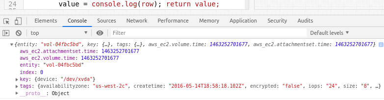

# Property Table

## Overview

The **Property Table** displays [properties](https://axibase.com/docs/atsd/schema.html#properties) collected by an entity in tabular format.

```ls
[widget]
  type = property
  expand-tags = true
  timespan = all

  [property]
    type = configuration
    entity = nurswgvml007
```


[](https://apps.axibase.com/chartlab/f7c2337f)

## Widget Settings

* The settings apply to the `[widget]` section.
* [Common](../shared/README.md#widget-settings) `[widget]` settings are inherited.
* [Common Table](../shared-table/README.md#widget-settings) `[widget]` settings are inherited.

Name | Description | &nbsp;
:--|:--|:--
<a name="join"></a>[`join`](#join)|Join by `entity` and `type`.<br>`join = entity` joins by `entity` only.<br>Possible values: `false`, `true`, `entity`.<br>Default value: `false`.<br>**Example**: `join = true`|[↗](https://apps.axibase.com/chartlab/1e6027a6)
<a name="merge-properties"></a>[`merge-properties`](#merge-properties)|Merge tags collected with different timestamps.<br>Possible values: `false`, `true`.<br>Default value: `false`.<br>**Example**: `merge-properties = true`|[↗](https://apps.axibase.com/chartlab/b0a037b1/2)

## Column Settings

* The settings apply to the `[column]` section.
* [Common Table](../shared-table/README.md#column-settings) `[column]` settings are inherited.

Name | Description | &nbsp;
:--|:--|:--
<a name="key"></a>[`key`](#key)|Identifier to associate field of [`row`](#rows-representation) to a column.<br>**Example**: `key = iface`|[↗](https://apps.axibase.com/chartlab/c404955b)
<a name="parse-numbers"></a>[`parse-numbers`](#parse-numbers)| If `true`, column values are processed as numbers.<br>Possible values: `true`, `false`.<br>Default value: `false`.<br>**Example**: `parse-numbers = true`|[↗](https://apps.axibase.com/chartlab/a0bbeb23/3/)
<a name="hide-column"></a>[`hide-column`](#hide-column)|Hide columns based on [expression](https://axibase.com/docs/atsd/api/meta/expression.html).<br>Column is hidden when the expression is `true` or column name matches the pattern.<br>The setting is **inherited**.<br>**Example**: `hide-column = value <= 0`|[↗](https://apps.axibase.com/chartlab/0ded4531)

### Property Settings

* The settings apply to the `[property]` section.

Name | Description | &nbsp;
:--|:--|:--
<a name="type"></a>[`type`](#type)|Property type.<br>To retrieve entity tags as reserved type use [`$entity_tags`](https://axibase.com/docs/atsd/api/network/property.html#reserved-property-types).<br>**Example**: `type = nmon.command`|[↗](https://apps.axibase.com/chartlab/a7339fe1/2/)<br>[↗](https://apps.axibase.com/chartlab/d82b0257)
<a name="exact-match"></a>[`exact-match`](#exact-match)|Select only records with exactly the same key as requested in [`[keys]`](#keys-settings) section.<br>Partial match selects records with key that contains requested fields but can also include other fields.<br>Possible values: `false`, `true`.<br>Default value: `false`.<br>**Example**: `exact-match = true`|[↗](https://apps.axibase.com/chartlab/0be4101c)
<a name="limit"></a>[`limit`](#limit)|Maximum number of returned records.<br>**Example**: `limit = 10`|[↗](https://apps.axibase.com/chartlab/b24d0b4b)
<a name="last"></a>[`last`](#last)|Return only records with the update time equal to the maximum update time of matched records.<br>Possible values: `false`, `true`.<br>Default value: `false`.<br>**Example**: `last = true`|[↗](https://apps.axibase.com/chartlab/da112ba6)
<a name="offset"></a>[`offset`](#offset)|Difference, in milliseconds, between maximum update time of matched records and update time of the current record.<br>If the difference exceeds `offset`, the record is excluded from results.<br>**Example**: `offset = 6000`|[↗](https://apps.axibase.com/chartlab/4efa6cc8)
<a name="merge-properties"></a>[`merge-properties`](#merge-properties)|If `true`, query all tag values within the record.<br>If set to `false`, only tag values within the latest update are included.<br>Default: `false`.|[↗](https://apps.axibase.com/chartlab/b0a037b1/2/)

Also, refer to [Entity Filter](../shared/README.md#entity-filter).

### Keys Settings

* The settings apply to the `[keys]` section.

Name | Description | &nbsp;
:--|:--|:--
<a name="key-tag-expression"></a>[`key-tag-expression`](#key-tag-expression)|One or multiple keys specified as `key = value` pairs.<br>**Example**: `queue = qm1.to.qm3`.| [↗](https://apps.axibase.com/chartlab/74add0d7)

### Rows Representation

Table row is represented by `row` object, fields of which depend on [`join`](#join) setting.

#### join = false

Each table row matches one [property](https://axibase.com/docs/atsd/schema.html#properties) record with unique primary key: **entity+type[+key]**.

* `date`: **string** - date, when property record is created
* `entity`: **string** - entity, to which property belongs
* `index`: **number** - column index
* `key`: **object** - represents property key
* `tags`: **object** - contains property tags
* `time`: **integer** - date as timestamp
* `type`: **string** - type of property

#### join != false

To review `row` fields, use [`value = console.log(row)`](https://apps.axibase.com/chartlab/1e6027a6/2/).



## Examples

### Entity Tags


[](https://apps.axibase.com/chartlab/013e6026/2/)

### Entity Tags for Entity Group


[](https://apps.axibase.com/chartlab/09255557)

### Unix Style


[](https://apps.axibase.com/chartlab/daae97ae)
