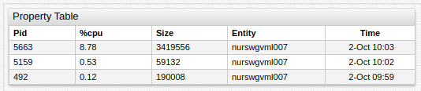
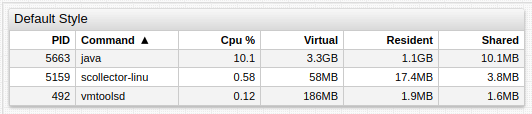

# Property Table

## Overview

The **Property Table** displays properties collected by an entity in tabular format.

```ls
[widget]
type = property

[column]
  key = pid
[column]
  key = %cpu
[column]
  key = size

  [property]
    type = process
    entity = nurswgvml007
```



[](https://apps.axibase.com/chartlab/a0e3a687)

## Widget Settings

* The settings apply to the `[widget]` section.
* [Shared](../shared/README.md#widget-settings) `[widget]` settings are inherited.
* [Shared Table](../shared-table/README.md#widget-settings) `[widget]` settings are inherited.
* By default, the **Property Table** contains `entity` and `time` columns.

Name | Example | Description | &nbsp;
:--|:--|:--|:--
<a name="join"></a>[`join`](#join)|`join = true`|Join by `entity` and `type`.<br>`join = entity` joins by `entity` only.<br>Possible values: `false`, `true`, `entity`.<br>Default value: `false`|[↗](https://apps.axibase.com/chartlab/74da0392)|
<a name="expand-tags"></a>[`expand-tags`](#expand-tags)|`expand-tags = true`|Show response tags as columns.<br>Useful when exact tags are unknown.|[↗](https://apps.axibase.com/chartlab/35bca3ba)|
<a name="hide-column"></a>[`hide-column`](#hide-column)|`hide-column = value <= 0||column.key.indexOf('paging') == 0`|Hide columns based on [expression](https://axibase.com/docs/atsd/api/meta/expression.html).<br>Column is hidden when the expression is `true`.|[↗](https://apps.axibase.com/chartlab/f860126d)|

## Column Settings

* The settings apply to the `[column]` section.
* [Shared Table](../shared-table/README.md#column-settings) `[column]` settings are inherited.

Name | Example | Description | &nbsp;
:--|:--|:--|:--
<a name="key"></a>[`key`](#key)|`key = iface`|Property name in server JSON response.|[↗](https://apps.axibase.com/chartlab/a37ebd8e)|
<a name="tag"></a>[`tag`](#tag)|`tag = addr`|Tag name in server JSON response.|[↗](https://apps.axibase.com/chartlab/6ee401c6)|
<a name="value"></a>[`value`](#value)|`value = value > 1.0`|Value which is writable to the JSON response property table.<br>Supported arguments: `this`, `value`, `alert`, `row`, `column`, `widget`, `el`, `rowEl`, `td`, `filter`, `dialog`, `series`.|[↗](https://apps.axibase.com/chartlab/5a79a608)|
<a name="format"></a>[`format`](#format)|`format = percent`|Formats cell using the specified [formatting functions](../../syntax/format-settings.md).|[↗](https://apps.axibase.com/chartlab/60f38f69)|
<a name="format-numbers"></a>[`format-numbers`](#format-numbers)|`format-numbers = true`|Value number formatting.<br>Possible values: `false`, `true`.<br>Default value: `true`.|[↗](https://apps.axibase.com/chartlab/b33e79ea)|
<a name="format-headers"></a>[`format-headers`](#format-headers)|`format-headers = true`|Column header formatting.<br>Possible values: `false`, `true`.<br>Default value: `true`|[↗](https://apps.axibase.com/chartlab/9b9f9f90)|

### Property Settings

* The settings apply to the `[property]` section.

Name | Example | Description | &nbsp;
:--|:--|:--|:--
<a name="type"></a>[`type`](#type)|`type = nmon.command`|Property type.<br>`$entity_tags` retrieves entity tags.| [↗](https://apps.axibase.com/chartlab/194ca582)
<a name="exact-match"></a>[`exact-match`](#exact-match)|`exact-match = true`|Select only records with exactly the same key as requested in [`[keys]`](#keys-settings) section.<br>Possible values: `false`, `true`.<br>Default value: `false`.<br>Partial match selects records with key that contains requested fields but can also include other fields.|↗
<a name="keys-tag-expression"></a>[`key-tag-expression`](#keys-manager)|`keys.manager = 'MGR01' AND tags.queue LIKE 'qm1.*'`|Expression for matching properties with specified keys and tags.<br>Keys are accessed with `keys.{key-name}` and tags with `tags.{tag-name}`.|↗
<a name="limit"></a>[`limit`](#limit)|`limit = 10`|Maximum number of returned records.|[↗](https://apps.axibase.com/chartlab/7cc3c6cc)
<a name="last"></a>[`last`](#last)|`last = true`|Return only records with the update time equal to the maximum update time of matched records.<br>Possible values: `false`, `true`.<br>Default value: `false`.|[↗](https://apps.axibase.com/chartlab/11f2baf7)
<a name="offset"></a>[`offset`](#offset)|`offset = 6000`|Difference, in milliseconds, between maximum update time of matched records and update time of the current record.<br>If the difference exceeds `offset`, the record is excluded from results.|[↗](https://apps.axibase.com/chartlab/7c7de881)
<a name="tag-offset"></a>[`tag-offset`](#tag-offset)|`tag-offset = 15000`|Difference, in milliseconds, between update time of the current record and update time of the tag field.<br>If the difference exceeds `tag-offset`, the tag field is excluded from tags object.|↗

### Keys Settings

* The settings apply to the `[keys]` section.

Name | Example | Description | &nbsp;
:--|:--|:--|:--
<a name="name"></a>[`name`](#name)|`queue = qm1.to.qm3`|One or multiple keys specified as `name = value` pairs.|↗

## Examples

### Entity Tags for Entity Group


[](https://apps.axibase.com/chartlab/09255557)

### Default Style



[](https://apps.axibase.com/chartlab/fc06d6f0)

### Unix Style


[](https://apps.axibase.com/chartlab/a1b538a8)
