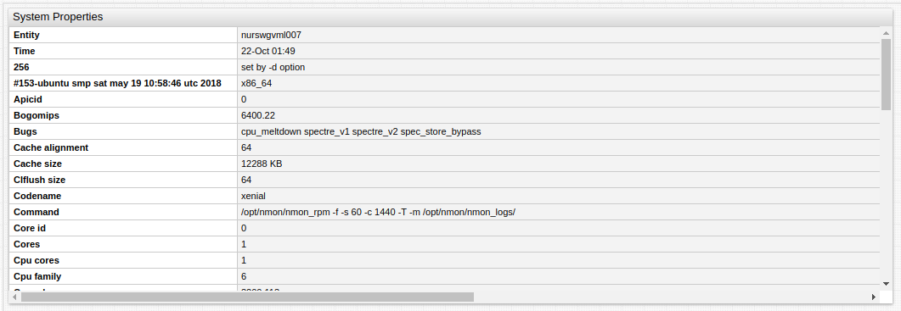
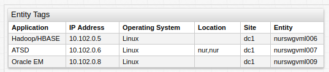
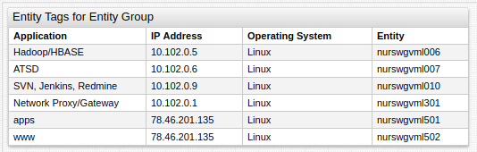
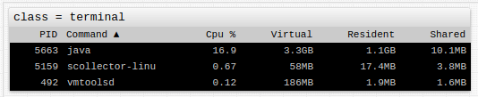

# Property Table

## Overview

The **Property Table** displays properties collected by an entity in tabular format.

```ls
[configuration]
  height-units = 2
  width-units = 1

[group]
[widget]
  type = property
  expand-tags = true
  timespan = all
  transpose = true

  [property]
    type = configuration
    entity = nurswgvml007
```



[](https://apps.axibase.com/chartlab/f7c2337f)

## Widget Settings

* The settings apply to the `[widget]` section.
* [Common](../shared/README.md#widget-settings) `[widget]` settings are inherited.
* [Common Table](../shared-table/README.md#widget-settings) `[widget]` settings are inherited.
* By default, the **Property Table** contains `entity` and `time` columns.

Name | Description | &nbsp;
:--|:--|:--
<a name="join"></a>[`join`](#join)|Join by `entity` and `type`.<br>`join = entity` joins by `entity` only.<br>Possible values: `false`, `true`, `entity`.<br>Default value: `false`.<br>**Example**: `join = true`|[↗](https://apps.axibase.com/chartlab/1e6027a6)
<a name="expand-tags"></a>[`expand-tags`](#expand-tags)|Show tags in response as columns.<br>Useful when exact tags are unknown.<br>**Example**: `expand-tags = true`|[↗](https://apps.axibase.com/chartlab/90412013)
<a name="hide-column"></a>[`hide-column`](#hide-column)|Hide columns based on [expression](https://axibase.com/docs/atsd/api/meta/expression.html).<br>Column is hidden when the expression is `true` or column name matches the pattern.<br>**Example**: `hide-column = value <= 0`|[↗](https://apps.axibase.com/chartlab/0ded4531)

## Column Settings

* The settings apply to the `[column]` section.
* [Common Table](../shared-table/README.md#column-settings) `[column]` settings are inherited.

Name | Description | &nbsp;
:--|:--|:--
<a name="key"></a>[`key`](#key)|Name of property in JSON received from the server.<br>**Example**: `key = iface`|[↗](https://apps.axibase.com/chartlab/c404955b)
<a name="format-numbers"></a>[`format-numbers`](#format-numbers)|Number formatting (thousand separator).<br>Possible values: `false`, `true`.<br>Default value: `true`.<br>**Example**: `format-numbers = true`|[↗](https://apps.axibase.com/chartlab/a0bbeb23)
<a name="format-headers"></a>[`format-headers`](#format-headers)|Column header formatting.<br>Possible values: `false`, `true`.<br>Default value: `true`.<br>**Example**: `format-headers = true`|[↗](https://apps.axibase.com/chartlab/62618861)

### Property Settings

* The settings apply to the `[property]` section.

Name | Description | &nbsp;
:--|:--|:--
<a name="type"></a>[`type`](#type)|Property type.<br>`$entity_tags` retrieves entity tags.<br>**Example**: `type = nmon.command`| [↗](https://apps.axibase.com/chartlab/d82b0257)
<a name="exact-match"></a>[`exact-match`](#exact-match)|Select only records with exactly the same key as requested in [`[keys]`](#keys-settings) section.<br>Partial match selects records with key that contains requested fields but can also include other fields.<br>Possible values: `false`, `true`.<br>Default value: `false`.<br>**Example**: `exact-match = true`|[↗](https://apps.axibase.com/chartlab/0be4101c)
<a name="limit"></a>[`limit`](#limit)|Maximum number of returned records.<br>**Example**: `limit = 10`|[↗](https://apps.axibase.com/chartlab/b24d0b4b)
<a name="last"></a>[`last`](#last)|Return only records with the update time equal to the maximum update time of matched records.<br>Possible values: `false`, `true`.<br>Default value: `false`.<br>**Example**: `last = true`|[↗](https://apps.axibase.com/chartlab/da112ba6)
<a name="offset"></a>[`offset`](#offset)|Difference, in milliseconds, between maximum update time of matched records and update time of the current record.<br>If the difference exceeds `offset`, the record is excluded from results.<br>**Example**: `offset = 6000`|[↗](https://apps.axibase.com/chartlab/4efa6cc8)

### Keys Settings

* The settings apply to the `[keys]` section.

Name | Description | &nbsp;
:--|:--|:--
<a name="key-tag-expression"></a>[`key-tag-expression`](#key-tag-expression)|One or multiple keys specified as `key = value` pairs.<br>**Example**: `queue = qm1.to.qm3`.| [↗](https://apps.axibase.com/chartlab/74add0d7)

## Examples

### Entity Tags



[](https://apps.axibase.com/chartlab/013e6026/2/)

### Entity Tags for Entity Group



[](https://apps.axibase.com/chartlab/09255557)

### Unix Style



[](https://apps.axibase.com/chartlab/daae97ae)
