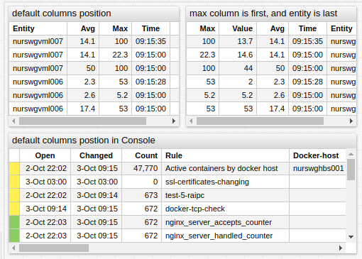

# Common Table Settings

## Overview

The **Common Table Settings** are inherited by [Table](../series-table/README.md), [Property](../property-table/README.md), and [Console](../alert-table/README.md) widgets.

## Widget Settings

* The settings apply to the `[widget]` section.

Name | Description | &nbsp;
:--|:--|:--
<a name="expand-tags"></a>[`expand-tags`](#expand-tags)| Automatically create columns for all tags in the received records.<br>Possible values: `false`, `true`.<br>Default: `false`.<br>**Example**: `expand-tags = true`| [↗](https://apps.axibase.com/chartlab/220498ff/4/)
<a name="columns"></a>[`columns`](#columns)| Add multiple columns by key.<br>**Example**: `columns = command`| [↗](https://apps.axibase.com/chartlab/d7c8ed94/2/)
<a name="sort"></a>[`sort`](#sort)| Sort table rows by column value using descending (`DESC`) or ascending (`ASC`) order.<br>All columns in the `property` and `console` widgets are sorted as text.<br>**Example**: `sort = memfree DESC`| [↗](https://apps.axibase.com/chartlab/d7c8ed94/3/)
<a name="transpose"></a>[`transpose`](#transpose)| Transpose table rows.<br>Possible values: `false`, `true`.<br>Default: `false`.<br>**Example**: `transpose = true`| [↗](https://apps.axibase.com/chartlab/fe7940e7)
<a name="show-tag-names"></a>[`show-tag-names`](#show-tag-names)| Display tag names in the `tags` column, if defined.<br>Possible values: `false`, `true`.<br>Default value: `false`.<br>**Example**: `show-tag-names = true`| [↗](https://apps.axibase.com/chartlab/4afb9290/3/)
<a name="display-tags"></a>[`display-tags`](#display-tags)| Enumerate specific tags displayed in the `tags` column.<br>Possible values: `tag name`.<br>**Example**: `display-tags = mount_point`| [↗](https://apps.axibase.com/chartlab/220498ff/3/)
<a name="format-headers"></a>[`format-headers`](#format-headers)| Format column headers.<br>Possible values: `true`, `false`.<br>Default value: `true`.<br>**Example**: `format-headers = true`| [↗](https://apps.axibase.com/chartlab/47565e08/2/)

### Style and Layout Settings

* The settings apply to the `[widget]` section.

Name | Description | &nbsp;
:--|:--|:--
<a name="class"></a>[`class`](#class)| Table class.<br>Possible settings: `terminal`.<br>**Example**: `class = terminal` | [↗](https://apps.axibase.com/chartlab/a535ad11)
<a name="responsive"></a>[`responsive`](#responsive)| Adjust font size based on widget dimensions.<br>Possible values: `false`, `true`.<br>Default value: `true`.<br>**Example**: `responsive = false`| [↗](https://apps.axibase.com/chartlab/c862e097)
<a name="table-header-style"></a>[`table-header-style`](#table-header-style)| Table header CSS style.<br>Hide table header with `table-header-style = display: none`.<br>**Example**: `table-header-style = font: 24 px`| [↗](https://apps.axibase.com/chartlab/1a277cd8)
<a name="header-style"></a>[`header-style`](#header-style)| Widget header CSS style.<br>Hide widget header with `header-style = display: none`.<br>**Example**: `background-color: steelblue`| [↗](https://apps.axibase.com/chartlab/343efa22)
<a name="auto-height"></a>[`auto-height`](#auto-height)| Assign row height based on vertical space allocated to the widget and number of rows.<br>Possible values: `false`, `true`.<br>Default: `false`.<br>**Example**: `auto-height = true`| [↗](https://apps.axibase.com/chartlab/8cef1677)
<a name="font-scale"></a>[`font-scale`](#font-scale)| Ratio of font height to row height when `auto-height = true`.<br>Minimum row height is `10px`, maximum row height is `64px`.<br>Default: `0.5`.<br>**Example**: `font-scale = 0.7`| [↗](https://apps.axibase.com/chartlab/ed4d8748)

:::tip

To increase font size for all table widgets in the portal, add the [global style](https://apps.axibase.com/chartlab/14318c01).

```javascript
script = $('<style>.axi-table-cell {font-size: 20px} </style>').appendTo('head')
```

:::

### Column Settings

* The settings apply to the `[column]` section.

Name | Description | &nbsp;
:--|:--|:--
<a name="key"></a>[`key`](#key)|Identifier to associate field of [`row`] object(#row-object) to a column.<br>**Example**: `key = pid`| [↗](https://apps.axibase.com/chartlab/79cde58f)
<a name="tag"></a>[`tag`](#tag)|Identifier to associate a tag to a column.<br>**Example**: `tag = file_system`|[↗](https://apps.axibase.com/chartlab/f9ddebdb/2/)
<a name="label"></a>[`label`](#label)| Customized column name displayed in the table header.<br>**Example**: `label = Server`| [↗](https://apps.axibase.com/chartlab/95bd95be/8/)
<a name="format"></a>[`format`](#format)|Cell value [format](../../syntax/format-settings.md).<br>The setting is **inherited**.<br>**Examples**: `format = kilobytes`|[↗](https://apps.axibase.com/chartlab/95bd95be/8/)
<a name="tooltip"></a>[`tooltip`](#tooltip)|Text displayed on header mouseover.<br>**Example**: `tooltip = CPU Usage`|[↗](https://apps.axibase.com/chartlab/95bd95be/9/)
<a name="style"></a>[`style`](#style)|CSS style applied to column values.<br>**Examples**: `style = color: red` |[↗](https://apps.axibase.com/chartlab/95bd95be/23/)
<a name="row-style"></a>[`row-style`](#row-style)|CSS style applied to the entire row.<br>**Example**: `row-style = value > 10 ? 'background: orange' : null`|[↗](https://apps.axibase.com/chartlab/95bd95be/24/)
<a name="row-alert-style"></a>[`row-alert-style`](#row-alert-style)|Styles assigned to the entire row when `alert-expression` is `true`.<br>**Example**: `row-alert-style = color: red`|[↗](https://apps.axibase.com/chartlab/95bd95be/12/)
<a name="display"></a>[`display`](#display)| Controls column visibility.<br>Default value is `true`.<br>**Example**: `display = false`| [↗](https://apps.axibase.com/chartlab/95bd95be/13/)
<a name="on-click"></a>[`on-click`](#on-click)|JavaScript code click event handler for each cell.<br>The setting is **inherited**.<br>**Examples**: `onclick = filter()` |[↗](https://apps.axibase.com/chartlab/95bd95be/15/)
<a name="icon"></a>[`icon`](#icon)|Name of the icon displayed in the cell.<br>**Example**: `icon = value > 1 ? 'exclamation-sign' : 'ok'`|[↗](https://apps.axibase.com/chartlab/95bd95be/25)
<a name="position"></a>[`position`](#position)|Position of the column relative to other columns in the table.<br>**Example**: `position = first`|[↗](https://apps.axibase.com/chartlab/d77c0677/6/)
<a name="value"></a>[`value`](#value)|JavaScript expression to calculate cell value.<br>Access initial data via [`row`](#row-object) object.<br>To access column value by [`key`](#key) use [`value()`](#value) function.<br>**Example**: <br>`value = Math.log(value('value'))`<br>`value = Math.log(row.last.v)`|[↗](https://apps.axibase.com/chartlab/7c05786f/5/)

### `value()`

```javascript
value([column_key])
```

Returns value of cell referenced by `column_key`. The value is not formatted, but processed as number if [`parse-numbers = true`](../property-table/README.md#parse-numbers). To get default value for the current cell, use `value`.

```ls
[column]
  key = memtotal
  value = value / 100 # divide current value by 100

[column]
  label = Derived column
  value = value('memtotal') # get value of cell 'memtotal'
```

### Click Behavior

The `on-click` handler supports the following options:

* Filter rows

```ls
on-click = filter()
```

* Load page in dialog window

### `row` Object

Each table row is represented by `row` object.

Refer to [Series Table row](../series-table/README.md#rows-representation) and [Property Table row](../property-table/README.md#rows-representation) for information about available fields.

### `value()`

```javascript
value([string column_key])
```

Returns value of cell referenced by `column_key`. The value is not formatted, but processed as number if [`parse-numbers = true`](../property-table/README.md#parse-numbers). To get default value for the current cell, use `value` or `value()`.

```ls
on-click = callDialog({ type: 'page', url: 'https://atsd.example.org?user=' + row.tags.userid })
```

* Display chart in dialog window

```ls
onclick = var s = series(); s.metric = 'metric-2';
onclick = callDialog({ series: [s] })
```

### Column Visibility

Columns can be hidden or renamed using a convenience setting `column-{key} = null` and `column-{key} = {new-name}`. The following syntax options are equivalent.


```ls
column-time = null

[column]
  key = time
  display = false
```

```ls
column-entity = Server

[column]
  key = entity
  label = Server
```

### Column Order

Column order is determined by the order of `[column]` sections in the widget configuration.

Default widget columns have a pre-defined position, for example the `Severity` column in `Console` widget is positioned first by default.

To change the position of the default column, specify the column name explicitly in the widget configuration.



[](https://apps.axibase.com/chartlab/3c57bf69)

`[column]` settings provide the `position` setting to control the placement of the column regardless of the order in which `[column]` settings are defined in the widget. Possible values are `first`, `middle` and `last`.


[](https://apps.axibase.com/chartlab/163a8733)
