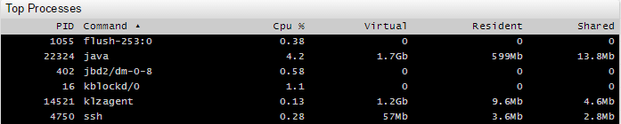

# Shared Table Syntax

## Overview

The generic table setting are inherited by Table, Property, and Console widgets.

## Syntax

### `[widget]` Settings

|Setting |Syntax |Description |Example |
|--- |--- |--- |--- |
| Responsive| `responsive = true`| Adjust font size based on widget dimensions. Font size is reduced proportionally to widget size. Default: `false`.| |
| Replace Underscore| `replace-underscore = true`| Replace underscores with whitespace in column names. Default: `false`.| |
| Capitalize| `capitalize = false`| Capitalize column names. Default: `true`.| |
| Display Tags| `display-tags = mount_point` `display-tags = file_system` `display-tags = app` `display-tags = alias`| Display a separate column for each tag in the underlying series. Default: `false`.|  |
| Show Tag Names| `show-tag-names = true`| Display all entity tags. Only valid for tables with `tag` column. Default: `false`.| |
| Sort| `sort = cpu_busy desc` `sort = memfree asc`| Sort the table by column or property. **Required**: Set sequence keys of the columns or names of the properties. Specify `DESC` after key or property name to sort in reverse order. `ASC` is used by default. For example: `sort = metric, value desc`. First column is sorted in alphabetical order, then a string with the same name of the metric is sorted according to value in descending order.| |
| Column Key| `column-entity = Entity` `column-time = Timestamp` `column-entity = null` `column-time = null` `column-metric = null` `column-value = null`| Shortcut to change column name `column-{key}=new-name` or hide it `column-{key}=null`.| |
| Columns| `columns = command`| Column keys to add new or rename existing columns.| |
| Class| `class = terminal`| Apply Unix style with black background. Possible settings: `terminal`. | |
| Transpose| `transpose = true`| Transpose rows and columns for a layout optimized for columnar presentation. Possible values: `true`, `false`. Default: `false`.| |
| Format| `format = %H:%M:%S` `format = %d/%m %H:%M:%S`| Format time values. For example when using the `min_time_value` or `max_time_value` aggregators.  See [Format Settings](../../syntax/format-settings.md) for more information.| |
| Merge Columns| `merge-columns = entity` `merge-columns = entity, tags`| Key by which columns are grouped into rows.| |
| Auto Height| `auto-height = true`| Calculate row height automatically based on vertical space allocated to the widget and the number of rows. Default: `false`| |
| font-scale| `font-scale = 0.7`| Ratio of font height to row height when `auto-height = true`. Minimum row height is `10px`, maximum row height is `64px`. Default: `0.5`| |
| Table Header Style| `table-header-style = display: none`| Custom CSS style applied to table header, including a style to hide the header.| |
| Widget Header Style| `header-style = display: none`| Custom CSS style applied to widget header, including a style to hide the widget header.| |

### `[column]` Settings

|Setting |Syntax |Description |Example |
|--- |--- |--- |--- |
|Key|`key = pid` `key = %cpu` `key = size`|**Optional** Key name. If set configuration of column can be sorted by name. If the name of the key is the property received from the server object, the value of the cell by default is the value of the property. | |
|Tag|`tag = file_system` `tag = mount_point`|**Optional** Name of tag to be displayed in its own column. Needed when an object received from the server contains property tags. Value of the cell by default is equal to the value of the tag.||
|Value|`value = row.openTime`|JavaScript code to determine the value of the cell. By default the value of the key or tag.||
|Format|`format = kilobytes` `format = ####`|Cell value [format](../../syntax/format-settings.md).||
|Label|`label = Virtual` `label = Resident` `label = PID`|Name of column displayed in the column titles. Specify as JavaScript code.||
|Tooltip|`tooltip = Process CPU Usage` `tooltip = Process ID`|Column description, displayed upon title mouseover.||
|Style|`style = text-align: left` `style = text-align: center` `style = background: orange`|Style assigned to the column. Can be specified as JavaScript code.||
|Row Style|`row-style = value > 1 ? 'background: orange' : null`|Style assigned to the entire row. Can be specified as JavaScript code.||
|Max Width Style|`style = max-width: 50%` `style = max-width: 400px`|Prevent scrolling in columns containing long text strings. Scroll bar appear when the column shrinks below the specified width. Can be set in percent or pixels. If `transpose = true`, then set `style = max-width:` in pixels.||
|[Alert Expression](../../syntax/alert-expression.md)|`alert-expression = value > 5` `alert-expression = value < 200000`|JavaScript code.  Use the returned value of the evaluation for sorting, if the column key is specified.||
|Alert Style|`alert-style = background-color: yellow` `alert-style = background-color: orange`|Styles assigned to the cell. Can be specified as JavaScript code.||
|Row Alert Style|`row-alert-style = background-color: orange`|Styles assigned to the whole row. Can be specified as JavaScript code.||
|Display|`display = false`|Hide a column. Default value is `true`.||
|Click Behavior|`onclick = var s = series({ metric: 'nmon.process.%cpu', disconnectInterval: '90 second' })` `onclick = dialog({ series: [s], disconnectValue: 0 })` `onclick = filter()`|JavaScript code click event handler for each cell. Supports `method` filter, which allows you to filter the rows in the table to the value of this cell.||
|Icon|`icon = value > 1 ? 'exclamation-sign' : 'ok'`|Name of the icon displayed in the cell. Can be specified as JavaScript code.||
|Position|`position = first`|Position of the column relative to other columns in the table.||

### Column Order

Column order is determined by the order of `[column]` sections in the widget configuration.

Default widget columns have a pre-defined position, for example the `Severity` column in `Console` widget is positioned first by default.

To change the position of the default column, specify the column name explicitly in the widget configuration.

`[column]` settings include the `position` setting to control the placement of the column regardless of the order in which `[column]` settings are defined in the widget. Possible values are `first`, `middle` and `last`.

