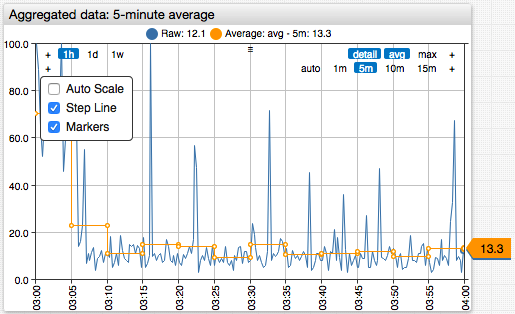

# Common Settings

## Overview

The **Common Settings** are shared settings supported by all widgets.

## Widget Settings

* The settings apply to the `[widget]` section.

Name | Description | &nbsp;
:--|:--|:--
<a name="type"></a>[`type`](#type) |Widget visualization type: [`chart`](../time-chart/README.md), [`gauge`](../gauge-chart/README.md), [`bar`](../bar-chart/README.md), [`histogram`](../histogram/README.md), [`box`](../box-chart/README.md), [`calendar`](../calendar-chart/README.md), [`treemap`](../treemap/README.md), [`pie`](../pie-chart/README.md), [`console`](../alert-table/README.md), [`property`](../property-table/README.md), [`text`](../text-widget/README.md), [`page`](../page-widget/README.md), [`graph`](../graph/README.md).<br>**Example**: `type = chart`| [↗](https://apps.axibase.com/chartlab/12d8cdf5)
<a name="title"></a>[`title`](#title) | Title displayed above chart.<br>HTML Markup is supported.<br>**Example**: `title = CPU Usage Statistics` | [↗](https://apps.axibase.com/chartlab/c91c3205)
<a name="tooltip"></a>[`tooltip`](#tooltip)| Widget description displayed on title mouseover.<br>**Example**: `tooltip = CPU Usage` | [↗](https://apps.axibase.com/chartlab/9c41753e)
<a name="widget-style"></a>[`style`](#widget-style)| Widget CSS style.<br>**Example**: `style = background-color: skyblue`| [↗](https://apps.axibase.com/chartlab/aca28019)
<a name="header-style"></a>[`header-style`](#header-style)| Widget header CSS style.<br>**Example**: `header-style = color: red`| [↗](https://apps.axibase.com/chartlab/6fa47d56)
<a name="colors"></a>[`colors`](#colors)| Comma separated list of colors applied to series shapes: lines, rectangles, or circles, depending on the widget type.<br>Possible values: [color names](https://en.wikipedia.org/wiki/Web_colors) or hex codes.<br>Default values: `steelblue`, `orange`, `forestgreen`, `blueviolet`, `maroon`, `yellowgreen`, `magenta`, `chocolate`, `deepskyblue`, `gray`.<br>Additional series are assigned colors at random.<br>**Example**: `colors = green, #cccccc`.<br>Recommended color picking tools: [`colorhexa`](https://www.colorhexa.com/ffffff-to-0c9150), [`material.io`](https://material.io/design/color/#tools-for-picking-colors), [`web colors`](https://en.wikipedia.org/wiki/Web_colors). | [↗](https://apps.axibase.com/chartlab/a2977750)

### Position and Size

Name | Description | &nbsp;
:--|:--|:--
<a name="width-units"></a>[`width-units`](#width-units)| Number of columns the widget occupies.<br>Default value: `1`.<br>**Example**: `width-units = 0.5`|[↗](https://apps.axibase.com/chartlab/1b677aa7/2/)
<a name="height-units"></a>[`height-units`](#height-units) | Number of rows the widget occupies.<br>Default value: `1`.<br>**Example**: `height-units = 2`|[↗](https://apps.axibase.com/chartlab/1b677aa7/2/)
<a name="top-units"></a>[`top-units`](#top-units) | Widget offset, in _units_, from the top page border.<br>Default value is equal to the ordinal number of its `[group]` section.<br>**Example**: `top-units = 2`|[↗](https://apps.axibase.com/chartlab/1b677aa7/3/)
<a name="left-units"></a>[`left-units`](#left-units) | Widget offset, in _units_, from the left page border.<br>Default value is equal to the ordinal number of the widget within the `[group]`.<br>**Example**: `left-units = 2`|[↗](https://apps.axibase.com/chartlab/1b677aa7/4/)

> See also [Layout Settings](../../configuration/README.md) that determine the total number of columns and rows in a grid placement.

### Data Loading

Name | Description | &nbsp;
:--|:--|:--
<a name="timespan"></a>[`timespan`](#timespan) | Data interval specified as the number of [time units](https://axibase.com/docs/atsd/api/data/series/time-unit.html).<br>When specified without `start-time` or `end-time` setting, `end-time` is `now`.<br>Format: `count time_unit`.<br>Default value: `1 hour`.<br>**Example**: `timespan = 6 hour`| [↗](https://apps.axibase.com/chartlab/a49c40a5)
<a name="start-time"></a>[`start-time`](#start-time)| Start time of interval specified in [ISO format](https://axibase.com/docs/atsd/shared/date-format.html), [calendar syntax](https://axibase.com/docs/atsd/shared/calendar.html), or local time.<br>When `start-time` is specified, either `end-time` **or** `timespan` is also required.<br>**Example**: `start-time = current_hour`| [↗](https://apps.axibase.com/chartlab/8d40e80d)
<a name="end-time"></a>[`end-time`](#end-time)| End time of interval specified in [ISO format](https://axibase.com/docs/atsd/shared/date-format.html), [calendar syntax](https://axibase.com/docs/atsd/shared/calendar.html), or local time.<br>When `end-time` is specified, either `start-time` **or** `timespan` is also required.<br>**Example**: `endtime = 2018-07-05 13:00:00`| [↗](https://apps.axibase.com/chartlab/f784e730)
<a name="timezone"></a>[`timezone`](#timezone)| Time zone for loaded data.<br>Possible values: `UTC`.<br>If `UTC` is set, `start-time` and `end-time` settings specified in local format are evaluated based on UTC time zone.<br>If `UTC` is not set, samples are displayed in the local time zone.<br>**Example**: `timezone = UTC`| [↗](https://apps.axibase.com/chartlab/01bcbf1c)
<a name="time-offset"></a>[`time-offset`](#time-offset)| Time series offset specified as the number of [time units](https://axibase.com/docs/atsd/api/data/series/time-unit.html).<br>`time-offset > 0`: Offset into the past.<br> `time-offset < 0`: Offset into the future.<br>Format: `count time_unit`.<br>**Example**: `time-offset = 3 month`| [↗](https://apps.axibase.com/chartlab/80152e9f)
<a name="series-limit"></a>[`series-limit`](#series-limit)| Maximum number of series retrieved from the database.<br>Default value: `1000`.<br>**Example**: `series-limit = 10`| [↗](https://apps.axibase.com/chartlab/60c6d82c)
<a name="limit"></a>[`limit`](#limit) | Maximum number of samples returned for each returned series.<br>Default value: `0` (not limited).<br>**Example**: `limit = 10`|[↗](https://apps.axibase.com/chartlab/ace8b96d)
<a name="cache"></a>[`cache`](#cache) | Query last values from the cache table for faster response.<br>Possible values: `false`, `true`.<br>Default value: `false`.<br>**Example**: `cache = true`| [↗](https://apps.axibase.com/chartlab/6cb1473e)
<a name="add-meta"></a>[`add-meta`](#add-meta)| Include metric and entity metadata in the response.<br>Possible values: `false`, `true`.<br>Default value: `false`.<br>**Example**: `add-meta = true`| [↗](https://apps.axibase.com/chartlab/100f5b65/3/)
<a name="filter"></a>[`filter`](#filter)| Boolean expression applied to detailed samples. Samples that satisfy the condition are included in the result. See also [`valueFilter`](https://axibase.com/docs/atsd/api/data/series/query.html#value-filter).<br>**Example**: `filter = value > 1`| [↗](https://apps.axibase.com/chartlab/0213f633)

* Supported formats for `start-time` and `end-time` settings:
  * [Calendar syntax](https://axibase.com/docs/atsd/shared/calendar.html), for example: `previous_week`.
  * [ISO format](https://axibase.com/docs/atsd/shared/date-format.html) in UTC time zone: `yyyy-MM-ddTHH:mm:ss[.S]Z`, for example: `2017-07-16T20:00:00Z`.
  * Simple format: `yyyy-MM-dd[ HH:mm:ss[.S]]` in client (browser) time zone, for example: `2017-07-16`, `2017-07-16 20:00:00`.

> See also [Control](https://axibase.com/docs/atsd/api/data/series/query.html#control-fields) fields in REST API.

### Data Update

Name | Description | &nbsp;
:--|:--|:--
<a name="update-interval"></a>[`update-interval`](#update-interval) | Interval for loading incremental data specified as the number of [time units](https://axibase.com/docs/atsd/api/data/series/time-unit.html).<br>Format: `count time_unit`.<br>Default value: `1 minute`.<br>**Example**: `update-interval = 5 minute` | [↗](https://apps.axibase.com/chartlab/724a08aa)
<a name="refresh-interval"></a>[`refresh-interval`](#refresh-interval)| Interval for including the series into the update request to load incremental data.<br>While the setting has no effect on the update frequency, set with `update-interval`, it controls which series are included in the request.<br>The interval is specified as the number of [time units](https://axibase.com/docs/atsd/api/data/series/time-unit.html).<br>Format: `count time_unit`.<br>**Example**: `refresh-interval = 5 minute` | [↗](https://apps.axibase.com/chartlab/634effc0/2/)
<a name="retry-refresh-interval"></a>[`retry-refresh-interval`](#retry-refresh-interval) | Interval for including **empty** series into the update request to load incremental data. Empty series contain no data.<br>The setting has no effect on the update frequency, set with `update-interval`, however it controls which series are included in the request.<br>The interval is specified as the number of [time units](https://axibase.com/docs/atsd/api/data/series/time-unit.html).<br>Format: `count time_unit`.<br>**Example**: `retry-refresh-interval = 5 minute` | [↗](https://apps.axibase.com/chartlab/d7e21c29)
<a name="error-refresh-interval"></a>[`error-refresh-interval`](#error-refresh-interval)| Interval for including **failed** series into the update request to load incremental data. Failed series are series for which a request to load data from server produced an error.<br>The setting has no effect on the update frequency, set with `update-interval`, however it controls which series are included in the request.<br>The interval is specified as the number of [time units](https://axibase.com/docs/atsd/api/data/series/time-unit.html).<br>Format: `count time_unit`.<br>**Example**: `error-refresh-interval = 30 minute`| [↗](https://apps.axibase.com/chartlab/48e8b5cc)
<a name="batch-update"></a>[`batch-update`](#batch-update)| Send data queries to the server in batches with size specified in `batch-size` setting.<br>Possible values: `false`, `true`.<br>If `true`, series for which the request has failed are requested separately from successfully updated series.<br>Default value: `false`.<br>**Example**: `batch-update = true`| [↗](https://apps.axibase.com/chartlab/669ac522)
<a name="batch-size"></a>[`batch-size`](#batch-size)| Maximum number of series per server batch request.<br>If `0` is specified, the limit is not set and all series are requested in one query.<br>Valid when `batch-update = true`.<br>Default value: `8`.<br>**Example**: `batch-size = 1`| [↗](https://apps.axibase.com/chartlab/4dda9f75)

> See also [Data API Endpoints](https://axibase.com/docs/atsd/api/data/#data-api-endpoints) in REST API.

### Data Source

Name | Description | &nbsp;
:--|:--|:--
<a name="url"></a>[`url`](#url)| Server URL, if different from the origin host.<br>URL for data requests is built from `{url}{context-path}{method-path}{url-parameters}`.<br>**Example**: `url = https://atsd.example.org:8443`| [↗](https://apps.axibase.com/chartlab/9cd66119)
<a name="context-path"></a>[`context-path`](#context-path)| Context path for data requests.<br>Default value: `/api/v1/`.<br>**Example**: `context-path = /api/v2/`|[↗](https://apps.axibase.com/chartlab/ccab4e32)
<a name="method-path"></a>[`method-path`](#method-path)| [REST API](https://axibase.com/docs/atsd/api/data/) method path.<br>Default value is specific for each data type: `/series/query`, `/properties/query`, `/messages/query`, `/alerts/query`.<br>**Example**: `method-path = /series/query` | [↗](https://apps.axibase.com/chartlab/16e8cdad)
<a name="url-parameters"></a>[`url-parameters`](#url-parameters) | Optional request parameters included in data requests.<br>Parameter names and values must be URL-encoded and separated by `&`.<br>`?` at the beginning of the query is optional.<br>**Example**: `url-parameters = db=1`| [↗](https://apps.axibase.com/chartlab/877e0c6b)

### Legend

Name | Description | &nbsp;
:--|:--|:--
<a name="legend-position"></a>[`legend-position`](#legend-position) | Legend location.<br>Possible values: `hidden`, `top`, `right`, `bottom`, `left`<br>Default value: `hidden` for a single series, `top` for multiple series.<br>Combine values to define corners.<br>**Example**: `legend-position = left`| [↗](https://apps.axibase.com/chartlab/dbffe43c)
<a name="label-format"></a>[`label-format`](#label-format)| Series label pattern consisting of literal text and [placeholders](../../syntax/label-formatting.md).<br>**Example**: `label-format = entity`| [↗](https://apps.axibase.com/chartlab/49f500c1)

### Axis

Name | Description | &nbsp;
:--|:--|:--
<a name="axis-title"></a>[`axis-title`](#axis-title) | Vertical text displayed along the left axis.<br>**Example**: `axis-title = CPU Utilization in %`| [↗](https://apps.axibase.com/chartlab/8f7647ff)
<a name="axis-title-right"></a>[`axis-title-right`](#axis-title-right) | Vertical text displayed along the right axis.<br>**Example**: `axis-title-right = Free Memory`| [↗](https://apps.axibase.com/chartlab/8f7647ff)
<a name="day-format"></a>[`day-format`](#day-format)| Time axis format.<br>**Example**: `day-format = %Y/%m/%d`| [↗](https://apps.axibase.com/chartlab/717b0f73)
<a name="min-range"></a>[`min-range`](#min-range) | Left axis minimum range.<br>If loaded values exceed `min-range` value, axis range is adjusted to show loaded values.<br>**Example**: `min-range = 0`| [↗](https://apps.axibase.com/chartlab/74052e3e/3/)
<a name="max-range"></a>[`max-range`](#max-range) | Left axis maximum range.<br>If loaded values exceed `max-range` value, axis range is adjusted to show loaded values.<br>**Example**: `max-range = 100`| [↗](https://apps.axibase.com/chartlab/74052e3e/4/)
<a name="min-range-right"></a>[`min-range-right`](#min-range-right)| Right axis minimum range.<br>If loaded values exceed `min-range-right` value, right axis range is adjusted to show loaded data.<br>**Example**: `min-range-right = 0`| [↗](https://apps.axibase.com/chartlab/a5d7f10b)
<a name="max-range-right"></a>[`max-range-right`](#max-range-right) | Right axis maximum range.<br>If loaded values exceed `max-range-right` value, right axis range is adjusted to show loaded data.<br>**Example**: `max-range-right = 100`| [↗](https://apps.axibase.com/chartlab/5f1445c6)
<a name="max-range-force"></a>[`max-range-force`](#max-range-force) | Left axis forced minimum and maximum range.<br>If loaded values exceed `max-range-force`, axis range is **not** adjusted to show loaded values.<br>`max-range-force` must be equal or exceed `max-range`.<br>**Example**: `max-range-force = 100`| [↗](https://apps.axibase.com/chartlab/fa0b58a7)
<a name="min-range-force"></a>[`min-range-force`](#min-range-force)| Left axis forced minimum and maximum range.<br>If loaded values exceed `min-range-force`, axis range is **not** adjusted to show loaded values.<br>**Example**: `min-range-force = 0`| [↗](https://apps.axibase.com/chartlab/fa0b58a7)
<a name="min-range-right-force"></a>[`min-range-right-force`](#min-range-right-force)| Right axis forced minimum range.<br>If loaded values exceed `min-range-right-force`, right axis range is **not** adjusted to show loaded values.<br>**Example**: `min-range-right-force = 0`| [↗](https://apps.axibase.com/chartlab/ac40afc3)
<a name="max-range-right-force"></a>[`max-range-right-force`](#max-range-right-force)| Right axis forced maximum range.<br>If loaded values exceed `max-range-right-force`, right axis range is **not** adjusted to show loaded values.<br>**Example**: `max-range-right-force = 100`| [↗](https://apps.axibase.com/chartlab/ac40afc3)

:::tip Difference between range settings.

* `*-range` settings specify the minimum and maximum value displayed on the axis.
* `*-range-force` settings set the thresholds for hiding values outside of the range.

:::

## Series Settings

* The settings apply to the `[series]` section.

### Series Selection

Name | Description | &nbsp;
:--|:--|:--
<a name="metric"></a>[`metric`](#metric)| Metric name.<br>When requesting data from a relational database specify both `table` and `attribute` as an alternative.<br>**Example**: `metric = cpu_busy`| [↗](https://apps.axibase.com/chartlab/f901f339)
<a name="table"></a>[`table`](#table) | Table in the relational database from which to retrieve numeric values.<br>Alternative to `metric` setting.<br>Both `table` and `attribute` must be defined.<br>**Example**: `table = KLZ_CPU`| [↗](https://apps.axibase.com/chartlab/35fde2bf)
<a name="attribute"></a>[`attribute`](#attribute)| Column name in a relational database table. The column must be of numeric data type.<br>**Example**: `attribute = Current_Average` | [↗](https://apps.axibase.com/chartlab/35fde2bf)
<a name="data-type"></a>[`data-type`](#data-type)| Series data type.<br>Possible values: `history`, `forecast`, `forecast_deviation`, `lower_confidence`, `upper_confidence`.<br>**Example**: `data-type = forecast`| [↗](https://apps.axibase.com/chartlab/2942e708)
<a name="forecast-name"></a>[`forecast-name`](#forecast-name)| [Forecast name](https://axibase.com/docs/atsd/api/data/series/query.html#forecast-filter).<br>If no forecast name is defined, [default series forecast](https://axibase.com/docs/atsd/forecasting/#persistence-settings) is loaded.<br>**Example**: `forecast-name = hw5`| [↗](https://apps.axibase.com/chartlab/533918cc)

### Entity Filter

Name | Description | &nbsp;
:--|:--|:--
<a name="entity"></a>[`entity`](#entity) | Entity name.<br>Supports `?` and `*` [wildcards](../../syntax/wildcards.md).<br>**Example**: `entity = nurswgvml007`| [↗](https://apps.axibase.com/chartlab/d65bdce1)
<a name="entities"></a>[`entities`](#entities)| Select multiple entities with one setting.<br>If both `entity` and `entities` are specified, `entity` takes precedence.<br>Supports `?` and `*` [wildcards](../../syntax/wildcards.md).<br>**Example**: `entities = nurswgvml007, nurswgvml008`| [↗](https://apps.axibase.com/chartlab/fc94835a)
<a name="entity-group"></a>[`entity-group`](#entity-group)| [Entity group](https://axibase.com/docs/atsd/configuration/entity_groups.html) name.<br>**Example**: `entity-group = nmon-sub-group` | [↗](https://apps.axibase.com/chartlab/f67397d7)
<a name="entity-expression"></a>[`entity-expression`](#entity-expression)| Server-side [entity filter](https://axibase.com/docs/atsd/api/data/filter-entity.html) to select series for matching entities by name, tags, and fields.<br>Refer to [Entity Filter](https://axibase.com/docs/atsd/api/data/series/query.html#entity-filter) REST API documentation for more information.<br>**Example**: `entity-expression = tags.app LIKE '*a*'`| [↗](https://apps.axibase.com/chartlab/9b48aaaf)

### Tag Filter

To select series with specific tags, add a `[tags]` section or define a condition using the `tag-expression` setting.

```ls
[series]
  metric = disk_used
  entity = nurswgvml007
  [tags]
    mount_point = /tmp
    fstype = tmpfs
```

To match multiple values for the same tag, separate the values with a comma. Escape commas if necessary using backslash.

```ls
[tags]
  tag_name = tag_value1, tag\,value
```

To match multiple tag values, use `?` and `*` wildcards:

```ls
[tags]
  tag_name = *val*
```

If the tag name contains an equals sign `=`, a comma`,`, or reserved names such as setting names, enclose the tag name in double quotes to avoid collisions:

```ls
[tags]
  "type" = sensor
  "tag\=name" = tag\,value
```

Name | Description | &nbsp;
:--|:--|:--
<a name="tag-expression"></a>[`tag-expression`](#tag-expression)| Server-side [tag filter](https://axibase.com/docs/atsd/api/data/series/query.html#tag-expression) to select series for matching tags.<br>**Example**: `tag-expression = tags.make LIKE 'AU*'`| [↗](https://apps.axibase.com/chartlab/ae493a65)
<a name="exact-match"></a>[`exact-match`](#exact-match)| Ignore series with tags other than those [specified](https://axibase.com/docs/atsd/api/data/series/query.html#tag-filter) in the `[tags]` section.<br>Default value: `false`.<br>**Example**: `exact-match = true`| [↗](https://apps.axibase.com/chartlab/79cd34ec)

### Series Style

Name | Description | &nbsp;
:--|:--|:--
<a name="color"></a>[`color`](#color)| Color applied to series shape.<br>Possible value: color name or hex code.<br>Default values: `steelblue, orange, green, purple`, `maroon`, `yellowgreen`, `hotpink`, `chocolate`, `deepskyblue`.<br>Additional series are assigned colors at random.<br>**Example**: `color = blue`<br>Recommended color picking tools: [`colorhexa`](https://www.colorhexa.com/ffffff-to-0c9150), [`material.io`](https://material.io/design/color/#tools-for-picking-colors).| [↗](https://apps.axibase.com/chartlab/3d6cab08)
<a name="label"></a>[`label`](#label)| Series label displayed in the legend. Overrides `label-format`.<br>**Example**: `label = CPU Busy - nurswgvml007`| [↗](https://apps.axibase.com/chartlab/bca3cf3e)
<a name="style"></a>[`style`](#style)| CSS style applied to the series shape.<br>**Example**: `style = stroke-width: 4`<br>`style = stroke-dasharray: 5 1 2`| [↗](https://apps.axibase.com/chartlab/15b5420b)
<a name="tooltip"></a>[`tooltip`](#tooltip)| Tooltips displayed on mouseover.<br>**Example**: `tooltip = NURSWGVML007`| [↗](https://apps.axibase.com/chartlab/a46ea93e)
<a name="axis"></a>[`axis`](#axis)| Series axis placement.<br>Possible values: `left`, `right`.<br>Default value: `left`.<br>**Example**: `axis = right`| [↗](https://apps.axibase.com/chartlab/8a66a428)
<a name="format"></a>[`format`](#format) | Format series values with a [measurement unit](../../syntax/format-settings.md).<br>**Example**: `format = kilobytes`| [↗](https://apps.axibase.com/chartlab/938f5c6c)
<a name="display"></a>[`display`](#display)| [Hide](../../configuration/display-filters.md) series based on boolean value or expression.<br>Supported fields: `value`, `previous`, `time`, [value](../../syntax/value-functions.md) and [ranking](../../syntax/ranking-functions.md) functions.<br>**Example**: <br>`display = value >  100`<br>`display = max('1 hour') >  50`<br>`display = value >= top(3)`<br>`display = false`<br>`display = !isNaN(value)`<br>`display = time < new Date().getTime() - 60*60000*24`<br>`display = this.lastRequestTime - this.last.t < 60000`<br>`display = tags.location != 'SVL'`<br>`display = +meta().entity.tags["capacity"] > 100`| [↗](https://apps.axibase.com/chartlab/22235081/2/)
<a name="enabled"></a>[`enabled`](#enabled) | [Toggle](../../configuration/display-filters.md) series visibility. Same as the `display` setting except that the disabled series legend remains visible.<br>**Example**: <br>`enabled = false`| [↗](https://apps.axibase.com/chartlab/c576ab5d)
<a name="alert-expression"></a>[`alert-expression`](#alert-expression)| Boolean expression to apply conditional CSS style to series shapes.<br>The CSS style must be specified in the `alert-style` setting.<br>The `value` field refers to the series value.<br>**Example**: `alert-expression = value < 95`| [↗](https://apps.axibase.com/chartlab/28e4a7f0)
<a name="alert-style"></a>[`alert-style`](#alert-style) | CSS style applied to the series shape if `alert-expression` returns `true`.<br>**Example**: `alert-style = fill: red; stroke: red`| [↗](https://apps.axibase.com/chartlab/28e4a7f0)
<a name="audio-alert"></a>[`audio-alert`](#audio-alert) | Boolean expression to apply conditional CSS style to series shapes.<br>**Example**: `audio-alert = /portal/resource/alarm.ogg`| [↗](https://apps.axibase.com/chartlab/d3943e68)

### Transformation

#### Transformation Order

Name | Description | &nbsp;
:--|:--|:--
<a name="transformation-order"></a>[`transformation-order`](#transformation-order)| [`transformation-order`](https://axibase.com/docs/atsd/api/data/series/query.html#transformations) controls the sequence of data modification procedures.<br>Default sequence: `interpolate`, `group`, `rate`, `aggregate`, `smooth`, `downsample`, `forecast`, `none`.<br>**Example**: `transformation-order = downsample, aggregate`.<br>Default value: `none`. If set to `none`, the default sequence is used.<br>If specified, the `server-aggregate` setting is set to `true` by default.| [↗](https://apps.axibase.com/chartlab/745ffe30/2/)

#### Aggregation

Aggregation splits the underlying series into periods of equal duration and applies statistical functions to values in each period. The derived series is regular and has fewer samples.

```ls
[series]
  statistics = avg
  period = 5 minute
```



[](https://apps.axibase.com/chartlab/de76132b/3/)

Name | Description | &nbsp;
:--|:--|:--
<a name="statistics"></a>[`statistics`](#statistics) | Statistical [function](../../configuration/aggregators.md) applied to values in each period.<br>**Example**: `statistics = avg`| [↗](https://apps.axibase.com/chartlab/de76132b/2/)
<a name="period"></a>[`period`](#period) | Repeating time interval to split the timespan, specified as the number of [time units](https://axibase.com/docs/atsd/api/data/series/time-unit.html).<br>Possible values: `count time_unit` or `auto`.<br>**Example**: `period = 15 minute`| [↗](https://apps.axibase.com/chartlab/0e1efe88)
<a name="align"></a>[`align`](#align) | [Alignment](https://axibase.com/docs/atsd/api/data/series/aggregate.html#period) of the period start or end time.<br>Possible values: `CALENDAR`, `START_TIME`, `END_TIME`, `FIRST_VALUE_TIME`.<br>Default value: `CALENDAR`.<br>**Example**: `align = END_TIME`| [↗](https://apps.axibase.com/chartlab/017975c4)
<a name="interpolate"></a>[`interpolate`](#interpolate) | Add missing aggregation periods.<br>Possible values: `NONE`, `LINEAR`, `PREVIOUS`, `NEXT`, `VALUE(n)`, where `n` is the numerical value to be used to fill missing samples.<br>Default value: `NONE`.<br>**Example**: `interpolate = LINEAR`| [↗](https://apps.axibase.com/chartlab/7af6f848)
<a name="interpolate-extend"></a>[`interpolate-extend`](#interpolate-extend)| Interpolate leading and trailing periods with `NEXT` or `PREVIOUS` value.<br>**Example**: `interpolate-extend = true`| [↗](https://apps.axibase.com/chartlab/4a3b8f7a)

> See also [Aggregation](https://axibase.com/docs/atsd/api/data/series/aggregate.html) transformation in REST API.

#### Interpolation

Name | Description | &nbsp;
:--|:--|:--
<a name="interpolate-function"></a>[`interpolate-function`](#interpolate-function)| Interpolation function applied to detailed samples.<br>Possible values: `NONE`, `LINEAR`, `PREVIOUS`, `NEXT`, `VALUE(n)`, where `n` is the numerical value to be used to fill missing samples.<br>Default value: `NONE`.<br>**Example**: `interpolate-function = linear`| [↗](https://apps.axibase.com/chartlab/6221d836)
<a name="interpolate-period"></a>[`interpolate-period`](#interpolate-period)| Interpolation period specified as the number of [time units](https://axibase.com/docs/atsd/api/data/series/time-unit.html).<br>Format: `count time_unit`.<br>**Example**: `interpolate-period = 1 minute`| [↗](https://apps.axibase.com/chartlab/6221d836)
<a name="interpolate-boundary"></a>[`interpolate-boundary`](#interpolate-boundary)| [Interpolation](https://axibase.com/docs/atsd/api/data/series/interpolate.html#boundary) for leading and trailing values.<br>Possible values: `inner`- Data outside of the selection interval is not loaded by the database. `outer`- One value before and one value after the selection interval is loaded by the database to interpolate leading and trailing values.<br>Default value: `inner`.<br>**Example**: `interpolate-boundary = outer`| [↗](https://apps.axibase.com/chartlab/5713cdf9)
<a name="interpolation-fill"></a>[`interpolation-fill`](#interpolation-fill)| Interpolate values outside of the selection interval.<br>Possible values: `false`, `true`, `count` of values to fill.<br>Default value: `false`.<br>**Example**: `interpolate-fill = true`| [↗](https://apps.axibase.com/chartlab/9361ea19/2/)

> See also [Interpolation](https://axibase.com/docs/atsd/api/data/series/interpolate.html) transformation in REST API.

#### Rate

Name | Description | &nbsp;
:--|:--|:--
<a name="rate"></a>[`rate`](#rate)| Compute the difference between consecutive samples per [period of time](https://axibase.com/docs/atsd/api/data/series/rate.html#rate-period).<br>If the period duration is zero, for example `rate = 0`, the rate function calculates the difference between consecutive samples, without adjusting it by the time difference between the samples.<br>Format: `count time_unit`.<br>**Example**: `rate = 15 second`| [↗](https://apps.axibase.com/chartlab/84c208d4)
<a name="rate-counter"></a>[`rate-counter`](#rate-counter) | Possible values: `false`, `true`.<br>Default value: `true`<br>If `true`, negative differences between consecutive sample values are converted to `0`.<br>**Example**: `rate-counter = true`| [↗](https://apps.axibase.com/chartlab/5e781448)

> See also [Rate](https://axibase.com/docs/atsd/api/data/series/rate.html) transformation in REST API.

#### Merging

Name | Description | &nbsp;
:--|:--|:--
<a name="merge-series"></a>[`merge-series`](#merge-series) | Merge multiple series loaded with the same `[series]` section into one series. Duplicate samples with the same timestamp are discarded.<br>Possible values: `false`, `true`.<br>Default value: `false` (keep series separate).<br>**Example**: `merge-series = true`| [↗](https://apps.axibase.com/chartlab/37064521/3/)
<a name="merge-fields"></a>[`merge-fields`](#merge-fields) | Merge series based on the specified field(s).<br>Applies if `merge-series` is set to `true`.<br>Possible values:<br>`entity` - Combine series with the same entity into one.<br>`tag-name` - Combine series with the same value for the specified tag into one series.<br>**Example**: `merge-fields = mount_point` | [↗](https://apps.axibase.com/chartlab/65f07c02)

#### Grouping

Name | Description | &nbsp;
:--|:--|:--
<a name="group-statistic"></a>[`group-statistic`](#group-statistic) | Group [statistic function](../../configuration/aggregators.md) applied to matching series. Note that `DELTA` and `COUNTER` functions are not supported by this transformation.<br>**Example**: `group-statistic = sum`| [↗](https://apps.axibase.com/chartlab/b61b7f82)
<a name="group-period"></a>[`group-period`](#group-period)|Group period over which to calculate [group statistics](https://axibase.com/docs/atsd/api/data/series/group.html#group-processor) specified as the number of [time units](https://axibase.com/docs/atsd/api/data/series/time-unit.html).<br>Format: `count time_unit`.<br>Default value: `auto` (inherited from `period` or set to `15 minute` if `period` is not set.<br>**Example**: `group-period = 1 day`| [↗](https://apps.axibase.com/chartlab/b61b7f82/2/)
<a name="group-interpolate"></a>[`group-interpolate`](#group-interpolate)| Interpolate grouped values.<br>Possible values: `LINEAR`, `PREVIOUS`, `VALUE`.<br>**Example**: `group-interpolate = LINEAR`| [↗](https://apps.axibase.com/chartlab/ea0512fa)
<a name="group-interpolate-extend"></a>[`group-interpolate-extend`](#group-interpolate-extend)| Fill missing leading and trailing periods with `NEXT` or `PREVIOUS` values.<br>**Example**: `group-interpolate-extend = true`| [↗](https://apps.axibase.com/chartlab/ea0512fa)

> See also [Grouping](https://axibase.com/docs/atsd/api/data/series/group.html) transformation in REST API.

#### Downsampling

Name | Description | &nbsp;
:--|:--|:--
<a name="downsample"></a>[`downsample`](#downsample)| Enable [downsampling](https://axibase.com/docs/atsd/api/data/series/downsample.html#downsampling).<br>Possible values: `false`, `true`.<br>Default value: `false`.<br>**Example**: `downsample = true`| [↗](https://apps.axibase.com/chartlab/ac7866e6)
<a name="downsample-gap"></a>[`downsample-gap`](#downsample-gap)| Frequency of repeated values defined as [`downsample-gap`](https://axibase.com/docs/atsd/api/data/series/downsample.html#parameters) in [time units](https://axibase.com/docs/atsd/api/data/series/time-unit.html).<br>A larger gap value decreases the occurrence of repeated values.<br>Possible values: `count time_unit`.<br>Default value: `10 minute`.<br>**Example**: `downsample-gap = 10 minute`| [↗](https://apps.axibase.com/chartlab/194e1b66)
<a name="downsample-ratio"></a>[`downsample-ratio`](#downsample-ratio)| Downsample [ratio](https://axibase.com/docs/atsd/api/data/series/downsample.html#ratio-check).<br>**Example**: `downsample-ratio = 1.1`| [↗](https://apps.axibase.com/chartlab/62853a21)
<a name="downsample-algorithm"></a>[`downsample-algorithm`](#downsample-algorithm)| [Downsample algorithm](https://axibase.com/docs/atsd/api/data/series/downsample.html#algorithm) used in calculation.<br>Possible values: `DETAIL`, `INTERPOLATE`.<br>Default value: `DETAIL`.<br>**Example**: `downsample-algorithm = interpolate`| [↗](https://apps.axibase.com/chartlab/0955c2ee)
<a name="downsample-difference"></a>[`downsample-difference`](#downsample-difference)|Deviation between consecutive values which ATSD considers equivalent.<br>Consolidate samples with minor deviations when downsampling.<br>**Example**: `downsample-difference = 4`| [↗](https://apps.axibase.com/chartlab/6764238a)

> See also [Downsampling](https://axibase.com/docs/atsd/api/data/series/downsample.html) transformation in REST API.

#### Smoothing

Name | Description | &nbsp;
:--|:--|:--
<a name="smooth"></a>[`smooth`](#smooth)| [Averaging](https://axibase.com/docs/atsd/api/data/series/smooth.html) function applied to window samples.<br>Possible values: `AVG`, `EMA`, `WAVG`, `WTAVG`.<br>**Example**: `smooth = AVG`| [↗](https://apps.axibase.com/chartlab/77d3a87b/2/)
<a name="smooth-count"></a>[`smooth-count`](#smooth-count)| Window size.<br>A larger window performs greater smoothing.<br>**Example**: `smooth-count = 50`| [↗](https://apps.axibase.com/chartlab/9af9e77b)
<a name="smooth-interval"></a>[`smooth-interval`](#smooth-interval) | Window duration interval, specified as the number of [time units](https://axibase.com/docs/atsd/api/data/series/time-unit.html).<br>Format: `count time_unit`.<br>**Example**: `smooth-interval = 15 minute`| [↗](https://apps.axibase.com/chartlab/e3bc966e)
<a name="smooth-minimum-count"></a>[`smooth-minimum-count`](#smooth-minimum-count)| [Minimum number](https://axibase.com/docs/atsd/api/data/series/smooth.html#fields) of samples in a window required to apply the smoothing function.<br>Default value: `1`.<br>**Example**: `smooth-minimum-count = 10`| [↗](https://apps.axibase.com/chartlab/eeeeba28)
<a name="smooth-incomplete-value"></a>[`smooth-incomplete-value`](#smooth-incomplete-value) | Sample value returned when downsampling window is not full.<br>**Example**: `smooth-incomplete-value = NaN`| [↗](https://apps.axibase.com/chartlab/6666ab6c)
<a name="smooth-factor"></a>[`smooth-factor`](#smooth-factor)| [`EMA`](https://axibase.com/docs/atsd/api/data/series/smooth.html#exponential-moving-average) smoothing parameter.<br>`EMA` does not depend on the window size.<br>In the presence of gaps, `EMA` reaction is [delayed](https://apps.axibase.com/chartlab/85e6f517/2/) due to the missing prior values.<br>Default value: `0.25`.<br>Possible values: `(0, 1)`.<br>**Example**: `smooth-factor = 0.50`| [↗](https://apps.axibase.com/chartlab/7ee5133e)
<a name="smooth-range"></a>[`smooth-range`](#smooth-range) | [`EMA`](https://axibase.com/docs/atsd/api/data/series/smooth.html#exponential-moving-average) smoothing parameter, as an alternative to `smooth-factor`.<br>The difference with the `factor` parameter appears when the samples are [irregular](https://apps.axibase.com/chartlab/85e6f517).<br>`EMA` does not depend on the window size.<br>**Example**: `smooth-range = 60000`| [↗](https://apps.axibase.com/chartlab/d26e18b3/2)

> See also [Smoothing](https://axibase.com/docs/atsd/api/data/series/smooth.html) transformation in REST API.

#### Forecasting

##### Shared Forecasting Settings

Name | Description | &nbsp;
:--|:--|:--
<a name="forecast-include"></a>[`forecast-include`](#forecast-include)| Include input series, forecast, or reconstructed series into response.<br>Possible values: `RECONSTRUCTED`, `HISTORY`, `FORECAST`.<br>Default value: `FORECAST`.<br>**Example**: `forecast-include = HISTORY, FORECAST`| [↗](https://apps.axibase.com/chartlab/f08e31e3/2/)
<a name="forecast-horizon-interval"></a>[`forecast-horizon-interval`](#forecast-horizon-interval)| Generate a forecast for the specified interval into the future starting with last sample of the loaded series.<br>The interval is specified as the number of [time units](https://axibase.com/docs/atsd/api/data/series/time-unit.html).<br>Format: `count time_unit`.<br>**Example**: `forecast-horizon-interval = 1 day`| [↗](https://apps.axibase.com/chartlab/f08e31e3)
<a name="forecast-horizon-length"></a>[`forecast-horizon-length`](#forecast-horizon-length)| Generate a forecast for the specified number of samples into the future.<br>**Example**: `forecast-horizon-length = 30`| [↗](https://apps.axibase.com/chartlab/f08e31e3/4/)
<a name="forecast-horizon-end-time"></a>[`forecast-horizon-end-time`](#forecast-horizon-end-time)| Generate a forecast starting with last sample of the loaded series and until the specified date in the future.<br>**Example**: `forecast-horizon-end-time = 2019-02-10T00:00:00Z` | [↗](https://apps.axibase.com/chartlab/f08e31e3/5/)
<a name="forecast-horizon-start-time"></a>[`forecast-horizon-start-time`](#forecast-horizon-start-time)| Generate a forecast for the specified interval into the future starting with specified date instead of the last sample of the loaded series.<br>**Example**: `forecast-horizon-start-time = 2019-02-10T00:00:00Z`| [↗](https://apps.axibase.com/chartlab/f08e31e3/6/)
<a name="forecast-score-interval"></a>[`forecast-score-interval`](#forecast-score-interval)| Interval for scoring the produced forecasts ending with the last sample of the input series.<br>The interval is specified as the number of [time units](https://axibase.com/docs/atsd/api/data/series/time-unit.html).<br>Format: `count time_unit`.<br>For SSA, the default value is the minimum of `forecast-horizon-interval` and `1/3` of the loaded series duration.<br>For ARIMA and Holt-Winters the default value is `1/4` of the loaded series duration.<br>**Example**: `forecast-score-interval = 1 day`| [↗](https://apps.axibase.com/chartlab/f08e31e3/7/)

> The settings `forecast-horizon-interval`, `forecast-horizon-length`, and `forecast-horizon-end-time` are mutually exclusive.

##### ARIMA Forecasting Settings

Name | Description | &nbsp;
:--|:--|:--
<a name="forecast-arima-auto"></a>[`forecast-arima-auto`](#forecast-arima-auto)| Generate an ARIMA forecast using optimal settings.<br>If `true` ARIMA parameters `p` and `d` are selected automatically best on scoring.<br>If set to `false`, parameters `p`, `d` are required.<br>**Example**: `forecast-arima-auto = true`| [↗](https://apps.axibase.com/chartlab/f08e31e3/8/)
<a name="forecast-arima-p"></a>[`forecast-arima-p`](#forecast-arima-p)| Auto-regression parameter `p`.<br>**Example**: `forecast-arima-p = 10` | [↗](https://apps.axibase.com/chartlab/f08e31e3/9/)
<a name="forecast-arima-auto-regression-interval"></a>[`forecast-arima-auto-regression-interval`](#forecast-arima-auto-regression-interval)| Alternative parameter for `p` where `p` is calculated as `auto-regression-interval / interval`.<br>Specified as the number of [time units](https://axibase.com/docs/atsd/api/data/series/time-unit.html).<br>Format: `count time_unit`.<br>**Example**: `forecast-arima-auto-regression-interval = 1 day`  | [↗](https://apps.axibase.com/chartlab/77d3a87b/2/)
<a name="forecast-arima-d"></a>[`forecast-arima-d`](#forecast-arima-d)| Integration parameter `d`, a number of `0` or `1`.<br>**Example**: `forecast-arima-d = 0` | [↗](https://apps.axibase.com/chartlab/f08e31e3/9/)

##### Holt-Winters Forecasting Settings

Name | Description | &nbsp;
:--|:--|:--
<a name="forecast-hw-auto"></a>[`forecast-hw-auto`](#forecast-hw-auto)| Generate a Holt-Winters forecast using optimal settings.<br>If `true` Holt-Winters parameters `alpha`, `beta`, `gamma` are selected automatically best on scoring.<br>If set to `false`, parameters `alpha`, `beta`, `gamma` are required.<br>**Example**: `forecast-hw-auto = true`| [↗](https://apps.axibase.com/chartlab/f08e31e3/11/)
<a name="forecast-hw-alpha"></a>[`forecast-hw-alpha`](#forecast-hw-alpha)| Holt-Winters `alpha` (data) parameter.<br>Possible values: `[0, 1]`. | [↗](https://apps.axibase.com/chartlab/f08e31e3/12/)
<a name="forecast-hw-beta"></a>[`forecast-hw-beta`](#forecast-hw-beta)| Holt-Winters `beta` (trend) parameter.<br>Possible values: `[0, 1]`. | [↗](https://apps.axibase.com/chartlab/f08e31e3/12/)
<a name="forecast-hw-gamma"></a>[`forecast-hw-gamma`](#forecast-hw-gamma)| Holt-Winters `gamma` (seasonality) parameter.<br>Possible values: `[0, 1]`. | [↗](https://apps.axibase.com/chartlab/f08e31e3/12/)
<a name="forecast-hw-period"></a>[`forecast-hw-period`](#forecast-hw-period)| Series period (seasonality) parameter.<br>The interval is specified as the number of [time units](https://axibase.com/docs/atsd/api/data/series/time-unit.html).<br>Format: `count time_unit`.<br>**Example**: `forecast-hw-period = 1 hour` | [↗](https://apps.axibase.com/chartlab/f08e31e3/13/)

##### SSA Forecasting Settings

Name | Description | &nbsp;
:--|:--|:--
<a name="forecast-ssa"></a>[`forecast-ssa`](#forecast-ssa)| Generate an SSA (singular spectrum analysis) forecast.<br>**Example**: `forecast-ssa = true`| [↗](https://apps.axibase.com/chartlab/f08e31e3/14/)
<a name="forecast-ssa-decompose-eigentriple-limit"></a>[`forecast-ssa-decompose-eigentriple-limit`](#forecast-ssa-decompose-eigentriple-limit)| Maximum number of eigenvectors extracted from the trajectory matrix during the singular value decomposition (SVD).<br>Possible values: between `0` and `500`.<br>If set to `0`, the count is determined automatically.<br>**Example**: `forecast-decompose-eigentriple-limit = 50`| [↗](https://apps.axibase.com/chartlab/f08e31e3/15/)
<a name="forecast-ssa-decompose-method"></a>[`forecast-ssa-decompose-method`](#forecast-ssa-decompose-method)| The algorithm applied in singular value decomposition (SVD) of the trajectory matrix to extract eigenvectors.<br>Possible values: `FULL`, `TRUNCATED`, `AUTO`.<br>**Example**: `forecast-ssa-decompose-method = TRUNCATED`| [↗](https://apps.axibase.com/chartlab/77d3a87b/2/)
<a name="forecast-ssa-decompose-window-length"></a>[`forecast-ssa-decompose-window-length`](#forecast-ssa-decompose-window-length)| Width of the trajectory matrix (number of columns), specified as the percentage of the sample count in the input series.<br>Possible values: between `0` and `50`.<br>Default value: `50`.<br>**Example**: `forecast-ssa-decompose-window-length = 50`| [↗](https://apps.axibase.com/chartlab/f08e31e3/16/)
<a name="forecast-ssa-decompose-singular-value-threshold"></a>[`forecast-ssa-decompose-singular-value-threshold`](#forecast-ssa-decompose-singular-value-threshold)| Threshold, specified in percent, to discard eigenvectors. Eigenvector is discarded if square root of its eigenvalue is below square root of sum of all eigenvalues multiplied by the threshold.<br>If set to `0`, no eigenvectors are discarded.<br>If set to `100`, only the eigenvector with the largest eigenvalue is included.<br>**Example**: `forecast-ssa-decompose-singular-value-threshold = 5`| [↗](https://apps.axibase.com/chartlab/f08e31e3/17/)
<a name="forecast-ssa-group-auto-count"></a>[`forecast-ssa-group-auto-count`](#forecast-ssa-group-auto-count)| Maximum number of eigenvector groups. The eigenvectors are placed into groups based on the clustering parameter in Auto mode, or using eigenvector indexes in Manual mode. The groups are sorted by maximum eigenvalue in descending order and are named using letters `A`, `B`, `C` etc.<br>If set to `0`, only one group is returned.<br>**Example**: `forecast-ssa-group-auto-count = 5`| [↗](https://apps.axibase.com/chartlab/f08e31e3/18/)
<a name="forecast-ssa-group-auto-stack"></a>[`forecast-ssa-group-auto-stack`](#forecast-ssa-group-auto-stack)| Build groups recursively, starting with the group `A` with maximum eigenvalue, to view the cumulative result of incrementally added eigenvectors. In enabled, group `A` contains its own eigenvectors. Group `B` contains its own eigenvectors as well as eigenvectors from group `A`. Group `C` includes its own eigenvectors as well as eigenvectors from group `A` and `B`, and so forth.<br>**Example**: `forecast-ssa-group-auto-stack = true`| [↗](https://apps.axibase.com/chartlab/f08e31e3/19/)
<a name="forecast-ssa-group-auto-clustering-method"></a>[`forecast-ssa-group-auto-clustering-method`](#forecast-ssa-group-auto-clustering-method)| Algorithm used to place eigenvectors into groups.<br>Possible values: `HIERARCHICAL`, `XMEANS`, `NOVOSIBIRSK`.<br>Default value: `HIERARCHICAL`.<br>**Example**: `forecast-ssa-group-auto-clustering-method = HIERARCHICAL`| [↗](https://apps.axibase.com/chartlab/f08e31e3/20/)
<a name="forecast-ssa-group-auto-clustering-params"></a>[`forecast-ssa-group-auto-clustering-params`](#forecast-ssa-group-auto-clustering-params)| Dictionary (map) of parameters required by the given clustering method.<br>**Example**: `forecast-ssa-group-auto-clustering-params = { "v": 0.8, "c": 0.8 }`| [↗](https://apps.axibase.com/chartlab/f08e31e3/21/)
<a name="forecast-ssa-group-auto-union"></a>[`forecast-ssa-group-auto-union`](#forecast-ssa-group-auto-union)| Join eigenvectors from automatically created groups into custom groups. Multiple custom groups are separated using comma. Groups within the custom group are enumerated using semi-colon as a separator or hyphen for range. For example, custom group `A;B;D` contains eigenvectors from automatic groups `A`, `B` and `D`. Custom group `A;C-E` contains eigenvectors from automatic groups `A`,`C`,`D`,`E`.<br>**Example**: `forecast-ssa-group-auto-union = A;C-E , B;F-` (two groups)| [↗](https://apps.axibase.com/chartlab/f08e31e3/22/)
<a name="forecast-ssa-group-manual-groups"></a>[`forecast-ssa-group-manual-groups`](#forecast-ssa-group-manual-groups)| Join eigenvectors using their index into custom groups. Multiple custom groups are separated using comma. Eigenvectors within the same group are enumerated using semi-colon as a separator or hyphen for range. For example, custom group `1;3-6` contains eigenvectors with indexes `1`, `3`, `4`, `5` and `6`.<br>**Example**: `forecast-ssa-group-manual-groups = 1;3-6 , 2;7-`| [↗](https://apps.axibase.com/chartlab/f08e31e3/23/)
<a name="forecast-ssa-reconstruct-averaging-function"></a>[`forecast-ssa-reconstruct-averaging-function`](#forecast-ssa-reconstruct-averaging-function)| Averaging function to calculate anti-diagonal elements of the reconstructed matrix.<br>Possible values: `AVG`, `MEDIAN`.<br>Default value: `AVG`<br>**Example**: `forecast-ssa-reconstruct-averaging-function = AVG`| [↗](https://apps.axibase.com/chartlab/f08e31e3/24/)
<a name="forecast-ssa-reconstruct-fourier"></a>[`forecast-ssa-reconstruct-fourier`](#forecast-ssa-reconstruct-fourier)| Use Fourier transform in the reconstruction stage and in SVD (singular value decomposition).<br>Default value: `true`.<br>**Example**: `forecast-ssa-reconstruct-fourier = true`| [↗](https://apps.axibase.com/chartlab/f08e31e3/25/)
<a name="forecast-ssa-forecast-method"></a>[`forecast-ssa-forecast-method`](#forecast-ssa-forecast-method)| Forecast calculation method.<br>Possible values: `RECURRENT`, `VECTOR`.<br>Default value: `RECURRENT`.<br>**Example**: `forecast-ssa-forecast-method = RECURRENT`| [↗](https://apps.axibase.com/chartlab/f08e31e3/26/)
<a name="forecast-ssa-forecast-base"></a>[`forecast-ssa-forecast-base`](#forecast-ssa-forecast-base)| Input series to which the recurrent formula is applied when calculating the forecast.<br>Possible values: `RECONSTRUCTED`, `ORIGINAL`.<br>**Example**: `forecast-ssa-forecast-base = RECONSTRUCTED`| [↗](https://apps.axibase.com/chartlab/f08e31e3/27/)

### Derived Value Settings

Specify `value` setting to create calculated series derived from raw series using arithmetic expressions in JavaScript syntax.

The expression must return a number or `null`. Samples with `null` values are hidden.

Name | Description | &nbsp;
:--|:--|:--
<a name="alias"></a>[`alias`](#alias)| Unique series name to pass data to other series.<br>**Example**: `alias = s1`| [↗](https://apps.axibase.com/chartlab/a18e5720)
<a name="value"></a>[`value`](#value) | Formula to calculate derived values at each timestamp of the other series identified by alias.<br>The formula can include [value functions](../../syntax/value-functions.md).<br>**Example**: `value = max('s1') - 10`| [↗](https://apps.axibase.com/chartlab/25a47d0d)
<a name="replace-value"></a>[`replace-value`](#replace-value) | Formula to replace values in the current series.<br>Supported [fields](../../syntax/replace-value-functions.md): `value`, `time`, `previousValue`, `previousTime`.<br>Unlike `value` setting, creating and referring to another series is not required.<br>**Example**: `replace-value = Math.log(value)`| [↗](https://apps.axibase.com/chartlab/5ff83724)<br>[↗](https://apps.axibase.com/chartlab/5ff83724/2/)
<a name="fill-value"></a>[`fill-value`](#fill-value) | Interpolates a missing value for the given timestamp when merging multiple series with different timestamps.<br>Possible values: `false`, `true`.<br>Default value: `true`.**Example**: `fill-value = true`| [↗](https://apps.axibase.com/chartlab/061698b1)
