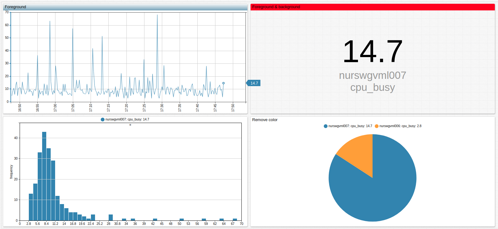

# Shared Widget Syntax



## Overview

Shared Widget syntax is common syntax supported by all other widgets.

## Syntax

### `[widget]` Settings

Inherited settings from the `[configuration]` level: `start-time`, `end-time`, `timespan`, `update-interval`, `timezone`, `batch-update`, `batch-size`, `dialog-maximize`, `url`, `path`, `url-parameters`. Overwrite these settings at the `[widget]` level.

Setting | Syntax | Description | Example
--|--|--|--
Type | `type = chart`<br>`type = bar`<br>`type = treemap`| Define widget type.<br>Available widgets: `chart`, `gauge`, `bar`, `histogram`, `box`, `calendar`, `treemap`, `pie`, `table`, `console`, `property`, `text`, `page`, `graph`.| [](https://apps.axibase.com/chartlab/adfe0fe2/2/)<br>[](https://apps.axibase.com/chartlab/adfe0fe2/3/)<br>[](https://apps.axibase.com/chartlab/adfe0fe2/4/)<br>
Tooltip | `tooltip = Widget Tooltip` | Display widget description on title mouseover. | [](https://apps.axibase.com/chartlab/adfe0fe2/5/)
Left Units | `left-units = 1` | Set absolute offset from the left, in units. | [](https://apps.axibase.com/chartlab/adfe0fe2/5/)
Top Units | `top-units = 1` | Set absolute offset from the top, in units. | [](https://apps.axibase.com/chartlab/adfe0fe2/7/)
Timespan | `timespan = 6 hour` | Define data load interval.<br>Set to `1 hour` by default.| [](https://apps.axibase.com/chartlab/adfe0fe2/8/)
Time Span Ahead | `ahead-time-span = 80%` | Show an amount of time ahead of the last series value.<br>Define in percent. | [](https://apps.axibase.com/chartlab/da03b8a5/26/)
Colors | `colors = green` | Redefine default palette.<br>Table, Console, Property, Text, and Page widgets do not support this setting.<br>Default palette is defined by the array `window.defaultColors`.| [](https://apps.axibase.com/chartlab/adfe0fe2/9/)
Legend Position | `legend-position = left` | Modify legend locations for widgets which contain a legend.<br>Possible values: `hidden`, `top`, `right`, `bottom`, `left`<br>By default, legend position is `hidden` in Time Chart.<br>Legend position is set to `top` on Dialog Chart.<br>Combine values to define corners: `legend-position = bottomright`| [](https://apps.axibase.com/chartlab/adfe0fe2/10/)
Scale | `scale = 1.5`<br>`scale-x = 0.7` | Scale a widget or axis.<br>Not supported in all browsers.| [](https://apps.axibase.com/chartlab/adfe0fe2/11/)
Left Axis Range | `max-range = 40`<br>`min-range = 10`| Define minimum and maximum range displayed on the left axis.<br>Actual range can differ based on loaded data samples.| [](https://apps.axibase.com/chartlab/d80980a8/6/)
Right Axis Range | `min-range-right = 250000`<br>`max-range-right = 500000` | Define minimum and maximum range displayed on the right axis.<br>Actual range can differ based on loaded data samples.| [](https://apps.axibase.com/chartlab/d80980a8/7/)
Force Left Axis Range | `min-range-force = 0`<br>`max-range-force = 100` | Apply a forced range to the left axis, regardless of loaded data. | [](https://apps.axibase.com/chartlab/d80980a8/8/)
Force Right Axis Range | `min-range-right-force = 0`<br>`max-range-right-force = 100` | Apply a forced range to the right axis, regardless of loaded data. | [](https://apps.axibase.com/chartlab/d80980a8/9/)
Rotate Ticks | `rotate-ticks = 45`<br>`rotate-ticks = true` | Rotate `x` axis labels.<br>Set in degrees.<br>`true` rotates by `90` degrees.<br>Default value is `90`.| [](https://apps.axibase.com/chartlab/8fe65e1b/29/)
Center Ticks | `centralize-ticks = true` | Position time and date markers between instead of under ticks.<br>Boolean expression, `false` by default.| [](https://apps.axibase.com/chartlab/8eddbb26)
Center Columns| `centralize-columns = true` | Position columns between ticks instead of directly above ticks.<br>Boolean expression, `false` by default.| [](https://apps.axibase.com/chartlab/8eddbb26/2/)
Label Axes | `axis-title = CPU Utilization in %`<br>`axis-title-right = Free Memory in KB`| Label left and right axes.| [](https://apps.axibase.com/chartlab/f6d07f8f)
Style | `style = padding: 50`| Apply styles to widget container. | [](https://apps.axibase.com/chartlab/adfe0fe2/15/)
Header Style| `header-style = background-color: steelblue`<br>`header-style = background: red`<br>`header-style = return 'background: white;'; header-style = display: none`| Customize widget header style.<br>Group diverse portals visually.<br>`background-color`: Replace color, retain pattern.<br> `background`: Replace both color and pattern.<br>`display: none`: Hide header.<br>`header-style = return 'background: white;';`: Remove all styles.| [](https://apps.axibase.com/chartlab/b4c45b71/2/)
Markers | `markers = false` | Hide series marker values.<br>Boolean expression, `true` by default. | [](https://apps.axibase.com/chartlab/adfe0fe2/12/)
Format| `format = kilobytes` | Display series with the appropriate unit of measurement.<br>See [Format Settings](../../syntax/format-settings.md) for complete syntax.| [](https://apps.axibase.com/chartlab/02b81553)
Format Labels| `label-format = tagName`<br>`label-format = statistics - period` | Label series using text and placeholders.<br>See [Label Formating](../../syntax/label-formatting.md).| [](https://apps.axibase.com/chartlab/6237dd1a/2/)
Date Format | `day-format = %y/%m/%d`<br>`day-format = %Y/%m/%d`<br>`day-format = %Y %m/%d`| Format `x` axis timestamp.| [](https://apps.axibase.com/chartlab/40dafe6b/2/)
Cache | `cache = true` | Retrieve the most recent value from the HBase **Last Insert** table.<br>This setting is useful for widget which only display one value: Gauge, Bar, Text, Treemap, etc.| [](https://apps.axibase.com/chartlab/adfe0fe2/32/)
Limit | `limit = 1000` | Limit the number of returned samples for the loaded series.<br>Limit is not applied to alert queries in the Console widget.|[](https://apps.axibase.com/chartlab/13549b9c/2/)<br>[](https://apps.axibase.com/chartlab/2604d710)
On Load Audio | `audio-alert = (alert > 1) ? 'path/to/audio/file'` | Play an audio alert on initial widget data load.<br>See [Audio Alerts](../../configuration/audio-alerts.md) for more information| [](https://apps.axibase.com/chartlab/59a834f3/5/)
Display Panels | `display-panels = true` | Display control panels in the top left or right corners in Time and Bar charts.<br>Possible values: `true`, `false`, `hover`.<br>Default is `hover`.| [](https://apps.axibase.com/chartlab/efa832ea/2/)
Expand Panels | `expand-panels = all`| Display control panels in the top left or right corners in Time and Bar charts.<br>Possible values: `true`, `false`, `hover`, `all`.<br>Default is `hover`.| [](https://apps.axibase.com/chartlab/808e5846/18/)

### Series Description

`[widget]` settings include one or more `[series]` settings. For more information about associating `[series]` settings with data stored in ATSD, see [Selecting Series](../../syntax/selecting-series.md).

### `[series]` Settings

Setting | Syntax | Description | Example
--|--|--|--
Metric | `metric = cpu_busy` | Define the Metric | [](https://apps.axibase.com/chartlab/da03b8a5)
Table and Attribute | `table = klz_disk`<br>`attribute = disk_used`| Use as an alternative to `metric` setting.<br>If both `table` and `attribute` are defined, `metric = table,attribute`.| [](https://apps.axibase.com/chartlab/0c8f522e)
Entity | `entity = nurswgvml007`<br>`entity = nurswgvml00*`| Define the Entity.<br>Supports `?` and `*` [wildcards](../../syntax/wildcards.md).| [](https://apps.axibase.com/chartlab/7e1cf18f/2/)
Entities| `entities = nurswgvml007, nurswgvml008`| Define multiple entities with one setting.<br>If both `entity` and `entities` are specified, the former takes precedence.<br>Support `?` and `*` [wildcards](../../syntax/wildcards.md)| [](https://apps.axibase.com/chartlab/2bc197f4)<br>[](https://apps.axibase.com/chartlab/e1d30997/2/)
[Entity Group](https://axibase.com/docs/atsd/api/data/#entity-group) | `entity-group = nmon-sub-group` | Define an Entity Group. | [](https://apps.axibase.com/chartlab/56e62e1e/4/)
Entity Expression | `entity-expression = tags.location = 'SVL'` | Apply server-side filter to all series based on entity names, tags, and fields.| [](https://apps.axibase.com/chartlab/56e62e1e/4/)
Tag Expression| `tag-expression = tags.file_system NOT LIKE '/m*'`| Apply server-side filtering based on [series tags](https://axibase.com/docs/atsd/api/meta/metric/series-tags.html).| [](https://apps.axibase.com/chartlab/906238e2/4/)
Statistics | `statistic = avg`<br>`statistic = percentile_95`| Apply aggregation statistical functions.<br>See [Aggregators](../../configuration/aggregators.md) for more information.| [](https://apps.axibase.com/chartlab/ed94c71b)
Period | `period = 15 minute`| Define period for [aggregator](https://axibase.com/docs/atsd/api/data/series/aggregate.html#aggregate-processor) functions which require one.<br>Possible values: `auto`, <code>count [time_unit](https://axibase.com/docs/atsd/api/data/series/time-unit.html)</code>.| [](https://apps.axibase.com/chartlab/da03b8a5/3/)
Align | `align = END_TIME` | Determine a uniform start time for all periods.<br>Possible values: `START_TIME`, `END_TIME`, `CALENDAR`(default), `FIRST_VALUE_TIME`. See [Aggregate Processor](https://axibase.com/docs/atsd/api/data/series/aggregate.html#period) for more information.
Interpolation | `interpolate = LINEAR` | Interpolate missing aggregation periods. | [](https://apps.axibase.com/chartlab/d8c03f11/3/)
Interpolation Extend| `interpolate-extend = true` | Interpolate leading and trailing periods with `NEXT` or `PREVIOUS` values, respectively.| [](https://apps.axibase.com/chartlab/d8c03f11/5/)
Interpolation Function | `interpolate-function = linear` | Define interpolation function for entire series, instead of only missing values. | [](https://apps.axibase.com/chartlab/6221d836)
Interpolation Period | `interpolate-period = 1 minute` | Define the period for interpolated values. | [](https://apps.axibase.com/chartlab/6221d836)
Interpolation Boundary | `interpolate-boundary = inner` | Define [interpolation behavior](https://axibase.com/docs/atsd/api/data/series/interpolate.html#boundary) for leading and trailing values. | [](https://apps.axibase.com/chartlab/af2064b6)
Interpolation Fill | `interpolate-fill = true` | Interpolate values outside of the selection interval.<br>Possible values: `true`, `false`, number of values to fill. | [](https://apps.axibase.com/chartlab/88ad3789)
Rate | `rate = 15 second` | Compute the difference between consecutive sample per unit of time, or [rate period](https://axibase.com/docs/atsd/api/data/series/rate.html#rate-period).<br>Compute the underlying rate of change when a metric measures a continuously incrementing counter. <br>Possible values: `auto`, <code>count [time_unit](https://axibase.com/docs/atsd/api/data/series/time-unit.html)</code>.| [](https://apps.axibase.com/chartlab/da03b8a5/25/)
Rate Counter | `rate-counter = true`| Compute the difference between consecutive samples per unit of time.<br>Boolean expression.| [](https://apps.axibase.com/chartlab/0a163b33)
Replace Value | `replace-value = value < 50 ? null : value`| Modify or filter series values.<br>The example expression filters all values less than `50` from the series.<br>Aggregators are not supported.| [](https://apps.axibase.com/chartlab/6a8cc3e3/3/)<br>[](https://apps.axibase.com/chartlab/3f080fe4/3/)<br>[](https://apps.axibase.com/chartlab/1e4dccf0/2/)
Data Type | `data-type = forecast` | Define current series data type.<br>Possible values: `historical`, `forecast`, `forecast_deviation`, `lower_confidence`, `upper_confidence`.| [](https://apps.axibase.com/chartlab/f80b8e53)
Forecast Name | `forecast-name = hw5` | Identify forecast name.<br>Create multiple forecasts for the same series.<br>If no forecast name is set, default forecast is loaded.| [](https://apps.axibase.com/chartlab/92b7e471/3/)
Style Stroke `dasharray` | `style = stroke-dasharray: none;`| Remove dashes from forecast line on Chart, display forecast line as solid. | [](https://apps.axibase.com/chartlab/92b7e471/4/)
Alias | `alias = total`<br>`alias = free` | Create a unique series designation to pass data to other series. | [](https://apps.axibase.com/chartlab/da03b8a5/6/)
[Alert Expression](../../syntax/alert-expression.md)| `alert-expression = value < 95` | Apply separate alert rules to several series with one `alert-style` in `[widget]` settings. | [](https://apps.axibase.com/chartlab/b3892525)
Alert Style | `alert-style = fill: red; stroke: red`| Apply separate alert styles to several series with one `alert-expression` in `[widget]` settings.| [](https://apps.axibase.com/chartlab/b3892525)
Audio Alert | `audio-alert = (alert > 0.5) ? '/portal/resource/alarm.oog' : '/portal/resource/klaxon.oog'`| Play an audio file when `alert-expression` evaluates to `true`.<br>Store audio files in the `opt/atsd/atsd/conf/portal` directory of your ATSD installation.<br>Set the following path in the `audio-alert` setting: `/portal/resource/alarm.oog`.<br>Files in this directory must always be references with the `/resource/` before the file name.<br>Audio is only played on `true` to `false` changes or vise versa.<br>Audio is played once, on initial alert occurrence.<br>Supported audio alert formats: `.mp3`, `.oog`, `.wav`.<br>See [Audio Alerts](../../configuration/audio-alerts.md) for more information.| [](https://apps.axibase.com/chartlab/59a834f3/2/)
Group Keys| `group-keys = type`<br>`group-keys = entity, type`| Count messages by period with a comma-separated list of keys including `entity`, `type`, `source`, and custom tags.<br>Supported in server aggregation mode only: `server-aggregate = true`.| [](https://apps.axibase.com/chartlab/bf166165#)
Group Statistic | `group-statistic = sum` | Assign a group statistic function to the series.<br>See [Aggregators](../../configuration/aggregators.md) for more information.| [](https://apps.axibase.com/chartlab/b61b7f82)
Group Period | `group period = 1 month` | Assign a group period to a series for computing [group](https://axibase.com/docs/atsd/api/data/series/group.html#group-processor) statistics.<br>Possible values: `auto`, <code>count [time_unit](https://axibase.com/docs/atsd/api/data/series/time-unit.html)</code>. | [](https://apps.axibase.com/chartlab/b4b72b79)
Group First | `group-first = false` | Control the sequence of aggregation and grouping. If set to `true`, grouping is performed before aggregation.| [](https://apps.axibase.com/chartlab/732de421)
Group Interpolation | `group-interpolate = LINEAR` | Interpolate grouped values. | [](https://apps.axibase.com/chartlab/f0a36dac)
Extended Group Interpolation | `group-interpolate-extend = true` | Fill missing leading and trailing periods with `NEXT` and `PREVIOUS` values.| [](https://apps.axibase.com/chartlab/f0a36dac)
Series Limit | `series-limit = 10` | Define the maximum number of series retrieved from the database, to prevent the client or server from processing excessive series.| [](https://apps.axibase.com/chartlab/af34dc29)
Exact Match | `exact-match = true` | Ignore series with tags, other than those specified in the series configuration. | [](https://apps.axibase.com/chartlab/dada4561/2/)
Merge Fields | `merge-fields = mount_point`<br>`merge-fields = entity`| Combine series into series grouped based on field. Applies only in `multiple-series` mode. Series which use [wildcard](../../syntax/wildcards.md), `entities`, `entityGroup` settings or comma-separated tag values are treated as multiple series by default.<br>Possible values:<br>`entity`: All series with the same entity are combined.<br>`{tag-name}`: All series with the same value of tag `{tag-name}` are combined. | [](https://apps.axibase.com/chartlab/3d45a84c).
Downsample | `downsample = true` | Enable [downsampling](https://axibase.com/docs/atsd/api/data/series/downsample.html#downsampling) for the current chart configuration. | [](https://apps.axibase.com/chartlab/af356224/2/)
Downsample Gap | `downsample-gap = 10 minute` | Control the occurrence of repeated values by defining the [gap](https://axibase.com/docs/atsd/api/data/series/downsample.html#parameters) using time interval.<br>A larger gap value decreases the occurrence of repeated values.<br>Possible values: `auto`, <code>count [time_unit](https://axibase.com/docs/atsd/api/data/series/time-unit.html)</code>.| [](https://apps.axibase.com/chartlab/b24e5c95)
Downsample Ratio | `downsample-ratio = 1.1` | Define downsample [ratio](https://axibase.com/docs/atsd/api/data/series/downsample.html#ratio-check)| [](https://apps.axibase.com/chartlab/63769ef5)
Downsample Algorithm | `downsample-algorithm = interpolate` | Define [downsample algorithm](https://axibase.com/docs/atsd/api/data/series/downsample.html#algorithm) used for calculation.<br>Possible values: `detail` and `interpolate`.<br>Default value: `detail`.| [](https://apps.axibase.com/chartlab/0d5f90f2)
Downsample Difference | `downsample-difference = 4` |Define deviation between consecutive values which the database considers equivalent.<br>Use this setting to include minor deviations in downsampling. | [](https://apps.axibase.com/chartlab/02f63201)
[Smoothing](https://axibase.com/docs/atsd/api/data/series/smooth.html) Function | `smooth = AVG` | Weighted [averaging](https://axibase.com/docs/atsd/api/data/series/smooth.html) function applied to window samples.<br>Supported functions: `AVG`, `EMA`, `WAVG`, `WTAVG` | [](https://apps.axibase.com/chartlab/3734bd35/4) |
Smoothing Factor | `smooth-factor = 0.5` | Weighting parameter used by `EMA` function. If specified, must be `>0 and <1`. | [](https://apps.axibase.com/chartlab/3734bd35/4)|
Smoothing Range | `smooth-range = 60000` | Weighting parameter used by `EMA` function. | [](https://apps.axibase.com/chartlab/3734bd35/4)|
Smoothing Count | `smooth-count = 50` | Number of samples in the window. | [](https://apps.axibase.com/chartlab/3734bd35/4)|
Smoothing Interval | `smooth-interval = 15 minute` | Window duration interval. | [](https://apps.axibase.com/chartlab/3734bd35/4)|
Smoothing Minimum Count | `smooth-minimum-count = 10` | Minimum number of samples in the window. | [](https://apps.axibase.com/chartlab/3734bd35/4)|
Smoothing Incomplete Value | `smooth-incomplete-value = NaN` | Sample value returned if the window is not full. | [](https://apps.axibase.com/chartlab/3734bd35/4)|

### `value` Settings

Specify the `value` setting to create calculated series derived from raw series using arithmetic expressions in JavaScript syntax. The expression returns a number or `null`.

Setting | Syntax | Description | Example
--|--|--|--
Value | `value = max('s1')`<br>`value = min('s1', '10 minute')`<br>`value = (1 - value('free') / value('total')) * 100`<br>`value = Math.max(0, value('alias'))`| Define series value.<br>Retrieve the value of the underlying series identified by alias.| [](https://apps.axibase.com/chartlab/2b2e7023/4/)<br>[](https://apps.axibase.com/chartlab/da03b8a5/6/)
[Aggregators](../../configuration/aggregators.md) | `value = avg('s1')`<br>`value = (1 - value('free') / value('total')) * 100`<br>`value = Math.max(0, value('alias'))`| Apply an aggregate statistic to the underlying series grouped by period.| [](https://apps.axibase.com/chartlab/da03b8a5/9/)
Percentile | `value = (1 - percentile(99,'free','5 minute') / percentile(99,'total','5 minute')) * 100`| Apply percentile statistics to the underlying series.<br>Percentile range from `0` to `100`, `alias` and `period`.| [](https://apps.axibase.com/chartlab/da03b8a5/10/)
Forecast| `value = (1 - forecast('free') / forecast('total')) * 100`| Return a forecast for the underlying series.| [](https://apps.axibase.com/chartlab/da03b8a5/11/)
Confidence Intervals | `value = (1 - lower_confidence(90, 'free') / forecast('total')) * 100`<br>`value = (1 - upper_confidence(90, 'free') / forecast('total')) * 100`| Retrieve upper and lower limits of the confidence interval for the underlying series.<br>Arguments: Level-specified integer from `0` to `100`, and `alias`.| [](https://apps.axibase.com/chartlab/da03b8a5/14/)

### Additional `[series]` Settings

Setting | Syntax | Description | Example
--|--|--|--
Style | `style = stroke-width: 4; color: green` | Assign a style to the series. | [](https://apps.axibase.com/chartlab/da03b8a5/16/)
Color | `color = orange` | Assign a color to the series. | [](https://apps.axibase.com/chartlab/da03b8a5/17/)
Label | `label = CPU Busy - nurswgvml007` | Assign a label to the series. Shown in the series legend/ | [](https://apps.axibase.com/chartlab/da03b8a5/18/)
Tooltip | `tooltip = NURSWGVML007` | Define tooltips which are displayed on series mouseover. | [](https://apps.axibase.com/chartlab/da03b8a5/19/)
Axis | `axis = right` | Assign series axis.<br>`left` by default.| [](https://apps.axibase.com/chartlab/da03b8a5/20/)
Format | `foramt = kilobytes`| Display appropriate series units in legend and on series pointers. See [Label Formatting](../../syntax/label-formatting.md) for more information. | [](https://apps.axibase.com/chartlab/bf5b45e9)
Display | `display = value > top(3)`<br>`display = tags.mount_point = '/'`<br>`display = false` | Define a rule to display series.<br> Filter series based on metric values for widgets containing many series.| [](https://apps.axibase.com/chartlab/23fd6313/2/)<br>[](https://apps.axibase.com/chartlab/3ebf1cca)<br>[](https://apps.axibase.com/chartlab/3f080fe4/2/)
Enable Series | `enabled = false` | Hide series in the widget legend based on expression or boolean statement.<br>See Expression Examples| [](https://apps.axibase.com/chartlab/da03b8a5/23/)
Refresh Interval | `refresh-interval = 120` | Define the period in seconds that ATSD waits before refreshing data with new samples. <br>Possible values: `auto`, number. | [](https://apps.axibase.com/chartlab/da03b8a5/24/)
Refresh Retry Interval | `retry-refresh-interval = 5 minute`| Define the wait period after ATSD receives an empty sample to retry data refresh. <br>Possible values: `auto`, <code>count [time_unit](https://axibase.com/docs/atsd/api/data/series/time-unit.html)</code>. | [](https://apps.axibase.com/chartlab/2ce8eed4)
Refresh Error Interval | `error-refresh-interval = 30 minute`| Define the wait period after ATSD handles a server processing error before refreshing data. <br>Possible values: `auto`, <code>count [time_unit](https://axibase.com/docs/atsd/api/data/series/time-unit.html)</code>. | [](https://apps.axibase.com/chartlab/dad50363)

## `[tag]` Settings

`[tags]` syntax examples:

```ls
[tags]
  mount_point = /tmp
  fstype = tmpfs
```

If there are several values for the same tag, separate the values with a comma:

```ls
[tags]
  tag_name = tag_value1, tag_value2
```

If the tag name contains an equals sign `=` or the tag value contains a comma`,`, escape them with a backslash `\`:

```ls
[tags]
  tag\=name = tag\,value
```

The tag name and value are `tag=name` and `tag=value`, respectively.

If the tag name contains reserved names such as setting names, surround the tag name with quotes to avoid collisions:

```ls
[tags]
  "type" = sensor
```

### `[series]` Example

```ls
[series]
  entity    entity == nurswgvml006
  metric  nurswgvml006    = disk_used_percent
  statistic = avg
  period = 15 minute
  [tags]
    file_system = none
    mount_point = /run/shm
```
