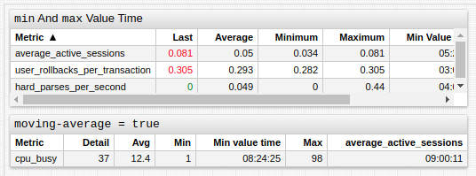
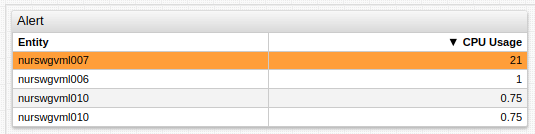
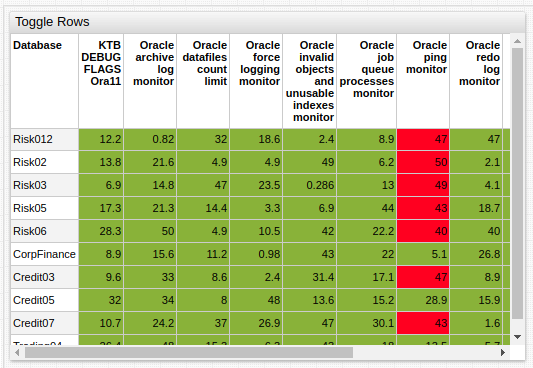

# Streaming Table

## Overview

The **Streaming Table** displays a table of values stored in ATSD.

```ls
[widget]
  type = table
  metric = cpu_busy

  [series]
    entity = nurswgvml0*
```


[](https://apps.axibase.com/chartlab/132d37c8)

## Widget Settings

* The settings apply to the `[widget]` section.
* [Shared](../shared/README.md#widget-settings) `[widget]` settings are inherited.
* [Shared Table](../shared-table/README.md#widget-settings) `[widget]` settings are inherited.

Name | Example | Description | &nbsp;
:--|:--|:--|:--
<a name="hide-empty-series"></a>[`hide-empty-series`](#hide-empty-series) | `hide-empty-series = false` | Hide series for which no data exists or data whose validity is expired.<br>Default Setting: `true`.| ↗
<a name="expire-time-span"></a>[`expire-time-span`](#expire-time-span) | `expire-time-span = 10 day` | Interval which determines the validity of series `last insert` data.| ↗

## Examples

### `min` and `max` Value Time



[](https://apps.axibase.com/chartlab/5bb723f1)

### Sliding Window


[](https://apps.axibase.com/chartlab/e9763ce8)

### Color Grid


[](https://apps.axibase.com/chartlab/0d60397e)

### Alert



[](https://apps.axibase.com/chartlab/243f21ce)

### Toggle Rows



[](https://apps.axibase.com/chartlab/ae3ece3f)

### Calculated Columns


[](https://apps.axibase.com/chartlab/b2a7070a)

### Multiple Metrics


[](https://apps.axibase.com/chartlab/b3835e7f)

### Multiple Tags


[](https://apps.axibase.com/chartlab/c2c46923)

### Configure Columns


[](https://apps.axibase.com/chartlab/f804ddc9)
