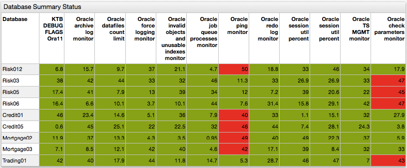

# Streaming Table



## Overview

Use Streaming Table widget to display a table of `metric` values. By default, it contains four columns: `entity`, `metric`, `time`, and `value`.

## Syntax

Alert Console supports both [Shared Widget](../shared/README.md) and Shared Table Syntax.

### `[widget]` Settings

Setting | Syntax | Description
--|--|--
Hide Empty Series | `hide-empty-series = false` | Hide series for which no data exists or data whose validity is expired.<br>Default Setting: `true`.
Expiry Time Span | `expire-time-span = 10 day` | Interval which determines the validity of series `last insert` data.

### `[series]` Settings

Streaming Tables inherit the following settings from [Shared Widget](../shared/README.md) syntax: `entity`, `metric`, `alert-expression`, `alert-style`, `style`, `color`, `label`, `tooltip`, `format`, `refresh-interval`, `retry-refresh-interval`, `error-refresh-interval`.

Under `[series]` level settings for Streaming Table widget, specify `hide-if-empty = true` setting to override the `hide-empty-series` setting indicated for all tables. If `alert-expression` is indicated for some series, it is possible to sort the tables according to their values specified in the `sort` setting.

## Examples

### Configuration

```ls
[widget]
  type = table
  title = CPU Usage
  column-time = null
  column-metric = null
  column-value = CPU Usage
  alert-expression = value > 4
  alert-style = background-color: orange
  sort = value desc

  [series]
    entity = nurswgvml003
    metric = cpu_busy

  [series]
    entity = nurswgvml006
    metric = cpu_busy

  [series]
    entity = nurswgvml007
    metric = cpu_busy

  [series]
    entity = nurswgvml010
    metric = cpu_busy
```


[](https://apps.axibase.com/chartlab/6489829c/3/)

### `min` and `max` Value Time

```ls
[widget]
alert-expression = this.alert = value <= min && value < avg ? 1 : value >= max && value > avg ? 2 : 0
  [column]
    key = value
    label = Last
    alert-expression = row.data.alert
    alert-style = alert == 1 ? 'color: green' : 'color: red'
```


[](https://apps.axibase.com/chartlab/37cbde3d/7/)

### Sliding Window

```ls
/*
This example visualizes relative changes for
many metrics at once, highlighting which metrics
have reached their local minimums or maximums
over the loaded time window.

Metrics that reached maximum are highlighted with red,
metrics that reached minimum are highlighted with green.
*/
```


[](https://apps.axibase.com/chartlab/37cbde3d)

### Color Grid

```ls
[column]
  key = s-6
  label = Query-6
  alert-expression = value+1
  alert-style = alert == 2 ? 'background-color: red' : 'background-color: #8DB600'
  style = padding: 10px;
```


[](https://apps.axibase.com/chartlab/6489829c/8/)

### Alert

```ls
[widget]
  alert-expression = value > 4
  alert-style = background-color: orange
```


[](https://apps.axibase.com/chartlab/6489829c)

### Toggle Rows

<!-- markdownlint-disable MD104 -->

```ls
[configuration]
entity = 10.102.0.15
metric = dbqueuemonitor
  
list databases = Risk01, Risk012, Risk02, Risk03, Risk04,   Risk05, Risk06,
  CorpFinance,
  Credit01, Credit02, Credit03, Credit04, Credit05, Credit06, Credit07, Credit08,
  Mortgage01, Mortgage02, Mortgage03,
  Trading01, Trading02, Trading03, Trading04, Trading05
endlist
```

<!-- markdownlint-enable MD104 -->


[](https://apps.axibase.com/chartlab/bb65c060)

### Multiple Metrics

```ls
[series]
  entity = nurswgvml009
  metric = cpu_busy

[series]
  entity = nurswgvml009
  metric = memtotal

[series]
  entity = nurswgvml009
  metric = memfree
```


[](https://apps.axibase.com/chartlab/6489829c/2/)

### Multiple Tags

```ls
[column]
  tag = mount_point
  label = Mount Point

[column]
  tag = file_system
  label = File System
```


[](https://apps.axibase.com/chartlab/fa6e2d15/4/)

### Configure Columns

```ls
script
  cmdb = {
   "nurswgvml006": {"location": "Cupertino", "type": "prod"},
   "nurswgvml007": {"location": "Sunnyvale", "type": "dev"}
  }
endscript
```


[](https://apps.axibase.com/chartlab/fb8bdf13/4/)