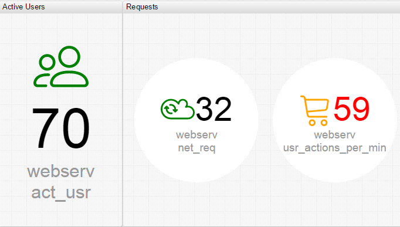
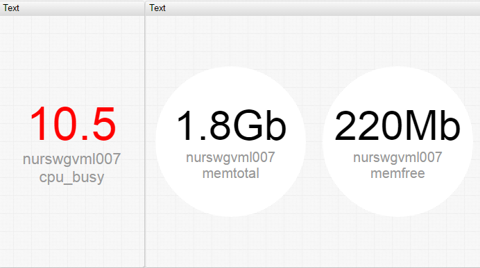
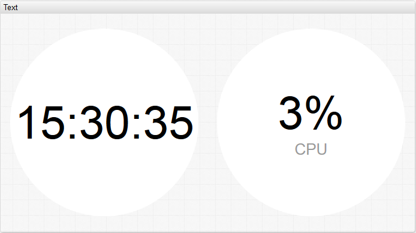
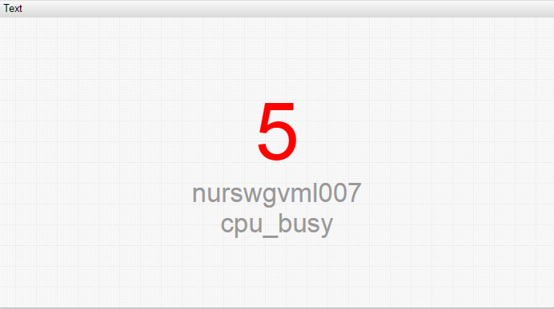
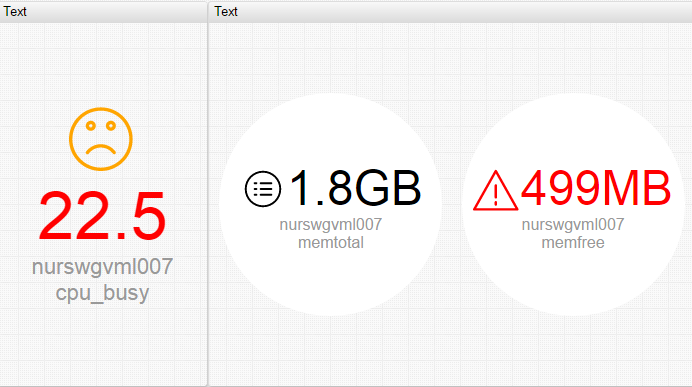

# Text Widget

## Syntax

Text Widgets support [Shared Widget](../shared/README.md) syntax.

### `[widget]` Settings

Setting|Syntax|Description|Example
--|--|--|--
|Circle|`circle = true`|Displays background circle. Default value: `false`||
|Minimum Font Size|`min-font-size = 10`|Minimum font size for labels, in pixels.||
|Maximum Font Size|`max-font-size = 14`|Maximum font size for labels, in pixels.||
|Series Click|`on-series-click = callDialog({ type: 'page', url: 'https://axibase.com/' })`|Change the type of widget that opens in a dialog window when the value is clicked. Default value: `time chart`||
|Icon Size|`icon-size = auto`|Automatically resize icons to occupy all available space except the area used by the value and label. If `icon-size` is not set, icon is scaled proportionally to the font height which can be controlled using the `min-font-size` and `max-font-size` settings.||

### `[series]` Settings

Inherited settings from [Shared Widget](../shared/README.md)): `entity`, `metric`, `alert-expression`, `alert-style`, `style`, `color`, `label`, `tooltip`, `format`, `refresh-interval`, `retry-refresh-interval`, `error-refresh-interval`.

Setting|Syntax|Description|Example
--|--|--|--
|label|`label = Memory Free` `label = Axibase`|Caption displayed below the number.Multiple lines and HTML markup are supported. If the label is not defined, entity and metric names are displayed below the value. To hide the label and display only the series value, add the `label =` setting with an empty value. Labels can be set as a link to an external page using HTML. Use the browser history buttons to go back to the previous page if you opened a URL on the same page.| |
|Icon|`icon = public/img/svg/linear/users.svg` `icon = alerts_color_01``icon = alerts-color-01`|Add an `svg` icon.Built-in icons can be referenced by name. View built-in [Icon Reference Sheet](../pie-chart/resources/atsd-embedded-icons.pdf). Substitute underscores (`_`) in built-in icon names with dashes(`-`): `icon = alerts_color_07` `icon = alerts-color-07`. Place custom icons in the `/opt/atsd/atsd/conf/portal/svg` directory and refer to them with the `/portal/resource/svg/image` `.svg` path. Custom icons in Axibase Server must be store in `./AxibaseServer/config/workspace/svg` and referenced with `/workspace/svg/image` `.svg` path.| |
|Icon Position|`icon-position = bottom`|Position of the icon relative to the series value. Possible settings: `left`, `right`, `bottom`, `top`||
|Icon Color|`icon-color = orange`|Color of the icon.||
|Icon Alert Style|`icon-alert-style = fill: red;`|Alert styles applied to the icon when the `alert-expression` is satisfied.||

## Examples

### Multiple Series

### Clock and Series

### Alert

### Conditional Icons

### Icon Alert

