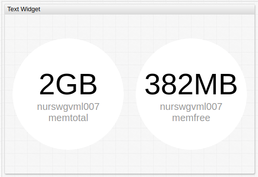
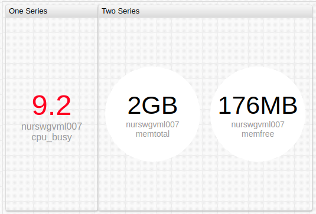
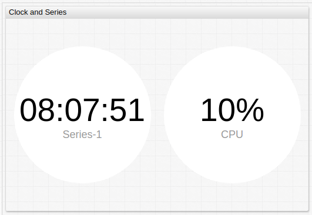
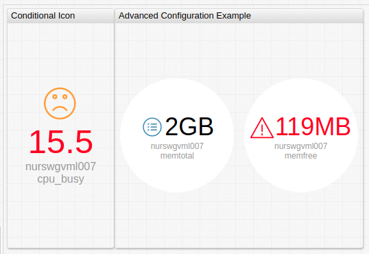
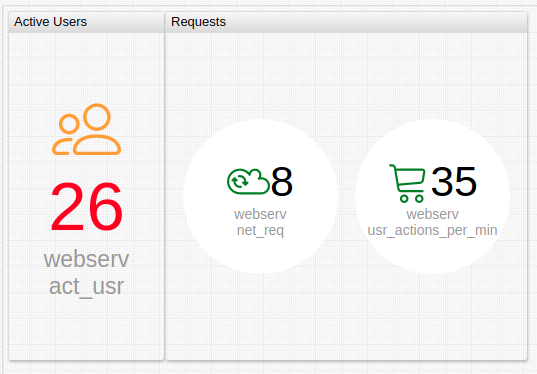

# Text Widget

## Overview

The **Text Widget** displays series last insert value in a text-based interface.

```ls
[widget]
  type = text
  entity = nurswgvml007

  [series]
    metric = memtotal
  [series]
    metric = memfree
```



[](https://apps.axibase.com/chartlab/6dc64b91)

## Widget Settings

* The settings apply to the `[widget]` section.
* [Shared](../shared/README.md#widget-settings) `[widget]` syntax is inherited.

Name|Example|Description|&nbsp;
:--|:--|:--|:--
<a name="circle"></a>[`circle`](#circle)|`circle = true`|Display series values inside a circle.<br>Possible values: `false`, `true`.<br>Default value: `false`|[↗](https://apps.axibase.com/chartlab/3ae9216a)
<a name="min-font-size"></a>[`min-font-size`](#min-font-size)|`min-font-size = 20`|Minimum font size for labels, in pixels.|[↗](https://apps.axibase.com/chartlab/f52c9b69)
<a name="max-font-size"></a>[`max-font-size`](#max-font-size)|`max-font-size = 60`|Maximum font size for labels, in pixels.|[↗](https://apps.axibase.com/chartlab/db454826)
<a name="on-series-click"></a>[`on-series-click`](#on-series-click)|`on-series-click = callDialog({ type: 'page', url: 'https://axibase.com/docs/atsd/' })`|Behavior upon series value click.<br>See example configuration for possible values.|[↗](https://apps.axibase.com/chartlab/0108c090)
<a name="icon-size"></a>[`icon-size`](#icon-size)|`icon-size = auto`|Resize icon to fill all available space.<br>If `icon-size` is not set, icon is scaled proportionally to font height.<br>Control font size with `min-font-size` and `max-font-size`.<br>Possible value: `auto`.|[↗](https://apps.axibase.com/chartlab/e456ba9d)

### Series Settings

* The settings apply to the `[series]` section.
* [Shared](../shared/README.md#series-settings) `[series]` syntax is inherited.

Name|Example|Description|&nbsp;
:--|:--|:--|:--
<a name="icon"></a>[`icon`](#icon)|`icon = public/img/svg/linear/user.svg`|Display `.svg` icon in the **Text Widget**.<br>Path to custom icons must be defined.<br>Default ATSD icon directory is `/opt/atsd/atsd/conf/portal/img/`.<br>Reference built-in icons by name, without directory path.<br>See the [Icon Reference Sheet](../pie-chart/resources/atsd-embedded-icons.pdf) for built-in icons.|[↗](https://apps.axibase.com/chartlab/6306e5e3)
<a name="icon-position"></a>[`icon-position`](#icon-position)|`icon-position = bottom`|Icon position relative to series value.<br>Possible values: `left`, `right`, `top`, `bottom`.<br>Default value: `top`.|[↗](https://apps.axibase.com/chartlab/a81127d4)|
<a name="icon-color"></a>[`icon-color`](#icon-color)|`icon-color = orange`|Icon color.<br>Possible values: [color name](https://en.wikipedia.org/wiki/Web_colors).|[↗](https://apps.axibase.com/chartlab/d877ea84)|
<a name="icon-alert-style"></a>[`icon-alert-style`](#icon-alert-style)|`icon-alert-style = fill: red;`|CSS style applied to icon when `alert-expression` is `true`.|[↗](https://apps.axibase.com/chartlab/bb8dd8ed)|

## Examples

### Multiple Series



[](https://apps.axibase.com/chartlab/573460c7)

### Clock and Series



[](https://apps.axibase.com/chartlab/b20f631f)

### Advanced Configuration Example



[](https://apps.axibase.com/chartlab/61fd6d23)

### Icon Alert



[](https://apps.axibase.com/chartlab/1bfb6339)