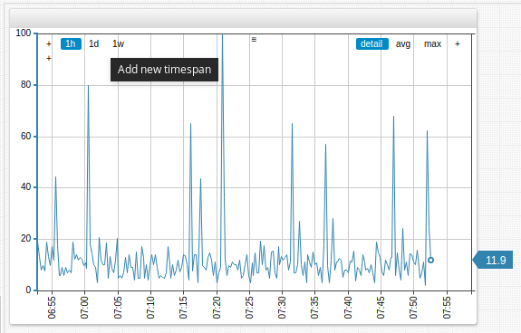
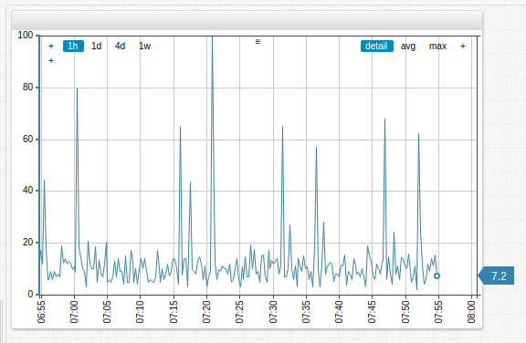
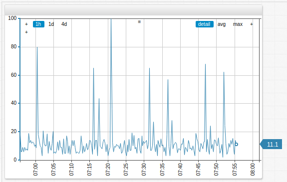

# Time Chart

## Overview

The **Time Chart** displays series values at successive time intervals for one or more series. Data is loaded for a specified interval and updated as new samples are received.

```ls
[widget]
  type = chart

  [series]
    entity = nurswgvml007
    metric = cpu_busy
```


[](https://apps.axibase.com/chartlab/3146896d)

## Widget Settings

* The settings apply to the `[widget]` section.
* [Shared](../shared/README.md) `[widget]` settings are inherited.

Name | Description | &nbsp;
:--|:--|:--
<a name="display-panels"></a>[`display-panels`](#display-panels) |  Display widget controls.<br>Possible values: `false`, `true`, `hover`.<br>Default value: `hover`.<br>**Example**: `display-panels = true`.|  [↗](https://apps.axibase.com/chartlab/fbb223ef)
<a name="expand-panels"></a>[`expand-panels`](#expand-panels)|  Expand widget controls.<br>Possible values: `false`/ `none`, or `true`/ `all`, or `auto`/ `default`/ `compact`.<br>Default value: `default`.<br>**Example**: `expand-panels = true`. |  [↗](https://apps.axibase.com/chartlab/209a449c)
<a name="periods"></a>[`periods`](#periods)|  Custom aggregation periods in widget controls.<br>Specified as the number of [time units](https://axibase.com/docs/atsd/api/data/series/time-unit.html).<br>Format: `count time_unit`.<br>**Example**: `periods = 20 minute, 4 hour`. |  [↗](https://apps.axibase.com/chartlab/eaf88286)
<a name="context-height"></a>[`context-height`](#context-height)| Height of the [Context Chart](#time-chart-controls).<br>Default value: `0`.<br>**Example**: `context-height = 50`.| [↗](https://apps.axibase.com/chartlab/67d1027d)
<a name="markers"></a>[`markers`](#markers)| Show series value markers.<br>Possible values: `false`, `true`.<br>Default value: `true`.<br>**Examples**: `markers = false`.| [↗](https://apps.axibase.com/chartlab/263a3ee8)
<a name="last-marker"></a>[`last-marker`](#last-marker)| Show last series value marker.<br>Possible values: `false`, `true`.<br>Default value: `true`.<br>**Example**: `last-marker = false`. | [↗](https://apps.axibase.com/chartlab/5a54b7ce)
<a name="horizontal-grid"></a>[`horizontal-grid`](#horizontal-grid) | Show horizontal grid.<br>Possible values: `false`, `true`.<br>Default value: `true`.<br>**Example**: `horizontal-grid = false`.| [↗](https://apps.axibase.com/chartlab/a28cbb11)
<a name="vertical-grid"></a>[`vertical-grid`](#vertical-grid)| Show vertical grid.<br>Possible values: `false`, `true`.<br>Default value: `true`.<br>**Example**: `vertical-grid = false`.| [↗](https://apps.axibase.com/chartlab/50895463)
<a name="pointer-position"></a>[`pointer-position`](#pointer-position)| Location of final value pointer.<br>Possible values: `left`, `right`, `none`.<br>Default value: `right`.<br>**Example**: `pointer-position = left`.| [↗](https://apps.axibase.com/chartlab/33aa5216)
<a name="step-line"></a>[`step-line`](#step-line)| Display step line.<br>Possible values: `false`, `true`.<br>Default value: `false`.<br>**Example**: `step-line = true`.| [↗](https://apps.axibase.com/chartlab/024cbe4f)
<a name="auto-period"></a>[`auto-period`](#auto-period)| Assign series aggregation period to the value of four time intervals.<br>Possible values: `false`, `true`.<br>Default value: `true`.<br>**Example**: `auto-period = false`.| [↗](https://apps.axibase.com/chartlab/ff922a73)
<a name="disconnect-interval"></a>[`disconnect-interval`](#disconnect-interval)| Maximum time gap between samples specified as the number of [time units](https://axibase.com/docs/atsd/api/data/series/time-unit.html).<br>If the gap between samples exceeds the specified interval, data points are not connected.<br>Format:  `count time_unit`.<br>**Example**: `disconnect-interval = 10 minute`. | [↗](https://apps.axibase.com/chartlab/2edca4d7)
<a name="disconnect-count"></a>[`disconnect-count`](#disconnect-count)| Maximum distance between samples specified as the number of periods.<br>If the gap between samples exceeds the defined value, data points are not connected.<br>If `disconnect-count = 1`, the interval is equal to the interval between samples.<br>**Example**: `disconnect-count = 50`.| [↗](https://apps.axibase.com/chartlab/2792adc4)
<a name="disconnect-value"></a>[`disconnect-value`](#disconnect-value)| Value applied to disconnected areas.<br>**Example**: `disconnect-value = 0`.| [↗](https://apps.axibase.com/chartlab/32f6fef5)
<a name="moving-average"></a>[`moving-average`](#moving-average)| Moving average based on a sliding window which ends at the current time.<br>Possible values: `false`, `true`.<br>Default value: `false`.<br>**Example**: `moving-average = true`.| [↗](https://apps.axibase.com/chartlab/10124798)
<a name="negative-style"></a>[`negative-style`](#negative-style)| CSS style applied to negative values in `column` or `column-stack` mode.<br>**Example**: `negative-style = fill: red`.| [↗](https://apps.axibase.com/chartlab/8dc77d01)
<a name="current-period-style"></a>[`current-period-style`](#current-period-style)| CSS styles applied to current period values in `column` and `column-stack` mode.<br>**Example**: `current-period-style = fill-opacity: 0; stroke-width: 2; stroke-dasharray: 5, 2, 1, 2`.| [↗](https://apps.axibase.com/chartlab/64ea74d4)
<a name="forecast-style"></a>[`forecast-style`](#forecast-style)| CSS style applied to [forecasts](https://axibase.com/docs/atsd/forecasting/) in `column` and `column-stack` mode.<br>**Example**: `forecast-style = stroke: magenta; opacity: 0.25`.| [↗](https://apps.axibase.com/chartlab/b3e87541)

### Value Axis Settings

Name |Description | &nbsp;
:--|:--|:--
<a name="auto-scale"></a>[`auto-scale`](#auto-scale)| Scale the value axis based on series values.<br>Possible values: `false`, `true`.<br>Default value: `false`.<br>**Example**: `auto-scale = true`.| [↗](https://apps.axibase.com/chartlab/4256fd76)
<a name="ticks"></a>[`ticks`](#ticks)| Tick marks on the left axis.<br>Default value: `5`.<br>**Example**: `ticks = 10`.| [↗](https://apps.axibase.com/chartlab/08a8bf45)
<a name="ticks-right"></a>[`ticks-right`](#ticks-right)| Tick marks on the right axis.<br>Default value: `5`.<br>**Example**: `ticks-right = 10`.| [↗](https://apps.axibase.com/chartlab/3972fb62)

### Time Axis Settings

Name | Description | &nbsp;
:--|:--|:--
<a name="ahead-time-span"></a>[`ahead-time-span`](#ahead-time-span)| Visualized time ahead of final series value.<br>Possible values: Percent value in `0.10` notation or `10%` notation.<br>**Example**: `ahead-time-span = 80%`.| [↗](https://apps.axibase.com/chartlab/c559d591)
<a name="rotate-ticks"></a>[`rotate-ticks`](#rotate-ticks)| Rotate labels on the time axis by `n` degrees.<br>Possible values: between `0` (horizontal) and `90` (vertical), or `true` (horizontal).<br>Default value: `90` (vertical).<br>**Example**: `rotate-ticks = 0`.| [↗](https://apps.axibase.com/chartlab/5b2621a8)
<a name="centralize-ticks"></a>[`centralize-ticks`](#centralize-ticks)| Center time and date markers over ticks.<br>Possible values: `false`, `true`.<br>Default value: `false`.<br>**Example**: `centralize-ticks = true`.| [↗](https://apps.axibase.com/chartlab/e100936c)
<a name="ticks-time"></a>[`ticks-time`](#ticks-time)| Tick marks on the time axis.<br>Default value: `10`.<br>**Example**: `ticks-time = 20`.| [↗](https://apps.axibase.com/chartlab/addb441e)
<a name="time-offset"></a>[`time-offset`](#time-offset)| Time series offset specified as the number of [time units](https://axibase.com/docs/atsd/api/data/series/time-unit.html).<br>`time-offset > 0`: Offset into the past.<br> `time-offset < 0`: Offset into the future.<br>Format: `count time_unit`.<br>**Example**: `time-offset = 10 week`.| [↗](https://apps.axibase.com/chartlab/23e8049e)
<a name="display-date"></a>[`display-date`](#display-date)| Display the time period captured by the **Time Chart**.<br>Possible values: `false`, `true`.<br>Default value: `false`.<br>**Example**: `display-date = true`.| [↗](https://apps.axibase.com/chartlab/37738a05)
<a name="retain-time-span"></a>[`retain-time-span`](#retain-time-span)| Preserve widget `timespan` as new data is added.<br>Possible values: `false`, `true`.<br>Default value: `true`.<br>**Example**: `retain-time-span = false`.| [↗](https://apps.axibase.com/chartlab/48eed908)

## Series Settings

* The settings apply to the `[series]` section.
* [Shared](../shared/README.md#series-settings) `[series]` settings are inherited.

Name | Description | &nbsp;
:--|:--|:--
<a name="mode"></a>[`mode`](#mode) | Chart mode.<br>Possible values: `line` - Connect series data points with a line. `stack` - Visually stack series. `column` - Display series as columns. `range` - Display range of series values. `column-stack` - Visually stack series in column-form.<br>Default value: `line`.<br>**Example**: `mode = column`. | [↗](https://apps.axibase.com/chartlab/267a5534)
<a name="fill-value"></a>[`fill-value`](#fill-value) | Interpolate a series with irregularly spaced values.<br>Detailed values are filled using [`linear` interpolation](https://axibase.com/docs/atsd/api/data/series/aggregate.html#interpolation-functions).<br>Aggregated periods are filled with `previous` values.<br>Possible values: `false`, `true`.<br>Default value: `true`.<br>**Example**: `fill-value = true`.| [↗](https://apps.axibase.com/chartlab/033b40d5)
<a name="load-future-data"></a>[`load-future-data`](#load-future-data)| Load future series values.<br>Import forecasts generated by third-party tools such as [R Language](https://github.com/axibase/atsd-api-r/blob/master/README.md#atsd-r-package).<br>Possible values: `false`, `true`.<br>Default value: `false`.<br>**Example**: `load-future-data = true`.| [↗](https://apps.axibase.com/chartlab/cf472245)
<a name="series-type"></a>[`series-type`](#series-type)| Grouping parameter for `stack` mode.<br>Series of the same type are grouped.<br>**Example**: `series-type = s1`.| [↗](https://apps.axibase.com/chartlab/2ad5b8ae)

## Threshold Settings

* The settings apply to the `[threshold]` section.
* Use `[threshold]` settings to define series thresholds:
  * Load the series and include `display = false` settings under `[widget]` settings.
  * Assign the series an `alias`.
  * In the `[threshold]` section, specify threshold value with `value = value('alias')` as seen in the **ChartLab** example below.


[](https://apps.axibase.com/chartlab/d32f63e0)

Name | Description | &nbsp;
:--|:--|:--
<a name="threshold-label"></a>[`label`](#threshold-label)| Threshold legend label.<br>**Example**: `label = threshold`.| [↗](https://apps.axibase.com/chartlab/6669e7a4)
<a name="threshold-color"></a>[`color`](#threshold-color) | Threshold color.<br>**Example**: `color = red`.| [↗](https://apps.axibase.com/chartlab/bf478ab6)
<a name="threshold-value"></a>[`value`](#threshold-value)|Threshold value.<br>**Example**: `value = 75`. | [↗](https://apps.axibase.com/chartlab/8bcd5a38)

## **Time Chart** Controls

* Modify selection interval and aggregation period on the fly.
* Add custom selection intervals and aggregation periods directly on the **Time Chart**.
* Apply various aggregations without reloading the portal.
* Change the chart mode: `line`, `column`, `range`, `stack`.
* View data in the appropriate format: hertz, joules, watts, bytes, percent, currency etc.
* Create custom metrics using custom formulas and aggregations.
* Modify alert rules directly in the portal.
* Instantly generate forecasts in the **Time Chart**.


1. **Title**: Click the title to expand the widget to fullscreen.
1. **Timespan**: Select one of the available timespans from the menu.
1. **Series Icon**: Toggle visibility of displayed series by clicking the icon to show or hide that series.
1. **Forecast Tools**: Display forecast and confidence intervals for series.
1. **Mode**: Select the display mode for the series.
1. **Aggregation**: Select aggregation method for the series.
1. **Aggregation Period**: Define the aggregation period for the series.
1. **Left Axis**: Scale the left axis manually by dragging. Double click to reset values to default.
1. **Right Axis**: Scale the right axis manually by dragging. Double click to reset values to default.
1. **Scale Options**: Auto-scale the value of axes in the **Time Chart**. Display the series in step-line format. Toggle value markers for the series.
1. **Load All Data**: Double click **Time Chart** surface to show all loaded data.
1. **Time Axis**: Scale the time axis manually by dragging. Double click to reset values to default.
1. **Context Chart**: Select a manual timespan by dragging context chart endpoints.

### Modifying **Time Chart** Controls

Add selection intervals and aggregation periods directly in **Time Chart** controls by double clicking the whitespace between the interval or period where the new interval is to be added. An interval or period roughly half way between the two values is added on each double click.



To add a four-day (`4d`) aggregation period, double click between the one-day (`1d`) and one-week (`1w`) aggregation periods in the controls of the **Time Chart**.



To remove selection intervals and aggregation periods, drag and drop the interval or period off the **Time Chart** controls. In the example below, the one-week (`1w`) aggregation period is removed.



## Examples

### `time-offset` Setting


[](https://apps.axibase.com/chartlab/ebd90c87)

### Dual Axis


[](https://apps.axibase.com/chartlab/2deaef48)

### Stack Average


[](https://apps.axibase.com/chartlab/2b8d550c)

### Fill Area


[](https://apps.axibase.com/chartlab/8bc482c9)

### `alert-expression` Example


[](https://apps.axibase.com/chartlab/b3892525)

### Percentile


[](https://apps.axibase.com/chartlab/fbf744aa)

### Forecast


[](https://apps.axibase.com/chartlab/e2880896)

### `disconnect-interval` and `disconnect-value`


[](https://apps.axibase.com/chartlab/7101d5b9)

### `[threshold]` Settings


[](https://apps.axibase.com/chartlab/ec3cabf2)

### `value` Settings Example


[](https://apps.axibase.com/chartlab/e11254b7)

### `value` Statistic Example


[](https://apps.axibase.com/chartlab/ada21b87)

### Message Overlay

Insert messages into the database as series, using series tags to encode message text. Add messages to a **Time Chart** with `mode=column` setting.


[](https://apps.axibase.com/chartlab/e14cb99c)

### Elapsed Time

Overlay multiple intervals on the time axis with interval formatting.


[](https://apps.axibase.com/chartlab/8a35d47d)
