# Time Chart

## Overview

The **Time Chart** displays series values at successive time intervals for one or more series. Data is loaded for a specified interval and updated as new samples are received.

```ls
[widget]
  type = chart
  time-span = 1 hour
  max-range = 100

  [series]
    entity = nurswgvml007
    metric = cpu_busy
```

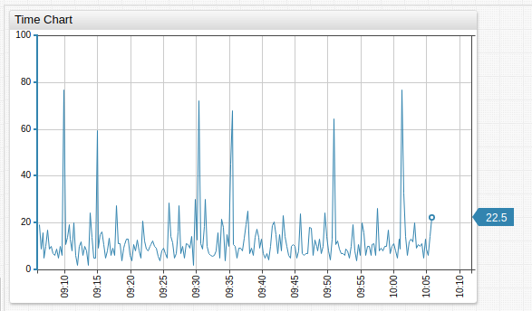

[](https://apps.axibase.com/chartlab/7b9d824c)

## Widget Settings

* The settings apply to the `[widget]` section
* [Shared](../shared/README.md) `[widget]` settings are inherited.

Name | Example | Description | &nbsp;
--|--|--|--
<a name="display-panels"></a>[`display-panels`](#display-panels)  |  `display-panels = true`  |  Display widget controls.<br>Possible values: `true`, `false`, `hover`.<br>Default value: `hover`. |  [↗](https://apps.axibase.com/chartlab/1a1bfdd3)
<a name="expand-panels"></a>[`expand-panels`](#expand-panels)  |  `expand-panels = compact`  |  Expand widget controls.<br>Allowed values: `all`, `compact`, `none`.  |  [↗](https://apps.axibase.com/chartlab/e9e8cd37)
<a name="ahead-time-span"></a>[`ahead-time-span`](#ahead-time-span) | `ahead-time-span = 80%` | Visualized time ahead of final series value.<br>Possible values:<br>`count` + `%`| [↗](https://apps.axibase.com/chartlab/adf5eeda)
<a name="rotate-ticks"></a>[`rotate-ticks`](#rotate-ticks) | `rotate-ticks = 0` | Rotate labels on the time axis by `n` degrees.<br>Possible values: between `0` (horizontal) and `90` (vertical).<br>Default value: `90` (vertical).| [↗](https://apps.axibase.com/chartlab/9370ecd7)
<a name="centralize-ticks"></a>[`centralize-ticks`](#centralize-ticks) | `centralize-ticks = true` | Center time and date markers with respect to ticks.<br>Boolean expression.<br>Default value: `false`.| [↗](https://apps.axibase.com/chartlab/834c0e43)
<a name="periods"></a>[`periods`](#periods)  |  `periods = 20 minute, 4 hour`  |  Specify custom aggregation periods in widget controls.  |  [↗](https://apps.axibase.com/chartlab/eaf88286)
<a name="context-height"></a>[`context-height`](#context-height) | `context-height = 50` | Define the height of the [Context Chart](#time-chart-controls)<br>Default value: `0`.<br> | [↗](https://apps.axibase.com/chartlab/2e0bf373)
<a name="ticks"></a>[`ticks`](#ticks) | `ticks = 10` | Control the number of tick marks on the left axis.<br>`5` by default. | [↗](https://apps.axibase.com/chartlab/fedaa42e/9/)
<a name="ticks-right"></a>[`ticks-right`](#ticks-right) | `ticks-right = 10` | Control the number of tick marks on the right axis.<br>`5` by default. | [↗](https://apps.axibase.com/chartlab/fedaa42e/10/)
<a name="ticks-time"></a>[`ticks-time`](#ticks-time) | `ticks-time = 20` | Control the number of tick marks on the time (`x`) axis.<br>`10` by default. | [↗](https://apps.axibase.com/chartlab/d0e85b27/)
<a name="day-format"></a>[`day-format`](#day-format) | `day-format = %Y/%m/%d` | Format `x` axis timestamps using Format Syntax. | [↗](https://apps.axibase.com/chartlab/40dafe6b/2/)
<a name="time-offset"></a>[`time-offset`](#time-offset) |`time-offset = 10 week` | Offset time series day into either the past or future based on sign.<br>Compare day from today to the same data from some ago.<br>`time-offset > 0`: Offset into the past.<br> `time-offset < 0`: Offset into the future.<br>Use on either `[widget]` or `[series]` level settings.| [↗](https://apps.axibase.com/chartlab/075941a0/15)
<a name="display-date"></a>[`display-date`](#display-date) | `display-date = true` | Display the time period captured by the Time Chart.<br>`false` by default.| [↗](https://apps.axibase.com/chartlab/fedaa42e/12/)
<a name="markers"></a>[`markers`](#markers) | `markers = false` | Hide series value markers.<br>Boolean expression, `true` by default.| [↗](https://apps.axibase.com/chartlab/fedaa42e/46/)
<a name="last-marker"></a>[`last-marker`](#last-marker) | `last-marker = false` | Hide most recent series value marker.<br>Boolean expression, `true` by default. | [↗](https://apps.axibase.com/chartlab/b0069bfe/6/)
<a name="horizontal-grid"></a>[`horizontal-grid`](#horizontal-grid) | `horizontal-grid = false` | Hide horizontal grid.<br>Boolean expression, `true` by default. | [↗](https://apps.axibase.com/chartlab/fedaa42e/13/)
<a name="vertical-grid"></a>[`vertical-grid`](#vertical-grid) | `vertical-grid = false` | Hide vertical grid.<br>Boolean expression, `true` by default. | [↗](https://apps.axibase.com/chartlab/fedaa42e/15/)
<a name="pointer-position"></a>[`pointer-position`](#pointer-position) | `pointer-position = left` | Define the location of the final value pointer.<br>Possible values: `left`,`right`,`auto`,`none`.<br>Default: `right`.| [↗](https://apps.axibase.com/chartlab/fedaa42e/52/)
<a name="auto-scale"></a>[`auto-scale`](#auto-scale) | `auto-scale = true` | Automatically scale the visible portion of the graph.<br>`false` by default. | [↗](https://apps.axibase.com/chartlab/fedaa42e/20/)
<a name="step-line"></a>[`step-line`](#step-line) | `step-line = true` | Connect neighboring samples using a step line instead of one which is linearly interpolated.<br>Toggle step line mode by changing `y` axis controls displayed on mouseover. | [↗](https://apps.axibase.com/chartlab/4f847a24/2/)<br>[↗](https://apps.axibase.com/chartlab/3fc3b5e6)
<a name="auto-period"></a>[`auto-period`](#auto-period) | `auto-period = false` | Automatically define the aggregation period for the series based on the chosen time interval.<br>`true` by default.| [↗](https://apps.axibase.com/chartlab/fedaa42e/22/)
<a name="retain-time-span"></a>[`retain-time-span`](#retain-time-span) | `retain-time-span = false` | Save the length of the chosen time interval during widget update.<br>`true` by default.| [↗](https://apps.axibase.com/chartlab/fedaa42e/23/)
<a name="disconnect-interval"></a>[`disconnect-interval`](#disconnect-interval) | `disconnect-interval = 1 minute` | Defines maximum time gap between data during which points of the series line are connected.<br>If the gap between data is greater than the specified interval, a break is displayed.<br>Possible values: `auto`, <code>count [time_unit](https://axibase.com/docs/atsd/api/data/series/time-unit.html)</code>. | [↗](https://apps.axibase.com/chartlab/fedaa42e/30/)
<a name="disconnect-count"></a>[`disconnect-count`](#disconnect-count) | `disconnect-count = 50` | Define average distance between time values in the series<br>If the gap between data is greater than the defined value,a break is displayed.<br>If `disconnect-count = 1`, the disconnect interval is equal to the mean interval.<br>See Disconnect Count Behavior for more information.| [↗](https://apps.axibase.com/chartlab/fedaa42e/33/)
<a name="disconnect-value"></a>[`disconnect-value`](#disconnect-value)| `disconnect-value = 0` | Apply disconnect value in tandem with disconnect interval or count.<br> Define the value to be applied to disconnected areas.<br>Use this setting when ATSD is not collecting `null` values or those below a minimum threshold.<br>Additionally, toggle display of disconnect value with **Connect Values** on left axis mouseover menu.| [↗](https://apps.axibase.com/chartlab/fedaa42e/34/)
<a name="moving-average"></a>[`moving-average`](#moving-average) | `moving-average = true` | Enable moving average to set aggregation period based on a sliding window ending with the current time.<br>Disable moving average to set aggregation period based on calendar.<br>Boolean expression, possible values: `true` and `false`.| [↗](https://apps.axibase.com/chartlab/b495f8ad/11/)
<a name="negative-style"></a>[`negative-style`](#negative-style) | `negative-style = fill: red` | Apply CSS styles to negative values of a series in `column` or `column-stack` mode. | [↗](https://apps.axibase.com/chartlab/37c39d18/5/)
<a name="current-period-style"></a>[`current-period-style`](#current-period-style) | `current-period-style = fill-opacity: 0; stroke-width: 2; stroke-dasharray: 5, 2, 1, 2` | Apply CSS styles to values of the current period, such as the most recent hour, day, or week, in `column` and `column-stack` mode.| [↗](https://apps.axibase.com/chartlab/37c39d18)
<a name="forecast-style"></a>[`forecast-style`](#forecast-style) | `forecast-style = stroke: magenta` | Apply CSS styles to [forecasts](https://axibase.com/docs/atsd/forecasting/) in `column` and `column-stack` mode.| [↗](https://apps.axibase.com/chartlab/37c39d18/3/)

## Series Settings

* The settings apply to the `[series]` section.
* [Shared](../shared/README.md#series-settings) `[series]` settings are inherited.

Name | Example | Description | &nbsp;
:--|:--|:--|:--
`display` | `display = value >= top(3)` | Series display setting.<br> Filter series based on metric values for widgets containing many series.<br>Refer to [Expression Syntax Documentation](https://axibase.com/docs/atsd/administration/metric-persistence-filter.html#expression-syntax) for more information.| [↗](https://apps.axibase.com/chartlab/23fd6313/2/)<br>[↗](https://apps.axibase.com/chartlab/3ebf1cca)<br>[↗](https://apps.axibase.com/chartlab/3f080fe4/2/)
<a name="mode"></a>[`mode`](#mode) | `mode = column`| Time Chart mode.<br>Possible values:<br>`stack`: Visually stack series.<br>`column`: Display series as columns.<br>`range`: Display range of series values.<br>`column-stack`: Visually stack series in column-form.| [↗](https://apps.axibase.com/chartlab/47c16847)<br>[↗](https://apps.axibase.com/chartlab/711f260c)<br>[↗](https://apps.axibase.com/chartlab/d4af051b)<br>[↗](https://apps.axibase.com/chartlab/976097d9)
<a name="fill-value"></a>[`fill-value`](#fill-value) | `fill-value = true`| Interpolate a computed series with irregularly spaced values.<br>Set to `true` to fill missing samples with interpolated values.<br>Detailed values are filled in using `linear` interpolation.<br>Aggregated periods are filled with `previous` values.<br>If `fill-value = false`, missing samples are filled with `0` or `null`.<br>Boolean expression<br>Default value: `true`.| [↗](https://apps.axibase.com/chartlab/3a1a0a7a)
<a name="load-future-data"></a>[`load-future-data`](#load-future-data) | `load-future-data = true` | Load future series values.<br>Import forecasts generated by third-party tools such as [R Language](https://github.com/axibase/atsd-api-r/blob/master/README.md#atsd-r-package).<br>Boolean expression.<br>Default value: `false` | [↗](https://apps.axibase.com/chartlab/f7c7a105)
<a name="series-type"></a>[`series-type`](#series-type) | `series-type = s1` | `stack` mode grouping parameter.<br>Series the same type are grouped together or summed.<br>Set a unique series type for fill effect without `stack`.| [↗](https://apps.axibase.com/chartlab/19146ba0)<br>[↗](https://apps.axibase.com/chartlab/19146ba0/2/)

## Threshold Settings

* The settings apply to the `[threshold]` section.
* Use `[threshold]` settings to define series thresholds:
  * Load the series and include `display = false` settings under `[widget]` settings.
  * Assign the series an `alias`.
  * Under `[threshold]` settings, define the threshold value with `value = value('alias')` as seen in the **ChartLab** example below.

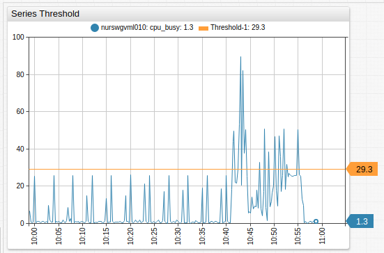

[](https://apps.axibase.com/chartlab/d32f63e0)

Name | Example | Description | &nbsp;
:--|:--|:--|:--
Label | `label = threshold` | Define the name of the threshold to be displayed in the legend.| ↗
Color | `color = red` | Define threshold line color.<br>By default, a random color is used.| ↗
Value | `value = 60`<br>`value = value('alias')`| Define threshold value. Set in JavaScript form when `alert-expression` for series uses the same format.| ↗

## Series Visibility

Hide empty series:

```ls
display = !isNaN(value)
```

Hide series without data in the previous 60 minutes:

```ls
display = this.lastRequestTime - this.last.t. < 60 * 60000
```

Modify the `60` component of the setting to change the number of minutes to search.

## Time Chart Controls

* Modify selection interval and aggregation period on the fly.
* Add custom selection intervals and aggregation periods directly on the Time Chart.
* View different aggregations without reloading the portal.
* Change the chart mode: `line`, `column`, `range`, `stack`.
* View data in the appropriate format: hertz, joules, watts, bytes, percent, currency etc.
* Create custom metrics using custom formulas and aggregations.
* Modify alert rules directly in the portal.
* Instantly generate forecasts in the Time Chart.

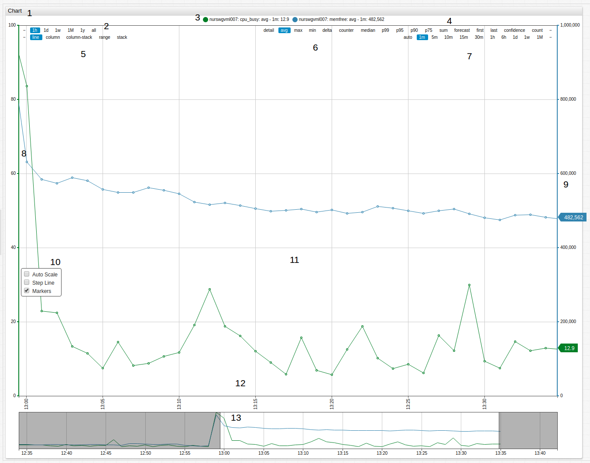

1. **Title**: Click the title to expand the widget to fullscreen.
1. **Timespan**: Select one of the available timespans from the menu.
1. **Series Icon**: Toggle visibility of displayed series by clicking the icon to show or hide that series.
1. **Forecast Tools**: Display forecast and confidence intervals for series.
1. **Mode**: Select the display mode for the series.
1. **Aggregation**: Select aggregation method for the series.
1. **Aggregation Period**: Define the aggregation period for the series.
1. **Left Axis**: Scale the left axis manually by dragging. Double click to reset values to default.
1. **Right Axis**: Scale the right axis manually by dragging. Double click to reset values to default.
1. **Scale Options**: Auto-scale the value of axes in the Time Chart. Display the series in step-line format. Toggle value markers for the series.
1. **Load All Data**: Double click the Time Chart surface to show all loaded data.
1. **Time Axis**: Scale the time axis manually by dragging. Double click to reset values to default.
1. **Context Chart**: Select a manual timespan by dragging context chart endpoints.

### Modifying Time Chart Controls

Add selection intervals and aggregation periods directly in Time Chart controls by double clicking the whitespace between the interval or period where a new interval needs to be added. An interval or period roughly half way between the two values is added on each double click.

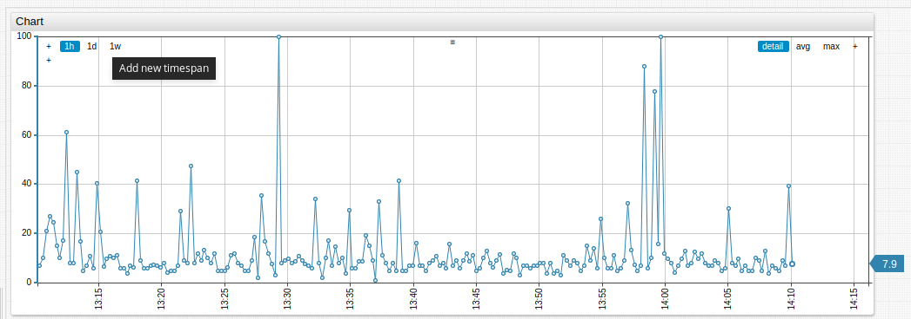

To add a four day aggregation period, double click between `1d` and `1w` on the aggregation period controls of the Time Chart.

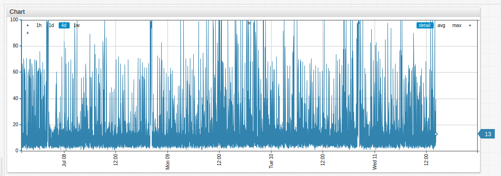

To remove selection intervals and aggregation periods, drag and drop the interval or period off the Time Chart controls. In the example below, `1w` is removed.

Modify time chart panel controls with the `defaultChartConfig.script` setting at the `[configuration]` level.

```ls
defaultChartConfig.script = widget.chart.panels[1].expand(8)
```

Substitute `8` with the number of panel controls to be displayed.

```ls
defaultChartConfig.script = widget.chart.panels[1].expand(6)
```

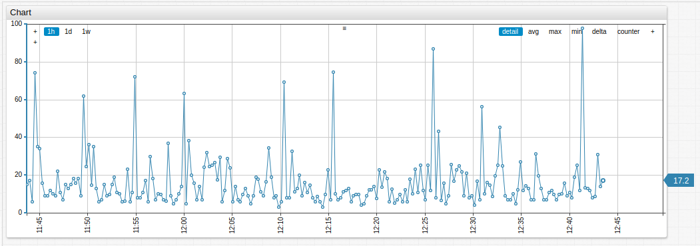

[](https://apps.axibase.com/chartlab/7ea19d6a)

To create specific groups of controls use long-form syntax:

```ls
defaultChartConfig.script = widget.panels.type.data(['detail', 'avg', 'max', 'min', 'percentile 50', 'percentile 99', 'percentile 95', 'percentile 90', 'percentile 75', 'sum', 'count', '+'])
```

Add or remove each control component to show or hide it from the widgets:

* `detail`
* `avg`
* `max`
* `min`
* `percentile 50`
* `percentile 99`
* `percentile 95`
* `percentile 90`
* `percentile 75`
* `sum`
* `count`
* `+`

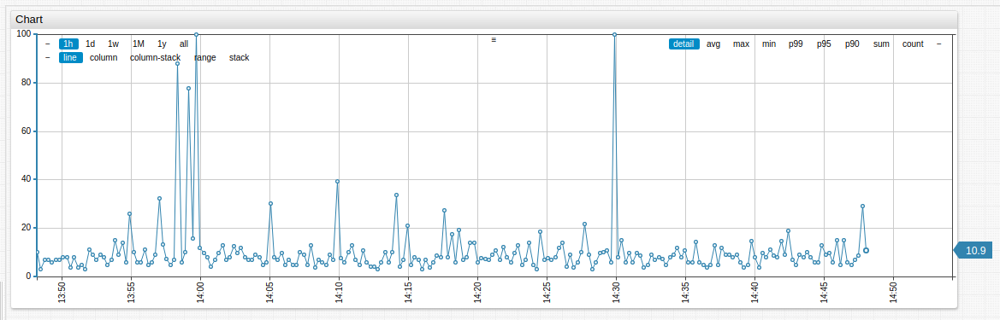

[](https://apps.axibase.com/chartlab/a9d3a8ba)

## Examples

### `time-offset` Setting

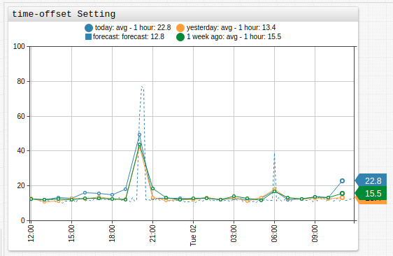

[](https://apps.axibase.com/chartlab/ebd90c87)

### Dual Axis

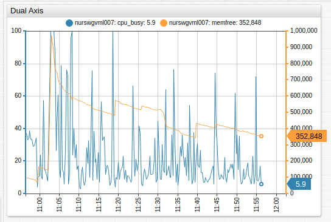

[](https://apps.axibase.com/chartlab/2deaef48)

### Stack Average

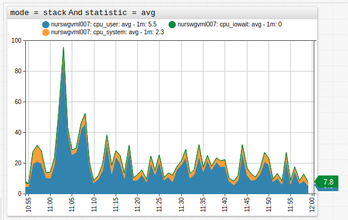

[](https://apps.axibase.com/chartlab/2b8d550c)

### Fill Area

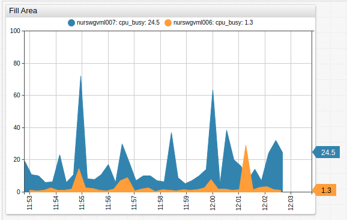

[](https://apps.axibase.com/chartlab/a8c1f22b)

### `alert-expression` Example

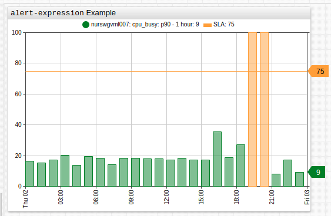

[](https://apps.axibase.com/chartlab/b3892525)

### Percentile

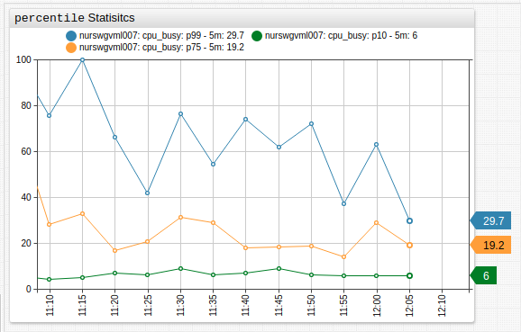

[](https://apps.axibase.com/chartlab/fbf744aa)

### Forecast

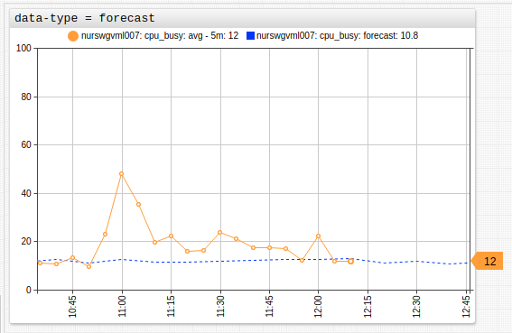

[](https://apps.axibase.com/chartlab/e2880896)

### `disconnect-interval` and `disconnect-value`


[](https://apps.axibase.com/chartlab/7101d5b9)

### `[threshold]` Settings

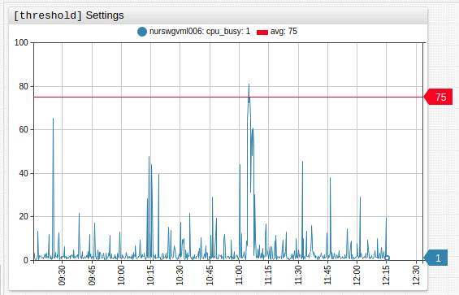

[](https://apps.axibase.com/chartlab/ec3cabf2)

### `value` Settings Example

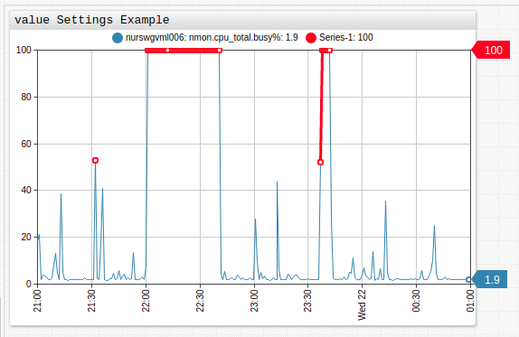

[](https://apps.axibase.com/chartlab/e11254b7)

### `value` Statistic Example

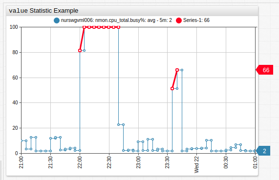

[](https://apps.axibase.com/chartlab/ada21b87)

### Message Overlay

Insert messages into the database as series, using series tags to encode message text. Add messages to a time chart with `mode=column` setting.


[](https://apps.axibase.com/chartlab/e14cb99c)

### Elapsed Time

Overlay multiple intervals on the time axis with interval formatting.

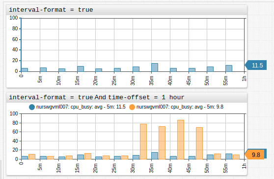

[](https://apps.axibase.com/chartlab/8a35d47d)
