# Time Chart


## Overview

Time Charts display series values at successive time intervals, showing one or more series, each assigned to the left or right value axis and scaled independently. Time Charts load data for a specified time interval and update the chart with incremental values as new data is received.

## Syntax

Time Charts support [Shared Widget](../shared/README.md) syntax.

### `[widget]` Settings

Setting | Syntax | Description | Example
--|--|--|--
Mode | `mode = column`<br>`mode = stack`<br>`mode = range`<br>`mode = column-stack`| Controls Time Chart mode:<br>Stack: Sum like series.<br>Column: Display Time chart in column-form.<br>Range: Display area between series.<br>Column Stack: Sum like series in column-form.| [](https://apps.axibase.com/chartlab/fedaa42e/18/)<br>[](https://apps.axibase.com/chartlab/fedaa42e/19/)<br>[](https://apps.axibase.com/chartlab/fedaa42e/32/)<br>[](https://apps.axibase.com/chartlab/a6a1cfef/2/)
Alert | `alert-expression = value > 75`<br>`alert-style = stroke: red; stroke-width: 3`| Define alert rule and behavior.<br>Applied to each series separately.| [](https://apps.axibase.com/chartlab/e4052904)
Display | `display = false`<br>`display = value > 5`<br>`display = value >= top(3)`<br>`display = this.lastRequestTime - this.last.t < 60 * 60000` | Define a rule to display series.<br> Filter series based on metric values for widgets containing many series.| [](https://apps.axibase.com/chartlab/23fd6313/2/)<br>[](https://apps.axibase.com/chartlab/3ebf1cca)<br>[](https://apps.axibase.com/chartlab/3f080fe4/2/)
Context Height | `context-height = 50` | Define the height of the context graph. Used to adjust the displayed timespan.<br>`0` by default for the widget in the main window.<br>`70` by default for the widget in the dialog window. | [](https://apps.axibase.com/chartlab/fedaa42e/8/)
Forced Minimum and Maximum Ranges | `min-range-force = 30`<br>`max-range-right-force = 150` | Define strict minimum and maximum value of the left or right axis. If the value of a series does not fall within the set boundaries set by these value gaps, the series is not displayed.<br> For right axis: add `right` to setting, as seen in the syntax example. | [](https://apps.axibase.com/chartlab/fedaa42e/26/)
Left Tick Marks | `ticks = 10` | Control the number of tick marks on the left axis.<br>`5` by default. | [](https://apps.axibase.com/chartlab/fedaa42e/9/)
Right Axis Tick Marks | `ticks-right = 10` | Control the number of tick marks on the right axis.<br>`5` by default. | [](https://apps.axibase.com/chartlab/fedaa42e/10/)
Time Axis Tick Marks | `ticks-time = 20` | Control the number of tick marks on the time (`x`) axis.<br>`10` by default. | [](https://apps.axibase.com/chartlab/d0e85b27/)
Timestamp Format | `day-format = %y/%m/%d`<br>`day-format = %Y/%m/%d`<br>`day-format = %Y %m/%d` | Format `x` axis timestamps using Format Syntax. | [](https://apps.axibase.com/chartlab/40dafe6b/2/)
Time Offset | `time-offset = -200 day`<br>`time-offset = 10 week` | Offset time series day into either the past or future based on sign.<br>Compare day from today to the same data from some ago.<br>`time-offset > 0`: Offset into the past.<br> `time-offset < 0`: Offset into the future.<br>Use on either `[widget]` or `[series]` level settings.| [](https://apps.axibase.com/chartlab/075941a0/15)
Display Date | `display-date = true` | Display the time period captured by the Time Chart.<br>`false` by default.| [](https://apps.axibase.com/chartlab/fedaa42e/12/)
Series Value Markers | `markers = false` | Hide series value markers.<br>Boolean expression, `true` by default.| [](https://apps.axibase.com/chartlab/fedaa42e/46/)
Last Series Value Marker | `last-marker = false` | Hide most recent series value marker.<br>Boolean expression, `true` by default. | [](https://apps.axibase.com/chartlab/b0069bfe/6/)
Horizontal Grid | `horizontal-grid = false` | Hide horizontal grid.<br>Boolean expression, `true` by default. | [](https://apps.axibase.com/chartlab/fedaa42e/13/)
Vertical Grid | `vertical-grid = false` | Hide vertical grid.<br>Boolean expression, `true` by default. | [](https://apps.axibase.com/chartlab/fedaa42e/15/)
Pointer Position | `pointer-position = left` | Define the location of the final value pointer.<br>Possible values: `left`,`right`,`auto`,`none`.<br>Default: `right`.| [](https://apps.axibase.com/chartlab/fedaa42e/52/)
Auto-scale | `auto-scale = true` | Automatically scale the visible portion of the graph.<br>`false` by default. | [](https://apps.axibase.com/chartlab/fedaa42e/20/)
Step Line | `step-line = true` | Connect neighboring samples using a step line instead of one which is linearly interpolated.<br>Toggle step line mode by changing `y` axis controls displayed on mouseover. | [](https://apps.axibase.com/chartlab/4f847a24/2/)<br>[](https://apps.axibase.com/chartlab/3fc3b5e6)
Auto-period | `auto-period = false` | Automatically define the aggregation period for the series based on the chosen time interval.<br>`true` by default.| [](https://apps.axibase.com/chartlab/fedaa42e/22/)
Time Span Retention | `retain-time-span = false` | Save the length of the chosen time interval during widget update.<br>`true` by default.| [](https://apps.axibase.com/chartlab/fedaa42e/23/)
Disconnect Interval | `disconnect-interval = 1 minute` | Defines maximum time gap between data during which points of the series line are connected.<br>If the gap between data is greater than the specified interval, a break is displayed.| [](https://apps.axibase.com/chartlab/fedaa42e/30/)
Disconnect Count | `disconnect-count = 50` | Define average distance between time values in the series<br>If the gap between data is greater than the defined value,a break is displayed.<br>If `disconnect-count = 1`, the disconnect interval is equal to the mean interval.<br>See Disconnect Count Behavior for more information.| [](https://apps.axibase.com/chartlab/fedaa42e/33/)
Disconnect Value| `disconnect-value = 0` | Apply disconnect value in tandem with disconnect interval or count.<br> Define the value to be applied to disconnected areas.<br>Use this setting when ATSD is not collecting `null` values or those below a minimum threshold.<br>Additionally, toggle display of disconnect value with **Connect Values** on left axis mouseover menu.| [](https://apps.axibase.com/chartlab/fedaa42e/34/)
Moving Average | `moving-average = true` | Enable moving average to set aggregation period based on a sliding window ending with the current time.<br>Disable moving average to set aggregation period based on calendar.<br>Boolean expression, possible values: `true` and `false`.| [](https://apps.axibase.com/chartlab/b495f8ad/11/)
Negative Style | `negative-style = fill: red` | Apply CSS styles to negative values of a series in `column` or `column-stack` mode. | [](https://apps.axibase.com/chartlab/37c39d18/5/)
Current Period Style | `current-period-style = fill-opacity: 0; stroke-width: 2; stroke-dasharray: 5, 2, 1, 2` | Apply CSS styles to values of the current period, such as the most recent hour, day, or week, in `column` and `column-stack` mode.| [](https://apps.axibase.com/chartlab/37c39d18)
Forecast Style | `forecast-style = stroke: magenta` | Apply CSS styles to [forecasts](https://axibase.com/docs/atsd/forecasting/) in `column` and `column-stack` mode.| [](https://apps.axibase.com/chartlab/37c39d18/3/)

### `[threshold]` Settings

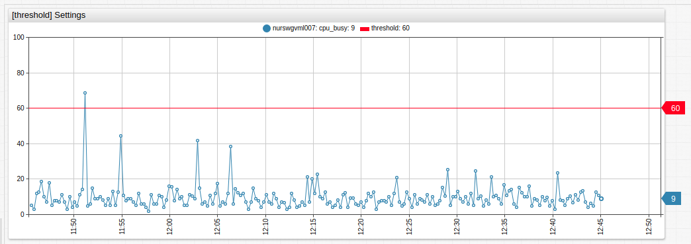

[](https://apps.axibase.com/chartlab/4101b548)

Use `[threshold]` settings to define series thresholds. Load the desired series and include `display = false` settings under `[widget]` settings. Give the series and `alias`. Under `[threshold]` settings, define the threshold value with `value = value('alias')` as seen in the **ChartLab** example below.

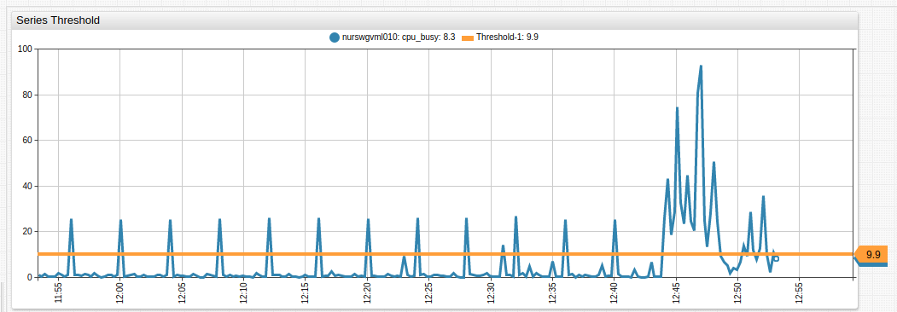

[](https://apps.axibase.com/chartlab/13899000)

Setting | Syntax | Description
--|--|--
Label | `label = threshold` | Define the name of the threshold to be displayed in the legend.
Color | `color = red` | Define threshold line color.<br>By default, a random color is used.
Value | `value = 60`<br>`value = value('alias')`| Define threshold value. Set in JavaScript form when `alert-expression` for series uses the same format.

### `[series]` Settings

If you add several series with the same `entity`, `metric` and other optional settings such as `label`, `color`, `format`, etc., you can set them for the first series only and subsequent series inherit the settings.

Setting | Syntax | Description | Example
--|--|--|--
Mode | `mode = column` | Apply mode setting to both or either `[widget]` and `[series]` settings. | [](https://apps.axibase.com/chartlab/b0069bfe)
[Alert Expression](../../syntax/alert-expression.md)| `alert-expression = value < 95` | Apply separate alert rules to several series with one `alert-style` in `[widget]` settings. | [](https://apps.axibase.com/chartlab/b3892525)
Alert Style | `alert-style = fill: red; stroke: red`| Apply separate alert styles to several series with one `alert-expression` in `[widget]` settings.| [](https://apps.axibase.com/chartlab/b3892525)
Fill Value | `fill-value = true`| Apply interpolation mode to a computed series if the values are irregularly spaced.<br>Set to `true` to fill missing samples with interpolated values.<br>Detailed values are filled in using `linear` interpolation.<br>Aggregated periods are filled with `previous` values.<br>If `fill-value = false`, missing samples are filled with `0` or `null`.<br>Boolean expression, `true` by default.| [](https://apps.axibase.com/chartlab/fba9e293)
Load Future Data | `load-future-data = true` | Load future series values.<br>Import forecasts generated by third-party tools such as R language.<br>Boolean expression. | [](https://apps.axibase.com/chartlab/733111e8)
Series Type | `series-type = s3` | Use this setting in `stack` mode as a grouping parameter.<br>Series of like types are grouped together or summed.<br>Set a unique series type to achieve fill effect without applying `stack` mode.| [](https://apps.axibase.com/chartlab/19146ba0)<br>[](https://apps.axibase.com/chartlab/19146ba0/2/)

### Series Visibility

Hide empty series:

```css
display = !isNaN(value)
```

Hide series without data in the previous 60 minutes:

```css
display = this.lastRequestTime - this.last.t. < 60 * 60000
```

Modify the `60` component of the setting to change the number of minutes to search.

## Time Chart Controls

* Modify selection interval and aggregation period on the fly.
* Add custom selection intervals and aggregation periods directly on the Time Chart.
* View different aggregations without reloading the portal.
* Change the chart mode: `line`, `column`, `range`, `stack`.
* View data in the appropriate format: hertz, joules, watts, bytes, percent, currency etc.
* Create custom metrics using custom formulas and aggregations.
* Modify alert rules directly in the portal.
* Instantly generate forecasts in the Time Chart.


1. **Title**: Click the title to expand the widget to fullscreen.
1. **Timespan**: Select one of the available timespans from the menu.
1. **Series Icon**: Toggle visibility of displayed series by clicking the icon to show or hide that series.
1. **Forecast Tools**: Display forecast and confidence intervals for series.
1. **Mode**: Select the display mode for the series.
1. **Aggregation**: Select aggregation method for the series.
1. **Aggregation Period**: Define the aggregation period for the series.
1. **Left Axis**: Scale the left axis manually by dragging. Double click to reset values to default.
1. **Right Axis**: Scale the right axis manually by dragging. Double click to reset values to default.
1. **Scale Options**: Auto-scale the value of axes in the Time Chart. Display the series in step-line format. Toggle value markers for the series.
1. **Load All Data**: Double click the Time Chart surface to show all loaded data.
1. **Time Axis**: Scale the time axis manually by dragging. Double click to reset values to default.
1. **Context Chart**: Select a manual timespan by dragging context chart endpoints.

### Modifying Time Chart Controls

Add selection intervals and aggregation periods directly in Time Chart controls by double clicking the whitespace between the interval or period where a new interval needs to be added. An interval or period roughly half way between the two values is added on each double click.


To add a four day aggregation period, double click between `1d` and `1w` on the aggregation period controls of the Time Chart.


To remove selection intervals and aggregation periods, drag and drop the interval or period off the Time Chart controls. In the example below, `1w` is removed.

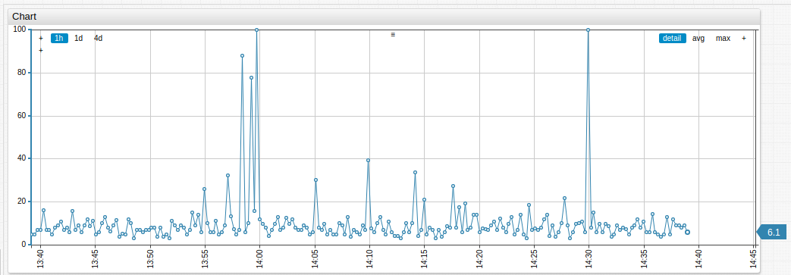

Modify time chart widget controls with the `defaultChartConfig.script` setting at the `[configuration]` level.

```css
defaultChartConfig.script = widget.chart.panels[1].expand(8)
```

Substitute `8` with the desired amount of control to be displayed.

```css
defaultChartConfig.script = widget.chart.panels[1].expand(6)
```

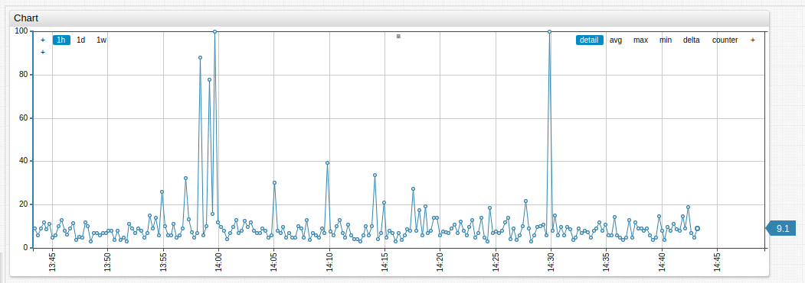

[](https://apps.axibase.com/chartlab/7ea19d6a)

To create specific groups of controls use long-form syntax:

```css
defaultChartConfig.script = widget.panels.type.data(['detail', 'avg', 'max', 'min', 'percentile 50', 'percentile 99', 'percentile 95', 'percentile 90', 'percentile 75', 'sum', 'count', '+'])
```

Add or remove each control component to show or hide it from the widgets:

* `detail`
* `avg`
* `max`
* `min`
* `percentile 50`
* `percentile 99`
* `percentile 95`
* `percentile 90`
* `percentile 75`
* `sum`
* `count`
* `+`


[](https://apps.axibase.com/chartlab/a9d3a8ba)

## Examples

### Offset

```css
[series]
  label = yesterday
  time-offset = 1 day
[series]
  label = 1 week ago
  time-offset = 1 week
```

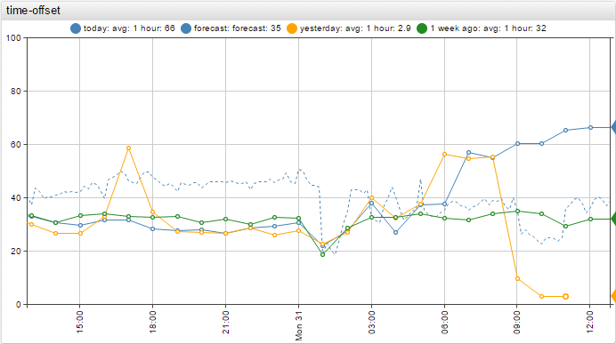

[](https://apps.axibase.com/chartlab/075941a0/2/)

### Dual Axis

```css
[series]
  entity = nurswgvml007
  metric = memfree
  axis = right
```

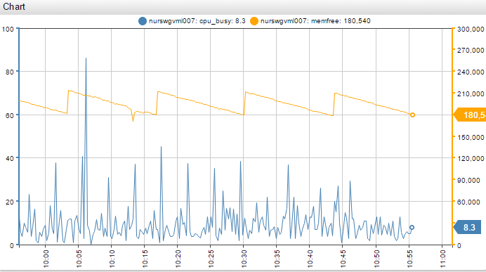

[](https://apps.axibase.com/chartlab/fedaa42e/10/)

### Stack

```css
[widget]
  type = chart
  mode = stack
```

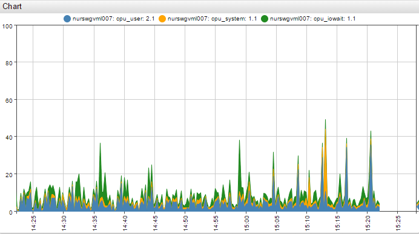

[](https://apps.axibase.com/chartlab/fedaa42e/3/)

### Stack Average

```css
[widget]
  type = chart
  mode = stack
  stepline = true
```

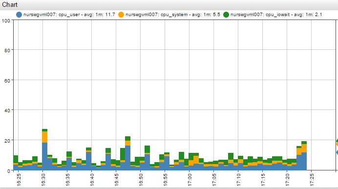

[](https://apps.axibase.com/chartlab/fedaa42e/6/)

### Area

```css
[widget]
  type = chart
  stack = true
[series]
  series-type = s1
[series]
  series-type = s2
```

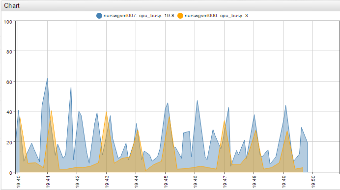

[](https://apps.axibase.com/chartlab/12c2c970)

### Column

```css
[widget]
  type = chart
  mode = column
```

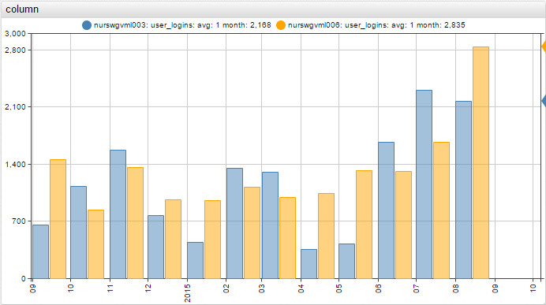

[](https://apps.axibase.com/chartlab/c6d19e38)

### Column Stack

```css
[widget]
  type = chart
  mode = column-stack
```

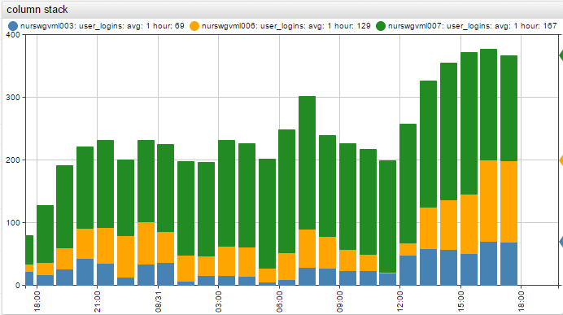

[](https://apps.axibase.com/chartlab/12819ce9)

### Column Alert

```css
[series]
  alert-expression = value > 75
  alert-style = fill: orange; stroke: orange
```

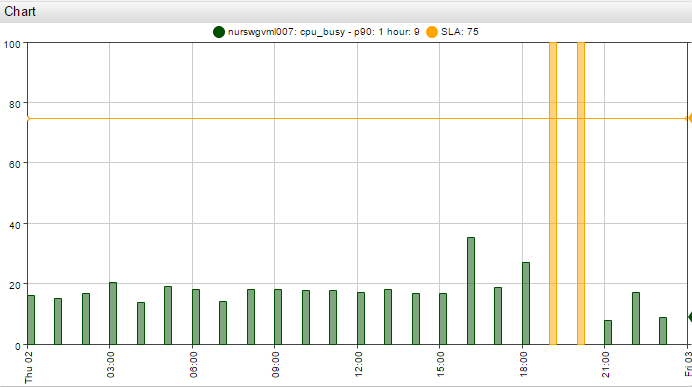

[](https://apps.axibase.com/chartlab/b3892525)

### Percentile

```css
[series]
  entity = nurswgvml010
  metric = cpu_busy
  statistic = percentile_99
```

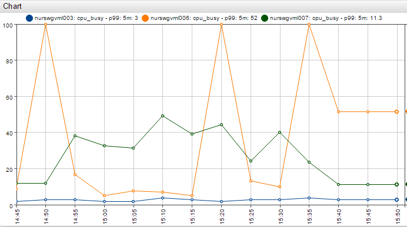

[](https://apps.axibase.com/chartlab/fedaa42e/4/)

### Forecast

```css
[series]
  entity = nurswgvml007
  metric = cpu_busy
  data-type = forecast
```

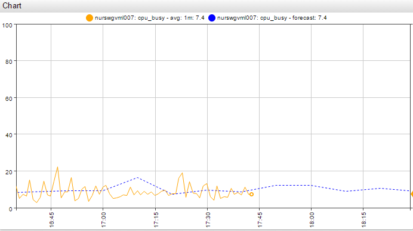

[](https://apps.axibase.com/chartlab/fedaa42e/7/)

### Disconnect

```css
[widget]
  disconnect-interval = 1 minute
  disconnect-value = 0
```

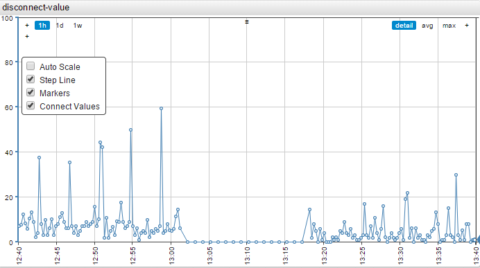

[](https://apps.axibase.com/chartlab/fedaa42e/35/)

### Threshold

```css
[threshold]
  color = red
  value = 75
  label = avg
```

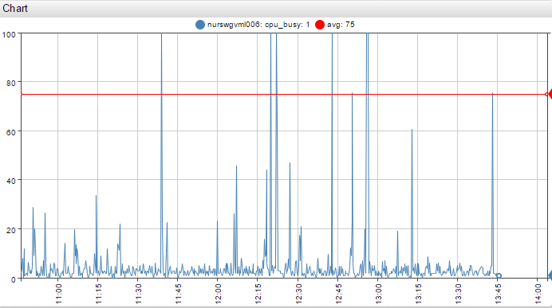

[](https://apps.axibase.com/chartlab/fedaa42e/2/)

### Alert

```css
[widget]
  alert-expression = value > 75
  alert-style = stroke: red; stroke-width: 3
```


[](https://apps.axibase.com/chartlab/e4052904)

### Violations

```css
[series]
  value = var v = value('s7');
  value = if (v > 50) return v;
  style = stroke-width: 3; stroke: red
```

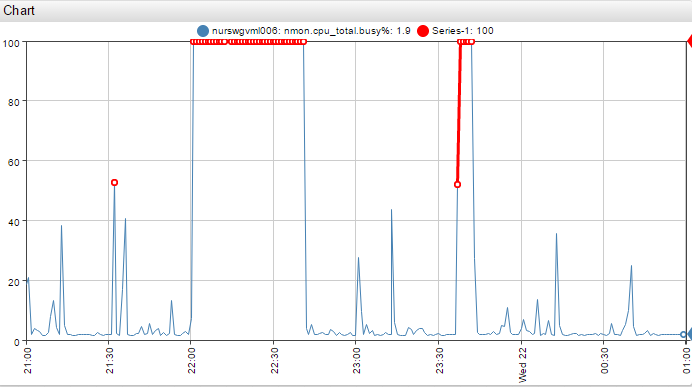

[](https://apps.axibase.com/chartlab/d8a3c6e2/5/)

### Violations Average

```css
[series]
  entity = nurswgvml006
  metric = nmon.cpu_total.busy%
  alias = s7
  period = 5 minute
  statistic = avg
[series]
  value = var v = value('s7');
  value = if (v > 50) return v;
  style = stroke-width: 3; stroke: red
```

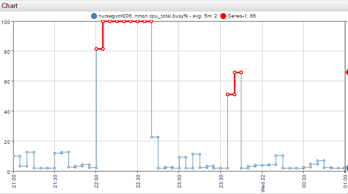

[](https://apps.axibase.com/chartlab/d8a3c6e2/7/)

### Message Overlay

Insert messages into the database as series, using series tags to encode message text. Add messages to a time chart with `mode=column` setting.

```ls
series e:e-highlight d:2016-07-21T15:05:00Z m:m-highlight=75 t:msg="Traffic Stopped"
```

```css
[series]
  entity = e-highlight
  metric = m-highlight
```

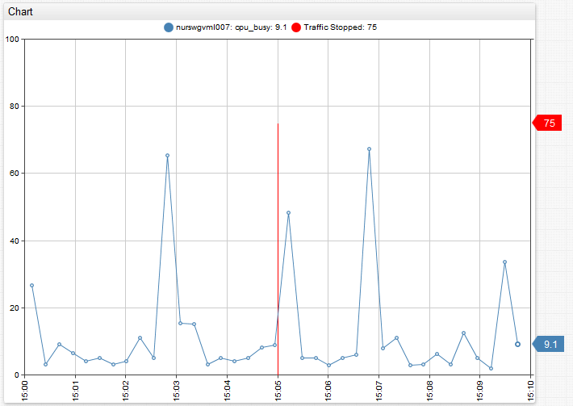

[](https://apps.axibase.com/chartlab/d16aed86)

### Elapsed Time

Overlay multiple intervals on the time (`x`) axis with elapsed time (interval) formatting.

```css
[widget]
  interval-format = true
```

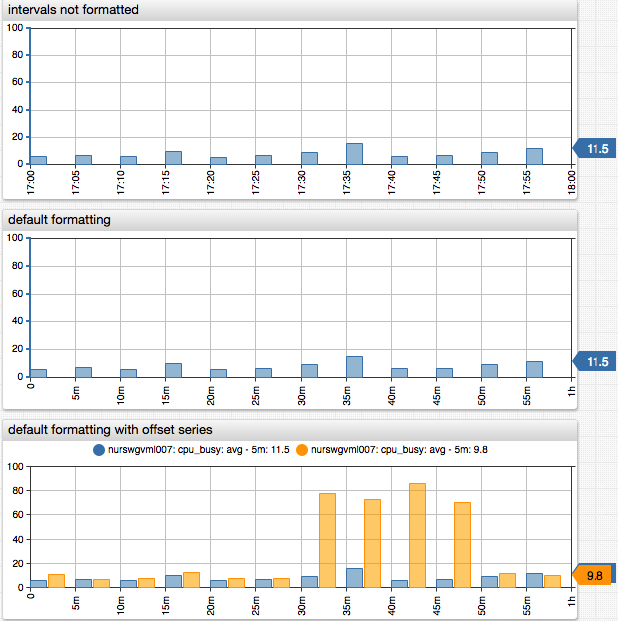

[](https://apps.axibase.com/chartlab/293c46cf/2/)