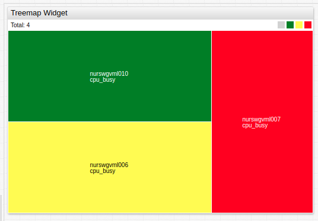

# Treemap Widget

## Overview

The **Treemap Widget** displays each series as a colored rectangle according to the magnitude of series value deviation from the threshold.

```ls
[widget]
  type = treemap
  entity = nurswgvml0*
  colors = green, yellow, red
  thresholds = 0, 10, 25, 50

  [series]
    metric = cpu_busy
```



[](https://apps.axibase.com/chartlab/6b9810d7)

## Widget Settings

* The settings apply to the `[widget]` section.
* [Common](../shared/README.md#widget-settings) `[widget]` settings are inherited.

Name | Description | &nbsp;
:--|:--|:--
<a name="mode"></a>[`mode`](#mode)|Widget layout mode.<br>Possible values:<br>`row` - Align rectangles as rows.<br>`column` - Align rectangles as columns.<br>`auto` - Switch between row and column modes depending on widget size.<br>**Example**: `mode = row`|[↗](https://apps.axibase.com/chartlab/700f826e)
<a name="display-total"></a>[`display-total`](#display-total)|Display the sum of rectangle sizes in widget header.<br>Possible values: `false`, `true`.<br>Default value: `true`.<br>**Example**: `display-total = false`|[↗](https://apps.axibase.com/chartlab/a6226b0b)
<a name="size-name"></a>[`size-name`](#size-name)|Title when `display-total = true`.<br>Specified `size-name` value is displayed after default title `Total`.<br>**Example**: `size-name = Value`|[↗](https://apps.axibase.com/chartlab/dd8c3ef3)
<a name="format-size"></a>[`format-size`](#format-size)|`Total` value format.<br>Refer to [Format Settings](../../syntax/format-settings.md) for possible values.<br>**Example**: `format-size = kilobytes`|[↗](https://apps.axibase.com/chartlab/f57883b3) |
<a name="font-size"></a>[`font-size`](#font-size)|Widget font size.<br>All text, except [widget header](../shared/README.md#header-style) is affected.<br>Default value: `10`.<br>**Example**: `font-size = 15` |[↗](https://apps.axibase.com/chartlab/51280d1e)
<a name="color-range"></a>[`color-range`](#color-range)|Color palette applied to threshold areas.<br>Possible values: `red`, `blue`, `black`.<br>**Example**: `color-range = red`|[↗](https://apps.axibase.com/chartlab/a4394617)
<a name="colors"></a>[`colors`](#colors)| Comma separated list of color [names](https://en.wikipedia.org/wiki/Web_colors) or hex codes, assigned to threshold areas.<br>The number must be `1` fewer than the number of thresholds.<br>**Example**: `colors = green, yellow, red`<br>Recommended color palette tools: [`colorhexa`](https://www.colorhexa.com/ffffff-to-0c9150), [`material.io`](https://material.io/design/color/#tools-for-picking-colors).| [↗](https://apps.axibase.com/chartlab/fcc28103)
<a name="thresholds"></a>[`thresholds`](#thresholds)| Threshold values.<br>The number of specified `colors` must be `1` fewer than the number of thresholds.<br>**Example**: `thresholds = 0, 25, 50, 75, 100`| [↗](https://apps.axibase.com/chartlab/87efaf08)
<a name="gradient-count"></a>[`gradient-count`](#gradient-count)|Number of gradients within each threshold rectangle.<br>**Example**: `gradient-count = 3`|[↗](https://apps.axibase.com/chartlab/c1ee249b)
<a name="total-size"></a>[`total-size`](#total-size)|Maximum size of all rectangles combined.<br>If `total-size` is greater than combined size of all rectangles, additional space is filled `white`.<br>**Example**: `total-size = 5`|[↗](https://apps.axibase.com/chartlab/41d113c0)
<a name="palette-ticks"></a>[`palette-ticks`](#palette-ticks) | Show legend labels.<br>[`thresholds`](#thresholds) setting must be specified.<br>Possible values: `false`, `true`.<br>Default Value: `false`.<br>**Example**:  `palette-ticks = true` | [↗](https://apps.axibase.com/chartlab/036b39f2)
<a name="rotate-palette-ticks"></a>[`rotate-palette-ticks`](#rotate-palette-ticks)| Rotate legend labels.<br>Possible values: `false` (horizontal), `true` (vertical).<br>Default value: `false`.<br>**Example**: `rotate-palette-ticks = true`| [↗](https://apps.axibase.com/chartlab/ff0885ac)
<a name="range-merge"></a>[`range-merge`](#range-merge)| If [`thresholds`](#thresholds) is not defined, a different set of ranges is computed for each series based on observed `min` and `max` values within the loaded `timespan`.<br>`range-merge` computes a single set of ranges for all series in the widget with `min` and `max` for all loaded series.<br>Possible values: `false`, `true`.<br>Default value: `false`.<br>**Example**: `range-merge = true` | [↗](https://apps.axibase.com/chartlab/036900cb)

## Series Settings

* The settings apply to the `[series]` section.
* [Common](../shared/README.md#series-settings) `[series]` settings are inherited.

Name | Description | &nbsp;
:--|:--|:--
<a name="size"></a>[`size`](#size)|Relative rectangle size.<br>Possible values: Number, `value`, `value('alias')`.<br>Default value: `1`.<br>**Examples**:<ul><li>`size = 3`</li><li>`size = value`</li></ul>|[↗](https://apps.axibase.com/chartlab/242da90e)

### Other Settings

* The settings apply to the `[other]` section.
* Specifying the `[other]` section creates an additional rectangle not associated with any series which displays a value or spare capacity.

Name | Description | &nbsp;
:--|:--|:--
<a name="size"></a>[`size`](#size)|Relative rectangle size.<br>Possible values: Number, `value`, `value('alias')`.<br>Default value: `1`.<br>**Examples**:<ul><li>`size = 3`</li><li>`size = value`</li></ul>|[↗](https://apps.axibase.com/chartlab/8d7286fe)
<a name="label"></a>[`label`](#label) | Rectangle label.<br>**Example**: `label = Total Capacity`|[↗](https://apps.axibase.com/chartlab/7f4d239c)
<a name="color"></a>[`color`](#color) | `[other]` section color.<br>Default value: `grey`.<br>**Example**: `color = black`|[↗](https://apps.axibase.com/chartlab/60b058e8)

### Properties Settings

* The settings apply to the `[properties]` section.
* In `[series]` or `[other]` section, define properties displayed on mouseover.
* If a value contains `=` or `\`, escape the characters, for example `\=` or `\\`, respectively.

```ls
[properties]
  Data Center = Cuperito
  Site = California
  Function = SAP DB
```


[](https://apps.axibase.com/chartlab/b686fb79)

## Examples

### Manual Thresholds


[](https://apps.axibase.com/chartlab/014e0cbe)

### Advanced Configuration Example


[](https://apps.axibase.com/chartlab/3bedad3f)