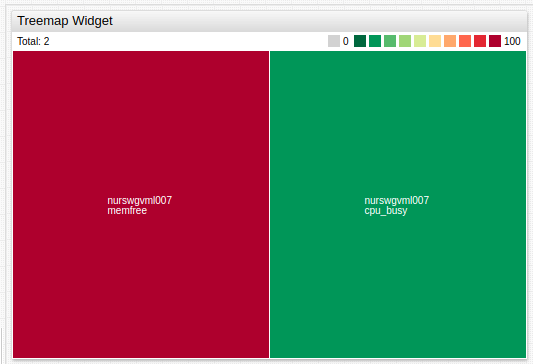
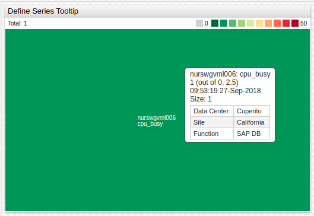
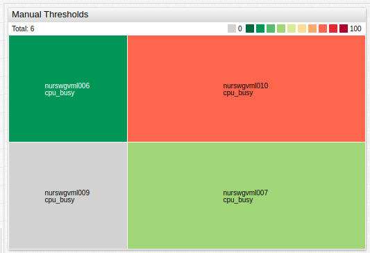
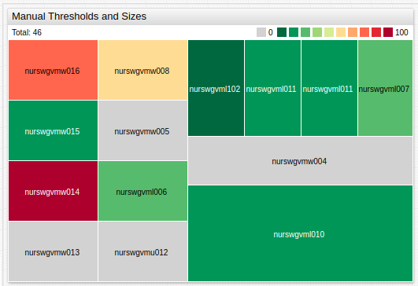

# Treemap Widget

## Overview

The **Treemap Widget** displays each series as a colored rectangle according to the magnitude of series value deviation from the threshold.

```ls
[widget]
  type = treemap
  entity = nurswgvml007

  [series]
    metric = cpu_busy
  [series]
    metric = memfree
```



[](https://apps.axibase.com/chartlab/a48c397d)

## Widget Settings

* The settings apply to the `[widget]` section.
* [Shared](../shared/README.md#widget-settings) `[widget]` settings are inherited.

Name | Description | &nbsp;
:--|:--|:--
<a name="mode"></a>[`mode`](#mode)|Widget layout.<br>Possible values: `row` - Align rectangles as rows. `column` - Align rectangles as columns. `auto` - Switch between row and column modes depending on widget size.<br>**Example**: `mode = row`.|[↗](https://apps.axibase.com/chartlab/e90ff080)
<a name="display-total"></a>[`display-total`](#display-total)|Display the sum of rectangle sizes in widget header.<br>Possible values: `false`, `true`.<br>Default value: `true`.<br>**Example**: `display-total = false`.|[↗](https://apps.axibase.com/chartlab/833f4bfc)
<a name="size-name"></a>[`size-name`](#size-name)|Secondary title when `display-total = true`.<br>`size-name` value appended to default title `Total`.<br>**Example**: `size-name = Value`.|[↗](https://apps.axibase.com/chartlab/bbe3b8bf)
<a name="format-size"></a>[`format-size`](#format-size)|`Total` value format.<br>Refer to [Format Settings](../../syntax/format-settings.md) for possible values.<br>**Example**: `format-size = kilobytes`.|[↗](https://apps.axibase.com/chartlab/e0b5c414) |
<a name="font-size"></a>[`font-size`](#font-size)|Widget font size.<br>All text, except widget header is affected.<br>Default value: `10`.<br>**Example**: `font-size = 15`. |[↗](https://apps.axibase.com/chartlab/268cbe21)
<a name="colors"></a>[`colors`](#colors)| Threshold range colors.<br>The number of [`thresholds`](#thresholds) must be `1` greater than the number of colors.<br>If there are more colors than threshold ranges, additional colors are assigned to the lowest threshold range first.<br>Possible values: [color names](https://en.wikipedia.org/wiki/Web_colors).<br>**Example**: `colors = green, yellow, red`.| [↗](https://apps.axibase.com/chartlab/c6effa9d)
<a name="color-range"></a>[`color-range`](#color-range)|Widget color range.<br>Possible values: [color names](https://en.wikipedia.org/wiki/Web_colors).<br>Built-in ranges: `red`, `blue`, `black`. <br>Default value: `red`.<br>**Example**: `color-range = blue`.|[↗](https://apps.axibase.com/chartlab/c121b493)
<a name="gradient-count"></a>[`gradient-count`](#gradient-count)|Gradients in each color range.<br>**Example**: `gradient-count = 2`.|[↗](https://apps.axibase.com/chartlab/66489085)
<a name="total-size"></a>[`total-size`](#total-size)|Maximum size of all rectangles combined.<br>If `total-size` is greater than combined size of all rectangles, additional space is filled `white`.<br>**Example**: `total-size = 70`.|[↗](https://apps.axibase.com/chartlab/14253ec2)
<a name="palette-ticks"></a>[`palette-ticks`](#palette-ticks) | Show legend palette ticks.<br>[`thresholds`](#thresholds) setting must be specified.<br>Possible values: `false`, `true`.<br>Default Value: `false`.<br>**Example**:  `palette-ticks = true`. | [↗](https://apps.axibase.com/chartlab/8d8fc6c8)
<a name="rotate-palette-ticks"></a>[`rotate-palette-ticks`](#rotate-palette-ticks)| Rotate legend palette ticks.<br>Possible values: `false` (horizontal), `true` (vertical).<br>Default value: `false`.<br>**Example**: `rotate-palette-ticks = true`.| [↗](https://apps.axibase.com/chartlab/268583f1)
<a name="range-merge"></a>[`range-merge`](#range-merge)| Compute a single range for all series with minimum and maximum from all loaded series.<br>Possible values: `false`, `true`.<br>Default value: `false`.<br>**Example**: `range-merge = true`. | [↗](https://apps.axibase.com/chartlab/ed732cda)

## Series Settings

* The settings apply to the `[series]` section.
* [Shared](../shared/README.md#series-settings) `[series]` settings are inherited.

Name | Description | &nbsp;
:--|:--|:--
<a name="size"></a>[`size`](#size)|Relative rectangle size.<br>Possible values: Number, `value`, `value('alias')`.<br>Default value: `1`.<br>**Example**:<ul><li>`size = 3`<li>`size = value`</ul>|[↗](https://apps.axibase.com/chartlab/76515697)
<a name="thresholds"></a>[`thresholds`](#thresholds)| Threshold values.<br>The number of specified [`colors`](#colors) must be `1` fewer than the number of thresholds.<br>**Example**: `thresholds = 0, 25, 50, 75, 100`.| [↗](https://apps.axibase.com/chartlab/c6effa9d)
<a name="label"></a>[`label`](#label) | Rectangle label.<br>Set empty `label =` setting to hide label.<br>Default value: `entity-metric`.<br>**Example**: `label = Total Capacity`.|[↗](https://apps.axibase.com/chartlab/1d1ec7aa)

### Other Settings

* The settings apply to the `[other]` section.
* Specifying the `[other]` section creates an additional rectangle not associated with any series which displays a value or spare capacity.

Name | Description | &nbsp;
:--|:--|:--
<a name="size"></a>[`size`](#size)|Relative rectangle size.<br>Possible values: Number, `value`, `value('alias')`.<br>Default value: `1`.<br>**Examples**:<ul><li>`size = 3`<li>`size = value`</ul>|[↗](https://apps.axibase.com/chartlab/912634a6)
<a name="label"></a>[`label`](#label) | Rectangle label.<br>**Example**: `label = Total Capacity`.|[↗](https://apps.axibase.com/chartlab/97baa0e8)
<a name="color"></a>[`color`](#color) | `[other]` section color.<br>Default value: `grey`.<br>**Example**: `color = black`.|[↗](https://apps.axibase.com/chartlab/976b6fc3)

### Properties Settings

* The settings apply to the `[properties]` section.
* In `[series]` or `[other]` section, define properties displayed on mouseover.
* If a value contains `=` or `\`, escape the characters, for example `\=` or `\\`, respectively.

```ls
[properties]
  Data Center = Cuperito
  Site = California
  Function = SAP DB
```



[](https://apps.axibase.com/chartlab/b686fb79)

## Examples

### Manual Thresholds



[](https://apps.axibase.com/chartlab/014e0cbe)

### Advanced Configuration Example



[](https://apps.axibase.com/chartlab/3bedad3f)