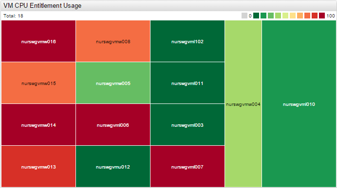
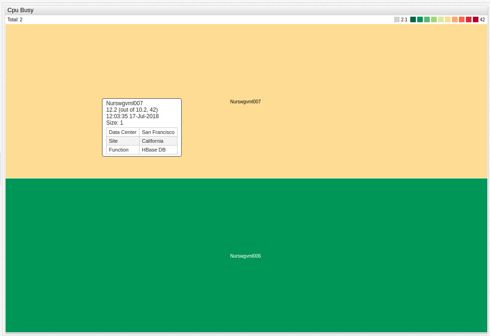
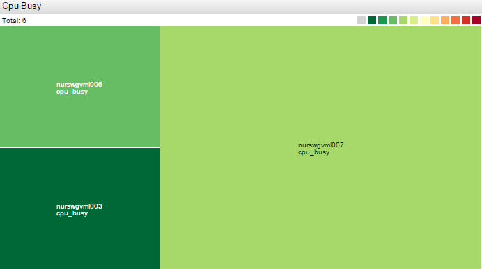
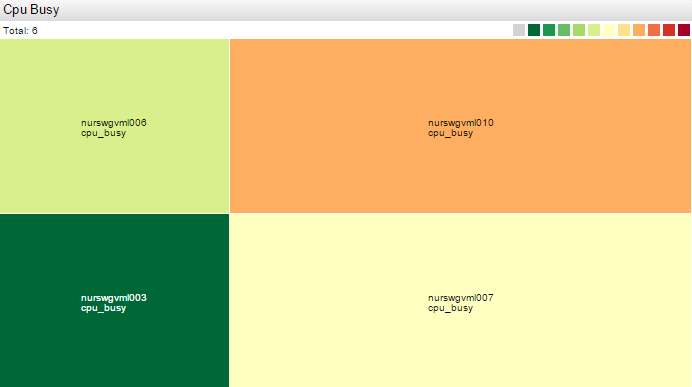

# Treemap Widget



## Overview

Treemap displays each series as a rectangle, sized according to the `size` setting and colored according to the magnitude of deviation of the series value from the threshold.

## Syntax

Treemaps support [Shared Widget](../shared/README.md) syntax.

### `[widget]` Settings

Setting |Syntax |Description |Example
--|--|--|--
|Display Totals |`display-total = false` |Displays the sum of rectangle sizes such as `size` setting for series<br>`true` by default. |[](https://apps.axibase.com/chartlab/aeeffb8f/3/) |
|Size Name |`size-name = sum` |Title for for `display-total`. <br>Displayed after `Total`.<br>For example: `Total sum`. |[](https://apps.axibase.com/chartlab/aeeffb8f/5/) |
|Size Format |`format-size = kilobytes` |Format size setting values.<br>For example: `format-size = bytes` |[](https://apps.axibase.com/chartlab/aeeffb8f/13/) |
|Font Size |`font-size = 42` |Font size settings as a whole number<br>For example: `10` or `12`. |[](https://apps.axibase.com/chartlab/aeeffb8f/6/) |
|Color Range |`color-range = blue`<br>`color-range = black`<br>`color-range = red`<br>`color-range = green, yellow, red` |Determine the color range of the widget.<br>By default: `color-range = red`.<br>Other built-in `color-range` scales: `blue`, `black`. |[](https://apps.axibase.com/chartlab/aeeffb8f/14/) |
|Gradient Count |`gradient-count = 2`<br>`gradient-count = 3, 1, 1` |Number of gradients in each range. |[](https://apps.axibase.com/chartlab/aeeffb8f/16/) |
|Total Size |`total-size = 70` |Maximum size of all rectangles combined |[](https://apps.axibase.com/chartlab/3233ff48) |
|Palette Ticks |`palette-ticks = true` |Display labels on the legend.<br>Possible values: `true`, `false`.<br>Default value: `false` |[](https://apps.axibase.com/chartlab/0ce65ec2) |
|Rotate Palette Ticks |`rotate-palette-ticks = true` |Rotate legend labels.<br>Possible values: `true`, `false`.<br>`true`: Vertical.<br>`false`: Horizontal.<br>Default value: `true` |[](https://apps.axibase.com/chartlab/0ce65ec2/2/) |
|Merge Range |`range-merge = true` |If threshold is not defined, different set of ranges is computed for each series based on observed `min` and `max` values within the loaded time-span.<br> `range-merge` computes a single set of ranges for all series in the widget by using `min` and `max` for all loaded series.<br>Default value: `false`. |[](https://apps.axibase.com/chartlab/db66c7fa) |
|Mode |`mode = row` |Layout mode controls how rectangles are positioned.<br>Available options: `default`, `row`: Align rectangles as rows, `column`: Align rectangles as columns, `auto`: Switch between row and column modes depending on widget size. |[](https://apps.axibase.com/chartlab/fc68bae4/7/) |

### `[series]` Settings

Setting |Syntax |Description |Example
--|--|--|--
|Size|`size = 3`<br>`size = value('007')`<br>`size = value('scala')`<br>`size = value`|The relative size of the series rectangle.<br>`1` by default.<br>Set to a series value by referring to `alias`.<br>Set to the current value of the series using `value`.|[](https://apps.axibase.com/chartlab/aeeffb8f/7/)<br>[](https://apps.axibase.com/chartlab/8f36fc06)<br>[](https://apps.axibase.com/chartlab/3289964c/10/)<br>[](https://apps.axibase.com/chartlab/3233ff48)|
|Thresholds|`thresholds = 0, 25, 50, 75, 100`<br>`thresholds = bottom(1),delta('total') / value('total'), top(1)`|Defines the threshold values.<br>By default the mean value all metrics for the whole time-span is chosen as the threshold.<br>Set to the rate of change (`delta`) of series contained in the widget by referring to `alias`.|[](https://apps.axibase.com/chartlab/aeeffb8f/18/)<br>[](https://apps.axibase.com/chartlab/3289964c/10/)|
|Color|`color = avg('30 minute') < 90 ? 'green' : 'red'`|Rectangle color.<br>Optionally use JavaScript code.<br>Same as `alert-expression` settings or value for series.|[](https://apps.axibase.com/chartlab/aeeffb8f/9/)|

### `[other]` Settings

`[other]` creates an additional rectangle not associated with any series used to display remaining value or spare capacity.

Setting | Syntax | Description
--|--|--
Size|`size = 1` | Relative size.<br>`1` by default.
Label | `label = Other`| Display name.<br>`Other` by default.
Color | `color = grey`| Rectangle color.

### `[properties]` Settings

For `[other]` and `[series]` tags in Treemap widget, define `[properties]` level settings, which specify any values divided by an equal sign. If a value contains `=` or `\`, escape the characters, for example `\=` or `\\`, respectively.

This setting displays a table in the tooltip that appears upon series rectangle mouseover.

```ls
/* Define upper series tooltip */
[properties]
  Data Center = Cuperito
  Site = California
  Function = SAP DB
  
/* Define lower series tooltip */
[properties]
  Data Center = San Francisco
  Site = California
  Function = HBase DB
```



[](https://apps.axibase.com/chartlab/aeeffb8f/10/)

## Examples

### Manual Thresholds and Size

```ls
width-units = 1
height-units = 1
thresholds = 0, 10, 20, 30, 40, 50, 60, 70, 80, 90, 100
```


[](https://apps.axibase.com/chartlab/cdb8bc6c)

### Default Threshold



[](https://apps.axibase.com/chartlab/aeeffb8f)

### Manual Thresholds

```ls
thresholds = 0, 25, 50, 75, 100
```



[](https://apps.axibase.com/chartlab/aeeffb8f/2/)